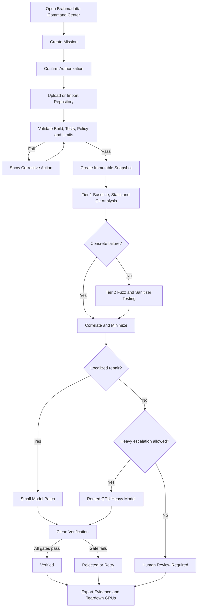

# User Flow Diagrams

## Primary competition flow



## Finding drill-down flow

```text
Vulnerability Queue
  → Finding Summary
  → Reproducer and Trace
  → Related Code and Git History
  → Routing Explanation
  → Patch Attempt
  → Verification Matrix
```

## Safe cancellation flow

```text
Operator requests cancellation
  → stop scheduling new work
  → terminate current sandbox at safe boundary
  → persist logs and partial evidence
  → terminate model jobs
  → release rented GPUs and temporary disks
  → mark mission Cancelled
```

---

## Fixed MVP competition decisions

- **Product name:** Brahmadatta AI.
- **Product type:** an authorized, defensive Cyber-Reasoning System for the AI Kavach competition MVP.
- **Architecture:** three evidence-driven tiers: fast deterministic triage, destructive sandbox testing with lightweight patching, and heavy repository-level reasoning only when escalation is justified.
- **Interface:** a dense futuristic armor-command-center dashboard with a central mission core, live telemetry, drill-down panels, and operator controls. The visual language is original and does not copy third-party logos or branded interface assets.
- **Primary workflow:** authorize → ingest → baseline → analyze → correlate → stress-test → patch → verify → export evidence.
- **Compute:** CPU-first processing with self-hosted models on rented GPU infrastructure. Repository content is not sent to an external inference API.
- **MVP target:** C/C++ repositories first; Python support is optional.
- **Verification rule:** a patch is never accepted on model confidence alone. The original reproducer, regression tests, static checks, and renewed fuzzing determine the verdict.
- **Safety boundary:** authorized repositories and isolated environments only; no public-target scanning, no exploit deployment, and no automatic production merge.

## Open decisions / next review

- Assign the final three-person team roles.
- Lock the rented GPU provider and tested model-serving recipe.
- Replace estimated performance targets with benchmark results.
- Confirm the final competition demo repository and fallback recording.
