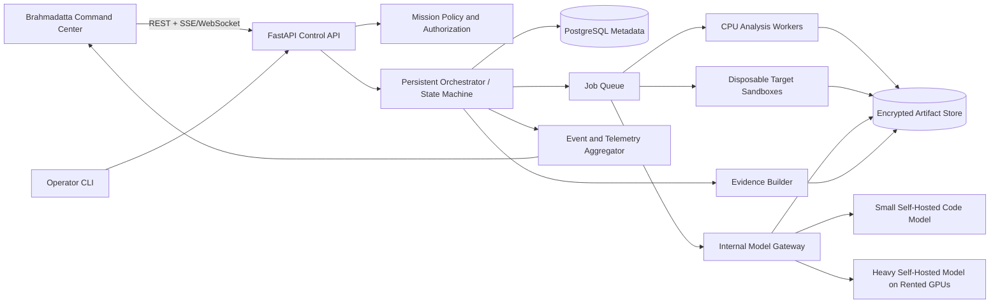

# System Architecture Document

## Architecture

## Three-tier execution architecture

### Tier 1 — Speed and sanity
- Baseline build and tests.
- Static analysis and compiler diagnostics.
- Dependency inventory.
- Git history and automated bisect.
- CPU-first and always attempted before model escalation.

### Tier 2 — Destructive testing and lightweight patching
- Sanitizer-enabled builds.
- AFL++ or libFuzzer.
- Crash deduplication and minimization.
- Small self-hosted code model for localized defects.

### Tier 3 — Heavy repository reasoning
- Only receives confirmed complex cases.
- Runs through an internal model gateway on rented dedicated GPUs.
- Uses a bounded context package, time limit, diff schema, and policy checks.
- Returns a patch candidate, never a verification verdict.

## Trust boundaries

1. Operator browser to control API.
2. Control plane to worker network.
3. Disposable target execution boundary.
4. Model network receiving approved context only.
5. Artifact and evidence storage boundary.
6. Rented GPU provider boundary with temporary credentials and teardown controls.

## Mission state machine

`CREATED → VALIDATING → SNAPSHOTTED → BASELINE → TRIAGE → STRESS_TEST → CORRELATE → PATCH → VERIFY → VERIFIED / REJECTED / HUMAN_REVIEW / FAILED / CANCELLED`

## UI event model

Every state transition emits an immutable event containing mission ID, sequence number, timestamp, stage, status, user-safe message, evidence references, and metrics. The UI reconstructs the command-center state from the event stream and periodic summary snapshots.

## Authority model

Models cannot merge code, change policy, access provider credentials, widen network access, suppress failed tests, or declare verification. The orchestrator owns all tools and final state transitions.

---

## Fixed MVP competition decisions

- **Product name:** Brahmadatta AI.
- **Product type:** an authorized, defensive Cyber-Reasoning System for the AI Kavach competition MVP.
- **Architecture:** three evidence-driven tiers: fast deterministic triage, destructive sandbox testing with lightweight patching, and heavy repository-level reasoning only when escalation is justified.
- **Interface:** a dense futuristic armor-command-center dashboard with a central mission core, live telemetry, drill-down panels, and operator controls. The visual language is original and does not copy third-party logos or branded interface assets.
- **Primary workflow:** authorize → ingest → baseline → analyze → correlate → stress-test → patch → verify → export evidence.
- **Compute:** CPU-first processing with self-hosted models on rented GPU infrastructure. Repository content is not sent to an external inference API.
- **MVP target:** C/C++ repositories first; Python support is optional.
- **Verification rule:** a patch is never accepted on model confidence alone. The original reproducer, regression tests, static checks, and renewed fuzzing determine the verdict.
- **Safety boundary:** authorized repositories and isolated environments only; no public-target scanning, no exploit deployment, and no automatic production merge.

## Open decisions / next review

- Assign the final three-person team roles.
- Lock the rented GPU provider and tested model-serving recipe.
- Replace estimated performance targets with benchmark results.
- Confirm the final competition demo repository and fallback recording.
