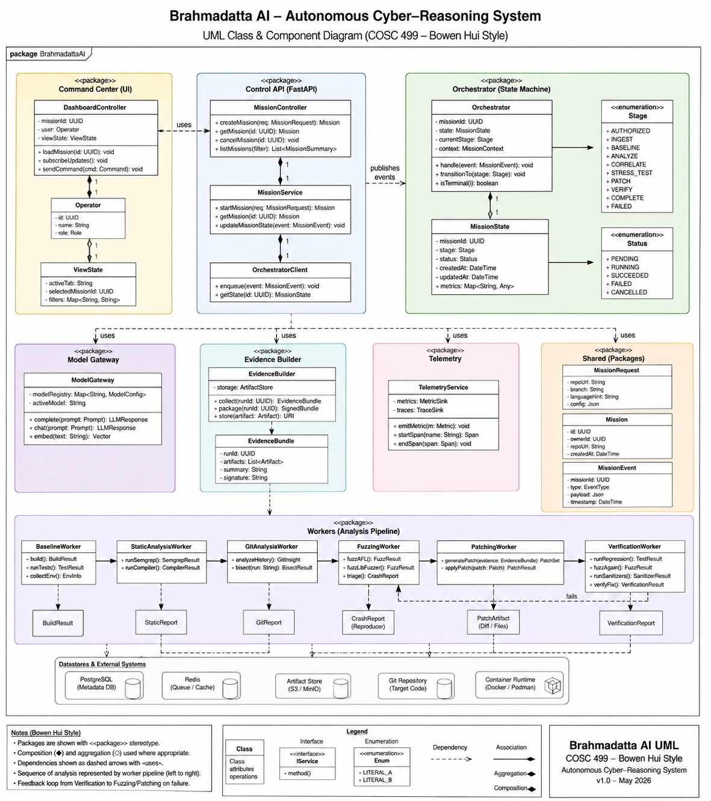

# UML Class and Component Diagram

| Field | Value |
|---|---|
| Author | Raunak |
| Version | 1.0 |
| Date | 2026-08 |
| Image | [`19a-uml-class-and-component-diagram.png`](19a-uml-class-and-component-diagram.png) |

Class and component decomposition across the seven packages: Command Center, Control API,
Orchestrator, Model Gateway, Evidence Builder, Telemetry, shared schemas, and the analysis
worker pipeline, with the datastores and external systems beneath them. It tracks
[`16-system-architecture-document.md`](16-system-architecture-document.md) closely.

## Two things to read it with

**The Control API package is labelled FastAPI. That is now stale.** The stack changed to
**Astro + Django (django-ninja) + nginx** by CEO decision on 2026-08-06 — recorded as D-013 in
[`.project/decisions.md`](../../.project/decisions.md), with the authoritative table in
[`CLAUDE.md`](../../CLAUDE.md). The class decomposition survives the change intact —
`MissionController`, `MissionService` and `OrchestratorClient` all still hold. What moves is the
framework label and where `packages/schemas` is generated from. Due for a v1.1.

**This is the full architecture, not the seven-day build.** Several things drawn here are in the
[`CUT` milestone](https://github.com/Mahatav/brahmadatta-ai/milestone/18) and will not exist by
the deadline: `GitAnalysisWorker.bisect()`, `StaticAnalysisWorker.runSemgrep()`,
`FuzzingWorker.fuzzAFL()`, and `EvidenceBundle.signature`. That is correct for an architecture
document — it should outlive the competition. It is not the build plan. The build plan is
[the board](https://github.com/users/Mahatav/projects/3) and
[`../09-company/03-seven-day-plan.md`](../09-company/03-seven-day-plan.md).
