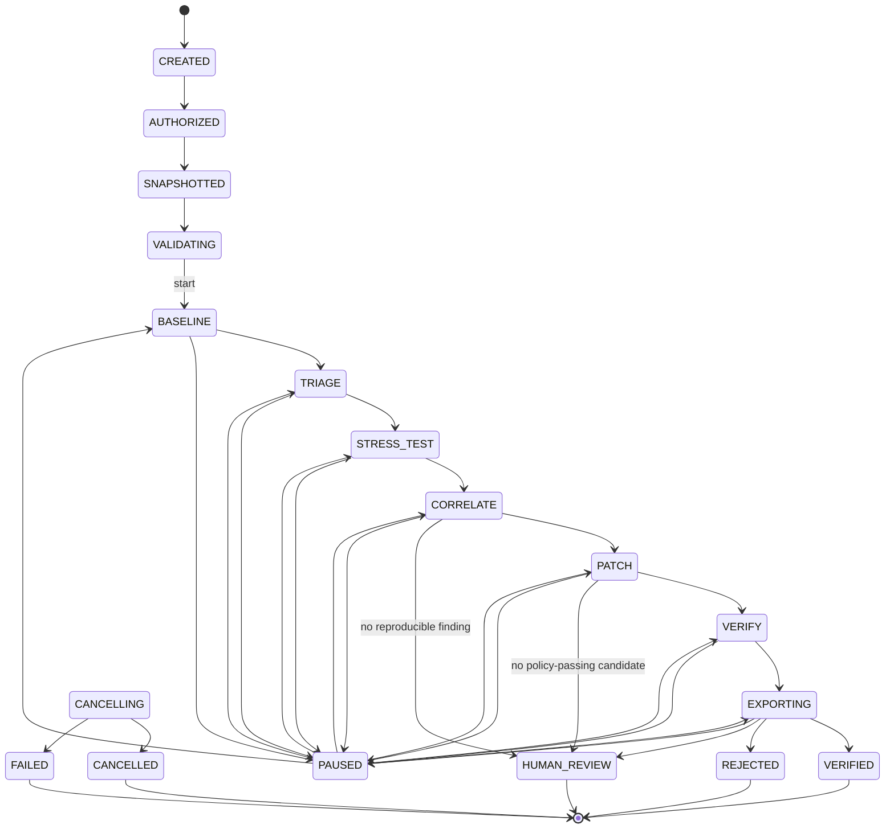

# Architecture Spec — the seven-day build

| Field | Value |
|---|---|
| Project | Brahmadatta AI |
| Document | Company-workflow phase 2 deliverable (architecture) |
| Status | **DRAFT — pending `cto` review** |
| Drafted by | `software-architect` seat |
| Date | 2026-08-07 |
| Scope | The system that will exist on **2026-08-13**. Nothing else. |
| Supersedes | Nothing. `docs/03-technical/16-system-architecture-document.md` is left intact; §8 below states where this document departs from it. |

## Why this document exists

`16-system-architecture-document.md` describes a fifteen-unit system with a rented-GPU
tier, an AFL++/Semgrep/bisect analysis plane, a model gateway service, an evidence-builder
service and a telemetry service. That system is not being built. Sixteen of its capabilities
are in the [`CUT` milestone](https://github.com/Mahatav/brahmadatta-ai/milestone/18), the GPU
plane was removed entirely by D-015, and the stack changed under it by D-013.

Implementation started before this phase ran. The contract layer in `apps/control-api/contracts/`
is already substantially built and is **good** — most of what follows ratifies it rather than
replacing it. Where this document asks for a change to code that already exists, it says so
explicitly and names the issue that owns the change. Nothing here is a licence to rewrite
another seat's work without going through that issue.

Read this against [the seven-day plan](03-seven-day-plan.md) and
[§3 of the P0 cut](01-vision-and-p0-cut.md#3-the-minimum-viable-demo) — the nine-step demo
is the entire scope, and every section below is written to make exactly that sequence run.

---

## 1. Component boundaries as they will actually exist

### 1.1 What runs

Six long-lived processes and two ephemeral kinds. That is the whole system.

```
                        ┌──────────────────────────────────────────────┐
   operator browser ───▶│  nginx  :443/:8080                           │
   (1440×900+)          │  · serves the Astro static build             │
                        │  · proxies /api/v1/*                         │
                        │  · proxy_buffering off on /events            │
                        │  · /admin 404 in the finale profile          │
                        └───────────────┬──────────────────────────────┘
                                        │  HTTP + SSE
                        ┌───────────────▼──────────────────────────────┐
                        │  control-api    (uvicorn, ASGI, Django 5.2)  │
                        │  · django-ninja routes, OpenAPI              │
                        │  · SSE fan-out (reads the event table)       │
                        │  · operator commands → state transitions     │
                        │  · READS everything, RUNS nothing            │
                        └───────────────┬──────────────────────────────┘
                                        │
                            ┌───────────▼───────────┐
                            │   PostgreSQL 16       │◀────┐
                            │   missions, events,   │     │
                            │   jobs, evidence      │     │
                            └───────────▲───────────┘     │
                                        │                 │
        ┌───────────────────────────────┴──┐   ┌──────────┴──────────────────┐
        │  orchestrator  (manage.py        │   │  worker  (manage.py          │
        │  run_orchestrator)               │   │  run_worker)  ×1..2          │
        │  · owns MissionState             │   │  · claims jobs SKIP LOCKED   │
        │  · tick loop: transition,        │   │  · runs stages in sandboxes  │
        │    enqueue, reap, watchdog       │   │  · emits STAGE_PROGRESS      │
        │  · never runs a subprocess       │   │  · never transitions a       │
        │                                  │   │    mission                   │
        └──────────────────────────────────┘   └───┬─────────────────┬────────┘
                                                   │                 │
                    ┌──────────────────────────────▼──┐   ┌──────────▼──────────┐
                    │  sandbox  (rootless podman,     │   │  model-host         │
                    │  --network=none, ephemeral)     │   │  (llama.cpp server, │
                    │  · configure / build / ctest    │   │   OpenAI-shaped,    │
                    │  · ASan+UBSan build             │   │   loopback only)    │
                    │  · libFuzzer campaign           │   │                     │
                    │  · clean-worktree verification  │   └─────────────────────┘
                    └─────────────────────────────────┘

   filesystem:  ARTIFACT_ROOT/  content-addressed, sha256, 0600, mode 0700 dir
```

| Process | Owns | Must never |
|---|---|---|
| **nginx** | TLS, static serving, one ingress, SSE buffering policy, admin blocking | Contain business logic. Rewrite response bodies. |
| **control-api** | The HTTP/SSE surface. Validating operator commands. Reading the event log and evidence tables. Requesting transitions. | Fork a subprocess. Touch a repository. Hold an inference client. Block on anything longer than a DB query. |
| **orchestrator** | `MissionState`. The only writer of `Mission.state`. Enqueuing jobs. Job lease reaping. Deadline watchdog. Teardown reaping. | Run a build, a fuzzer, or a model call. |
| **worker** | Executing one job at a time: build, fuzz, patch generation, verification. Emitting progress events. Persisting artifacts. Creating and destroying sandboxes. | Write `Mission.state`. Decide a verdict's meaning (it computes gates; the record derives the verdict). |
| **sandbox** | Untrusted target code and the fuzzer. | Reach the network. Persist beyond its job. Run as root. |
| **model-host** | Serving the small code model. | Be reachable from anything except the worker. Be reachable from a sandbox. |
| **PostgreSQL** | All state. Every process is restartable because nothing important is in memory. | — |

### 1.2 What is deliberately *not* built

The pack's `services/` split is over-decomposed for a single-operator, single-mission,
seven-day system. Three of its four services collapse into modules inside the existing
Django project:

| Pack unit | Becomes | Why |
|---|---|---|
| `services/model-gateway` | `apps/control-api/gateway/` — a Python package imported **only by the worker** | Making this a network service creates a second process that must both hold repository context and reach the model — i.e. a second egress-capable node to secure, for zero benefit at one concurrent mission. As a module it is a single file that a lint test can pin (§4.1). |
| `services/evidence-builder` | `apps/control-api/evidence/` — a module plus `manage.py export_evidence` | It is a render job that runs once per mission and needs read access to every evidence table. A service would need the same DB access plus an RPC surface. |
| `services/telemetry` | The `MissionEvent` table and the SSE endpoint | P2-5 cut Prometheus. There is no metrics backend to aggregate into. Real telemetry already flows through the event stream by design. |
| `workers/{baseline,static,git,fuzzing,patching,verification}` | One `worker` process with a `JobKind` dispatch table | Six worker binaries for six functions that share a sandbox helper, an artifact writer and an event emitter is five extra deployment units. Two of the six (`static-analysis`, `git-analysis`) have nothing to run in this scope. |
| `adapters/python` | Not built (P2-3) | — |
| `services/orchestrator` as a separate codebase | A Django management command in the same project | It shares every model. A separate codebase means a schema duplicated in two places on day two. |
| Redis / RQ / Celery | Not installed. Postgres `SELECT … FOR UPDATE SKIP LOCKED` (§3) | P2-12. Closing it: see DR-A. |
| Rented GPU plane | Not built (D-015) | — |

Also not built: `apps/operator-cli` (the Command Center plus `manage.py` covers it),
`packages/policy` (policy lives in `contracts/`), microVM adapter (P2-4), S3 artifact store
(§5.2), signed bundles (P2-8).

**Net: 15 deployable units in the pack → 4 application processes here** (nginx, control-api,
orchestrator, worker) plus Postgres and the model host.

### 1.3 Folder layout, reconciled

`docs/04-development/35-project-folder-structure.md` is stale in the same way. What lands:

```
apps/control-api/          # Django project — API, orchestrator, worker, all of it
  config/                  # settings profiles, asgi, env       [exists]
  contracts/               # frozen schemas, enums, state machine, policy  [exists]
  api/                     # routers, auth, trace, error envelope [partial]
  missions/                # Django models + migrations          #14
  orchestrator/            # tick loop, transitions, job queue    #12
  worker/                  # job runners, sandbox, adapters       #15,#16,#17,#27,#28
  gateway/                 # the ONLY inference client           #35,#36
  evidence/                # bundle assembly, markdown/json render #32,#51
apps/command-center/       # Astro                                #67
packages/ui-components/    # design tokens                        [exists]
infrastructure/compose/    # compose files, nginx conf            #10,#11
demo/repositories/         # the controlled C target              #4
tests/security/            # egress + invariant tests             §4
```

`services/`, `workers/`, `adapters/` as top-level directories do not appear. Per D-016
directories are created as code lands.

### 1.4 Fixed vs. to decide

**Fixed** (change only via CTO): the four-process shape; orchestrator as the sole writer of
`Mission.state`; the worker as the sole holder of repository content and the sole caller of
the model; no Redis; the module collapse in §1.2.

**Engineering-manager / devops decide:** worker replica count (1 or 2); whether the
orchestrator tick lives in its own container or the same container as the worker with a
supervisor; container base images and their pins; whether Postgres runs in compose or on the
host. All are inside the constraint that nothing may hold state in memory.

**Backend developer decides:** module-internal structure of `orchestrator/` and `worker/`;
the `JobKind` dispatch mechanism; logging shape (P1-9 is CUT, so plain formatted logs are fine).

---

## 2. The mission state machine

`apps/control-api/contracts/state_machine.py` already implements a state machine that is
close to right. This section is the definitive version; the deltas from the current code are
called out as **[Δ]** and each names an issue.

### 2.1 The states

Eighteen. Thirteen live, five terminal.

| State | Meaning | Stage running | Who moves it out |
|---|---|---|---|
| `CREATED` | Mission row exists. Nothing is authorized. | — | operator: authorize |
| `AUTHORIZED` | An unrevoked, unexpired `AuthorizationRecord` exists. | `AUTHORIZE` | operator: snapshot |
| `SNAPSHOTTED` | Immutable snapshot ingested, `archive_sha256` recomputed server-side and matched. | `INGEST` | operator: preflight |
| `VALIDATING` | Preflight has run. **A pass leaves the mission here, awaiting `start`.** | `INGEST` | operator: start |
| `BASELINE` | Configure → build → ctest on the pristine tree. | `BASELINE` | orchestrator |
| `TRIAGE` | Deterministic triage. **Real as of D-150/#22 — see §2.5.** | `ANALYZE` | orchestrator |
| `STRESS_TEST` | Sanitizer build + libFuzzer campaign + crash capture + minimization. | `STRESS_TEST` | orchestrator |
| `CORRELATE` | Bind the confirmed crash to a source location and build the bounded context package. | `CORRELATE` | orchestrator |
| `PATCH` | Generate **the candidate set** (§2.3). Policy-evaluate each. | `PATCH` | orchestrator |
| `VERIFY` | Verify **every policy-passing candidate** in its own clean worktree. | `VERIFY` | orchestrator |
| `EXPORTING` | Assemble and write the evidence bundle. | `EXPORT_EVIDENCE` | orchestrator |
| `PAUSED` | Operator hold. `paused_from` is recorded. | — | operator: resume/cancel |
| `CANCELLING` | Cooperative shutdown in progress; sandboxes being torn down. | — | orchestrator |
| **`VERIFIED`** | terminal — ≥1 candidate reached `Verdict.VERIFIED`. | — | — |
| **`REJECTED`** | terminal — ≥1 candidate evaluated, none verified, ≥1 rejected. | — | — |
| **`HUMAN_REVIEW`** | terminal — the pipeline stopped on an honest "I don't know". | — | — |
| **`FAILED`** | terminal — infrastructure or target failure. Not a verdict. | — | — |
| **`CANCELLED`** | terminal — operator stopped it, teardown confirmed. | — | — |

`BASELINE_PASSED` is **not** a state. See §8.5.

### 2.2 Legal transitions



Plus, from **every** non-terminal state: `→ CANCELLING` and `→ FAILED`. Those two are never
blocked by a missing authorization record — getting out safely must never depend on the thing
whose absence made it necessary. That is already correct in the code.

Three rules on top of the table, none of which the table can express:

- **R1 — resume goes back where it came from.** `PAUSED → X` is legal only when
  `X == mission.paused_from`. The current `_RESUMABLE` set would let a mission paused in
  `BASELINE` resume into `VERIFY`. **[Δ #12]** add `paused_from` to the mission row and
  `assert_resume(current, target, paused_from)` to `contracts/state_machine.py`.
- **R2 — a terminal verdict requires a verification record that produces it.**
  `EXPORTING → VERIFIED` is currently legal with zero evidence in the database. That is the
  single largest hole in the strongest product rule in the project. **[Δ #12/#38]** — see
  §4.2.6 for the exact function.
- **R3 — `CANCELLING → CANCELLED` requires a teardown receipt.** Without one it is
  `CANCELLING → FAILED`. P0-14 is uncuttable and the only way it stays true under pressure is
  if the happy path cannot skip it. **[Δ #15]**

### 2.3 Two candidates, one pass — the shape the D6 gate needs

The D6 kill criterion and issue #45 require **one `Verified` and one `Rejected` verdict from a
single operator action**. The current machine cannot express this: `PATCH → VERIFY → EXPORTING`
is a single pass over a single candidate.

Two ways to fix it:

- **(a) Loop.** Add `VERIFY → PATCH` with a bounded iteration counter.
- **(b) Fan out inside the stage.** The `PATCH` stage produces a *set* of `PatchCandidate`
  rows; the `VERIFY` stage produces one `VerificationRecord` per policy-passing candidate. The
  state list stays linear.

**(b), decided.** A loop turns a linear timeline into a cyclic one — the Command Center's
stage timeline (P0-13) would have to render "PATCH (2nd time)", the event `sequence` no longer
maps onto a monotone progress bar, and "which pass are we in" becomes a second piece of state
to persist. The fan-out is entirely data: `Mission → * PatchCandidate → * VerificationRecord`,
which the schemas in `contracts/schemas/evidence.py` already express as lists on
`EvidenceBundle`. It also gives the ten-attempt patch-generation run (D6 supporting threshold)
somewhere to live for free.

Consequence: **the mission's terminal state is derived from the candidate set, not from the
last verification.** [Δ #12] add to `contracts/state_machine.py`:

```
derive_mission_outcome(verdicts: Sequence[Verdict]) -> MissionState
    any VERIFIED                              -> MissionState.VERIFIED
    else any REJECTED                         -> MissionState.REJECTED
    else (empty, or all HUMAN_REVIEW_REQUIRED)-> MissionState.HUMAN_REVIEW
```

A mission that produced one verified patch and one rejected patch is `VERIFIED`, and the
bundle carries both records with both gate matrices. That is precisely the demo.

### 2.4 Where the operator touches it

Five operator actions, then the machine is autonomous:

`create` → `authorize` → `snapshot` → `preflight` → **`start`**

After `start`, `BASELINE` through a terminal state runs with no human in the loop. This is
what "a single operator action produces both verdicts" means and it is the property the D6
gate measures. `pause` and `cancel` are available throughout; nothing else is.

### 2.5 What is hollow because its stage was cut

Nothing in the state list is unreachable. Several things inside it are empty, and the honest
move is to disclose that rather than delete the state (the nine-step workflow is a
non-negotiable product rule in `CLAUDE.md`).

| State / path | Status in the 7-day build |
|---|---|
| `TRIAGE` (`ANALYZE`) | **Reopened under D-144, real as of D-150.** Semgrep (#22, PR #274) is a real `JobKind.ANALYZE` executor running inside `ContainerJail` against a vendored ruleset, replacing the old stub. Compiler-warning capture (#23) is specified but not yet built — see D-150 Question 2 for the exact composition (a second sub-step inside the same `ANALYZE` job, not a second stage) and the real BASELINE-capture gap it depends on first. `git bisect` (#24, PR #275) is built and tested but **deliberately not part of this stage or any automatic mission path** — D-150 rules it a separate, operator-triggered capability (only meaningfully invokable against the #5 fixture today), never dispatched by `JOB_BACKED_STATES`. Git-history/bisect-timeline UI (#26) is unbuilt and depends on the not-yet-built bisect executor actually emitting real events — see D-150 Question 3. The old "must not fabricate a finding count" discipline still applies: a real scan that finds nothing is a real zero, not the same as "no analyzer ran." |
| `CORRELATE` | **Real, but narrower than the name.** P2-10 cut multi-finding correlation. Its one job here: bind the sanitizer-confirmed crash to a `SourceLocation` and produce the bounded `FindingDetail.code_slice` the patch stage feeds the model. Label it that way in the UI. |
| `GateName.STATIC_DELTA` | Always `NOT_RUN` (P1-2, still cut). |
| `GateName.RENEWED_FUZZING` | **No longer always `NOT_RUN`** — #40/D-144 (2026-08-24) built this gate for real: `orchestrator/verification.py::run_verification` runs a bounded libFuzzer campaign (`RenewedFuzzConfig`, reusing `adapters.cpp.fuzzing.run_libfuzzer_campaign`, the same function `JobKind.FUZZ` uses) against the patched build and PASSes/FAILs on whether it finds a new crash; it still reports `NOT_RUN` with a disclosed reason when no `SANDBOX_FUZZ_IMAGE` is configured for the deployment or the harness itself could not be built/run. `derive_verdict`'s optional-gate `FAIL` branch is therefore live, not dead code, for this gate specifically — `STATIC_DELTA` alone is what still exercises only the `NOT_RUN` path. This line superseded the one below it; the line otherwise wins where it still describes `STATIC_DELTA`. |
| `AnalyzerTool.COMPILER_DIAGNOSTIC` | Never produced (#23 cut). |
| `MissionState.PAUSED` | Reachable, and worth keeping — it is the only safe response to "the fuzzer is behaving oddly and I want to look" at 03:00. |
| `ResourceUsage.gpu_seconds` | Always `0.0` (D-015). Field retained so bundle shape survives. |
| `ErrorCode.GPU_LIMIT_EXCEEDED`, `MODEL_CAPACITY_UNAVAILABLE` | The first is unreachable; the second is reachable (§6.4). |

### 2.6 Fixed vs. to decide

**Fixed:** the eighteen states and the transition table; R1–R3; the fan-out decision (b);
`derive_mission_outcome`; the operator's five actions; the orchestrator as sole state writer.

**Backend developer (#12) decides:** how the tick loop is structured; whether transitions run
in an explicit DB transaction per tick or per transition (recommend: one transaction per
transition, `SELECT … FOR UPDATE` on the mission row, event write in the same transaction);
polling interval (recommend 1 s — this is one mission on one machine).

**Not decidable downstream:** adding, removing or renaming a `MissionState`; adding a
transition. Those are CTO calls because the Command Center timeline, the posture map and the
evidence bundle all read from this list.

---

## 3. Dispatching work, and long jobs

This is the section that has to survive two people 12.5 hours apart deliberately starting
40-minute fuzz campaigns and ten-attempt patch runs at end of shift.

### 3.1 The queue

One table, no broker.

```
Job
  id                uuid pk
  mission_id        fk -> Mission
  kind              JobKind     BASELINE | SANITIZER_BUILD | FUZZ | MINIMIZE |
                                CORRELATE | PATCH_GENERATE | VERIFY | EXPORT | TEARDOWN
  state             JobState    QUEUED | LEASED | RUNNING | SUCCEEDED |
                                FAILED | TIMED_OUT | CANCELLED
  payload           jsonb       inputs; never a secret, never a raw archive
  result            jsonb       summary the orchestrator reads to pick the next transition
  attempt           int         1-based
  max_attempts      int         per-kind, see §3.4
  run_after         timestamptz backoff
  deadline_at       timestamptz MANDATORY — set at enqueue, never null
  lease_owner       text        worker id
  lease_expires_at  timestamptz
  heartbeat_at      timestamptz
  cancel_requested  bool
  created/started/finished_at
```

Claim, in the worker:

```sql
SELECT * FROM job
 WHERE state = 'QUEUED' AND run_after <= now()
 ORDER BY created_at
 FOR UPDATE SKIP LOCKED
 LIMIT 1;
-- then: state='LEASED', lease_owner=<worker id>, lease_expires_at = now() + interval '60 seconds'
```

`SKIP LOCKED` is why there is no Redis. It is correct with two workers, it is durable across
a restart, and it is about eighty lines including the reaper. Adding a broker adds a process
to run, a failure mode to debug at 03:00, and a second place mission state can live.

### 3.2 Progress without touching the state machine

**The rule: a job emits many events and causes exactly one transition.**

The worker holds the mission's *work*; the orchestrator holds the mission's *state*. The only
thing that crosses between them is the job's terminal row. A 40-minute fuzz campaign writes
~480 `STAGE_PROGRESS` events and moves the mission zero times until it finishes.

Concretely, per job kind:

| Kind | Progress source | Event cadence |
|---|---|---|
| `BASELINE` | parse `ctest` progress lines and the build's compiled-file count | on each ctest case, capped at 4/s |
| `FUZZ` | libFuzzer writes `#<execs> cov: <n> ft: <n> corp: <n> exec/s: <n>` to stderr. The worker tails the container's stderr and parses. | **throttled to one event per 5 s**, carrying real `executions`, `coverage`, `corpus_size`, `exec_per_second`. A crash file appearing emits an immediate `FINDING_RECORDED`. |
| `MINIMIZE` | libFuzzer `-minimize_crash` progress; replay attempt index | per attempt |
| `PATCH_GENERATE` | attempt index out of `attempts_target` | **per attempt, and each candidate is persisted the moment it is produced** |
| `VERIFY` | per gate | one `STAGE_PROGRESS` per gate started/finished (5 gates → ≤10 events) |

Two details that matter more than they look:

- **Throttle at the source, not in the UI.** libFuzzer prints thousands of lines a minute. One
  event per line would put the SSE fan-out and Postgres under load for no operator benefit,
  and would make the event `sequence` counter useless as a progress indicator. 5 s is the
  cadence; the numbers in each event are the *real latest* values, never interpolated or
  smoothed (no fake telemetry).
- **`percent_complete` is nullable and stays null for fuzzing.** `StageProgressPayload` already
  models this correctly. A fuzz campaign has no honest percentage; the UI shows an
  indeterminate indicator and the real counters. Do not compute `elapsed/budget` and call it
  progress.

### 3.3 The overnight contract

Five properties, each of which is a review checklist item on every job-running PR:

1. **Partial output is persisted as it is produced, never only at completion.** A patch run
   killed at attempt 7 leaves 6 `PatchCandidate` rows. A fuzz campaign killed at minute 30
   leaves its corpus and crash files as artifacts. The morning shift never inherits a job whose
   only output was in a dead process's memory.
2. **Every process is restartable with no loss.** Nothing lives in memory. `docker compose
   restart worker` mid-fuzz loses that job's lease, the reaper marks it, and the mission is
   still exactly where the DB says it is.
3. **`deadline_at` is mandatory at enqueue.** Set from `MissionPolicy` (`fuzz_seconds`,
   `sandbox.max_seconds`), **not** from `docs/03-technical/29-performance-requirements.md`
   (see §8.11). A job that hits its deadline becomes `TIMED_OUT`, which is a *result*, not a
   failure — see §6.3.
4. **A shift-end job is readable without the stack running.** At every `STAGE_COMPLETED` the
   worker writes `ARTIFACT_ROOT/missions/<id>/status.json` — the current `MissionDetail` plus
   the last 200 events. If the incoming shift's compose stack won't come up, they can still
   read what happened. Costs one file write per stage.
5. **Cancellation is cooperative and DB-mediated.** The orchestrator sets
   `job.cancel_requested = true`. The worker's heartbeat thread reads it every 10 s and issues
   `podman kill --signal TERM`, then `SIGKILL` after a 15 s grace. No cross-process signals, no
   PID files. This is what makes `pause` and `cancel` real rather than decorative.

The handoff note on the issue (per `02-two-person-24h-cycle.md`) carries the mission id and
the `status.json` path. Nothing else needs to be written down.

### 3.4 Retry policy

Straight from `docs/03-technical/28-error-handling-specification.md`, made concrete:

| Kind | `max_attempts` | Rationale |
|---|---|---|
| `BASELINE`, `SANITIZER_BUILD` | 1 | A build failure is a real result. Retrying hides it. |
| `VERIFY` | 1 | Retrying a verification is how a flaky pass becomes a verdict. Never. |
| `FUZZ` | 2 | Only when the *first attempt stalled* (§6.3), never when it completed with no crash. |
| `PATCH_GENERATE` | 1 job, N attempts internally | One transport retry per model call lives inside the gateway. |
| `EXPORT`, `TEARDOWN` | 3, backoff 5/15/45 s | Idempotent, and the ones that must not be lost. |

Lease reclaim: the orchestrator's tick moves any `LEASED`/`RUNNING` job with
`lease_expires_at < now()` to `FAILED` (or `QUEUED` if `attempt < max_attempts`), and emits a
`LOG` event saying the worker died. A dead worker is visible on the dashboard within 60 s.

### 3.5 Fixed vs. to decide

**Fixed:** DB-backed queue, no broker; one transition per job; mandatory `deadline_at`;
cooperative cancellation via `cancel_requested`; the five overnight properties; progress
throttling at the source; `percent_complete` nullable.

**Backend developer (#12) decides:** the exact `JobKind` list beyond the nine above; lease
duration (60 s suggested); heartbeat interval (10 s suggested); backoff shape.

**DevOps (#11) decides:** how the worker is supervised and restarted; whether one or two
worker replicas; resource limits per container.

---

## 4. The two hard invariants, enforced structurally

Neither of these is allowed to rest on "the developers will be careful". Each gets a
mechanism, and each gets a test that fails when the mechanism is removed.

### 4.1 Invariant A — repository content never reaches an external inference API

**First, a correction to the pack's threat model.** `16-system-architecture-document.md` and
`26-infrastructure-and-hosting-plan.md` place the egress control on the *sandbox*. The sandbox
is the wrong process: it runs untrusted target code, it holds a checkout, but it has no
inference client and never will. The process that holds repository content *and* an HTTP
client pointed at a model is the **worker**. Blocking egress from the sandbox and not from the
worker satisfies nothing. Every mechanism below applies to the worker.

Six layers. Layers 1 and 6 are the ones that make it structural; the rest sharpen the failure.

**L1 — Network. The worker container has no route to the internet.**

```yaml
networks:
  brahma-internal:
    internal: true        # compose creates no gateway; there is no default route out
services:
  worker:
    networks: [brahma-internal]      # ONLY this network
  model-host:
    networks: [brahma-internal]
  control-api:
    networks: [brahma-internal, brahma-edge]
```

`internal: true` means `httpx.post("https://api.openai.com/…")` from the worker fails at DNS
or connect, not at review. The worker never needs egress: the snapshot arrives through the
control-api, and the model is on the internal network. Owned by **#11**, acceptance criterion
below. *(Note for devops: if the snapshot is fetched by `git clone` from a remote, that fetch
belongs in the control-api or a one-shot ingest job on the edge network — not in the worker.)*

**L2 — Configuration. The process refuses to boot with a hosted endpoint.**
Already built and correct: `contracts/model_policy.py` is allowlist-shaped (private/loopback/
`.internal` only; the hosted-provider denylist only improves the error message and removing an
entry cannot make a public host legal), and `contracts/checks.check_model_endpoints` registers
it as a Django system check at `Error` severity. **[Δ #12/#35]** confirm `run_worker` and
`run_orchestrator` do not set `requires_system_checks = []` — a management command that skips
checks skips this.

**L3 — Code. Exactly one module may construct an inference client.**
`apps/control-api/gateway/client.py` and nothing else. Enforced by
`tests/security/test_single_inference_client.py`: walk the AST of every `.py` under `apps/`,
collect modules importing `httpx`, `requests`, `aiohttp`, `urllib3`, `openai`, `httpcore`, or
calling `urllib.request`, and assert the set equals `{"gateway.client"}`. Roughly 30 lines,
runs in CI, fails loudly when someone adds a convenient `requests.post` in the worker.
*(Today the set is empty — no HTTP client is installed yet, which is the cheapest possible
moment to add this test.)*

**L4 — Types. "Send the repository" is not expressible.**
The gateway's only entry point is:

```python
def request_patch(context: ContextPackage, policy: PatchPolicy) -> ModelResponse: ...
```

`ContextPackage` is constructible only by `gateway/context.py::build_context(finding: FindingDetail,
policy: MissionPolicy) -> ContextPackage`, which:
- takes `FindingDetail`, whose `code_slice` is already capped at 20 000 chars by the schema;
- takes no path, no directory handle, no file object, and no `str` the caller supplies freely;
- raises if `context_bytes > policy.max_context_bytes` (**[Δ #6]** add `max_context_bytes`,
  default 32768, to `MissionPolicy`);
- redacts absolute paths and any `KEY|TOKEN|SECRET|PASSWORD`-shaped line before returning;
- records `prompt_sha256` and `context_bytes` on the returned `ModelProvenance`.

There is no function anywhere in `gateway/` that accepts a repository root. That is the point.

**L5 — Evidence. Where inference happened is on the record.**
`ModelProvenance.served_from` and `prompt_sha256` are already in the schema and go into the
bundle. A judge can read the host and hash the prompt artifact. This is the layer that makes
the claim *checkable by someone outside the team*, which is worth more than any of the others
at a competition.

**L6 — The test that fails.** `tests/security/test_egress.py`, required in CI and a named
acceptance criterion on **#11** and **#15**:

```
1. bring up compose
2. from inside the worker container:
     - assert connect to 1.1.1.1:443 fails within 2 s
     - assert DNS resolution of api.openai.com fails or returns nothing routable
     - assert an HTTPS GET to a public host fails
     - assert GET http://model-host:8080/health succeeds
3. from inside a job sandbox:
     - assert ALL of the above fail, including model-host   (the sandbox reaches nothing)
4. assert `manage.py check` exits non-zero with SMALL_MODEL_BASE_URL=https://api.openai.com/v1
```

Step 3 is the one people forget: the sandbox must not reach the model host either.
A sandbox that can talk to the model is a channel from untrusted target code into the gateway.

### 4.2 Invariant B — model confidence can never advance a mission past a gate

Most of this is already built in `contracts/verdict.py` and `contracts/schemas/evidence.py`,
and it is the best code in the repository. Ratified as-is:

1. **`derive_verdict(gates: GateMatrix) -> Verdict` takes one argument.** There is no
   parameter a confidence value could occupy.
2. **`GateStatus` is a four-valued enum.** `PASS | FAIL | NOT_RUN | ERROR`. There is no numeric
   field anywhere on the evidence→verdict path, so there is nothing for a threshold to compare
   against.
3. **`extra="forbid"` on every contract schema.** `GateResult(**payload)` with a stray
   `confidence=0.98` raises rather than silently carrying it along.
4. **`VerificationRecord` re-derives and refuses.** Its `model_validator` runs `derive_verdict`
   over the stored matrix and raises if the stored verdict disagrees. A `VERIFIED` record over
   a failing regression gate cannot be constructed, persisted, or serialized.
5. **`ModelProvenance.confidence` exists, is display-only, and is not reachable from
   `GateMatrix`.** Hiding the model's claim would be its own dishonesty; the design records it
   *next to* what the tools proved, with no path between them.

Four things to add:

6. **[Δ #12 — the actual hole] The terminal transition is not gated by evidence.**
   `assert_transition(EXPORTING, VERIFIED, …)` currently succeeds against an empty database.
   Add to `contracts/state_machine.py`:

   ```python
   def assert_terminal_verdict(
       target: MissionState,
       verdicts: Sequence[Verdict],
   ) -> None:
       """Raise unless `target` is the outcome the recorded verdicts produce."""
       if target not in {MissionState.VERIFIED, MissionState.REJECTED,
                         MissionState.HUMAN_REVIEW}:
           return
       derived = derive_mission_outcome(verdicts)
       if target is not derived:
           raise InvalidStateTransitionError(...)
   ```

   called from `assert_transition`, with the verdict list loaded from the persisted
   `VerificationRecord` rows. Test: `test_cannot_enter_verified_without_a_verified_record`.
   Without this, every other layer protects a record that the state machine then ignores.

7. **[Δ #38] The verifier is provenance-blind by signature.**

   ```python
   def run_verification(
       worktree: Path,
       reproducer: ReproducerRecord,
       baseline: BaselineReport,
   ) -> GateMatrix: ...
   ```

   It does **not** take a `PatchCandidate`. It cannot see `provenance`, `model`, `confidence`,
   or `rationale`, because none of them are in its arguments. This also makes D-008 honest for
   free: the operator-supplied rejected candidate goes through a *genuinely* identical path,
   because the verifier is incapable of telling the two apart.
   Test: `test_verifier_is_provenance_blind` — apply the same diff twice, once recorded as
   `MODEL_GENERATED` and once as `OPERATOR_SUPPLIED`, assert identical `GateMatrix` modulo
   timestamps.

8. **[Δ #42] The no-score test that already has its helper.** `contracts/verdict.py` ships
   `iter_nested_field_names` for exactly this and the test does not exist yet. Write
   `tests/security/test_no_score_on_verdict_path.py`: walk every field reachable from
   `GateMatrix` and `VerificationRecord` and assert none matches
   `/confidence|score|probability|likelihood|certainty|rating|rank/i`. It fails the day someone
   adds one.

9. **[Δ #37] Patch policy is evaluated before a candidate is ever built.** `PatchPolicyStatus`
   is computed from the diff text alone — path allowlist, file count, line count, parseability.
   A candidate that fails policy is persisted with its rejection reason and **never reaches
   `run_verification`**, so a policy-violating diff cannot even produce a gate matrix to argue
   about.

### 4.3 Fixed vs. to decide

**Fixed:** all six layers of A and all nine points of B, including the four additions. The
`internal: true` network. The single-inference-client rule. The verifier's signature.
`assert_terminal_verdict`.

**Cybersecurity seat holds a veto** on any change to §4, per `CLAUDE.md` — this is
security-sensitive by definition and every PR touching `contracts/verdict.py`,
`contracts/state_machine.py`, `gateway/`, or the compose network needs that review recorded.

**Developer decides:** internal structure of `gateway/`; the redaction regex set (must be at
least the four keywords above); which HTTP client library `gateway/client.py` uses.

---

## 5. The evidence record

The evidence bundle is the product's output. Slide 5's deliverable, the judge's audit trail,
and the only artifact that survives the demo.

### 5.1 What is persisted in Postgres

Structured, queryable, small. One row per fact.

| Entity | Key fields | Notes |
|---|---|---|
| `Mission` | state, paused_from, adapter, repository_ref, policy jsonb, verdict | policy is `MissionPolicy` serialized |
| `Authorization` | statement, granted_by, granted_at, expires_at, revoked_at, snapshot_sha256 | **write-once**; revocation is a new field, never an edit |
| `Snapshot` | commit_sha, archive_sha256, file_count, bytes_total | immutable; digest recomputed server-side and matched |
| `MissionEvent` | sequence, type, stage, state, severity, message, payload jsonb, trace_id | append-only, gap-free `sequence` per mission |
| `Job` | §3.1 | |
| `BaselineReport` | configure_ok, build_ok, tests_total/passed/failed, duration | the denominator for "regression preserved" |
| `Finding` | category, severity, tool, file/line/function, fingerprint, reproducible | |
| `Reproducer` | minimized, replay_attempts, replay_successes, test_command, artifact_ref | `reproducible` is set from `successes == attempts`, never guessed |
| `FuzzingReport` | harness, engine, runtime, executions, crashes, corpus_size, sanitizers | |
| `PatchCandidate` | provenance, model jsonb, diff, files/lines changed, policy_status, rationale | diff inline — the policy caps it at 40 lines |
| `VerificationRecord` | patch_id, gates jsonb, verdict, worktree_sha256, resource_usage | |
| `ResourceSample` | cpu_seconds, peak_memory_mb, wall_seconds, sandbox_count | measured, never estimated |
| `Artifact` | sha256 (pk), kind, size_bytes, mission_id, created_at | the index over §5.2 |
| `Export` | export_id, formats, generated_at, artifact_refs | |

**Handoff to `database-engineer` for schema detail.** Four calls I have made that constrain
you, and everything else is yours:

- **`gates` is `jsonb`, not five FK rows.** `GateMatrix` is the frozen contract; a relational
  copy of it is a second source of truth that will drift. Validate on write with the pydantic
  schema. We lose "count missions where static_delta was NOT_RUN" — at N=1 mission that is not
  a cost.
- **`MissionEvent.sequence` must be gap-free per mission.** Allocate it inside the same
  transaction as the state write, under `SELECT … FOR UPDATE` on the mission row. Not a
  Postgres sequence (those gap on rollback), not `max(sequence)+1` without the lock.
  `unique_together(mission, sequence)`.
- **`Authorization` and `Snapshot` are append-only.** Enforce with a `save()` override or a
  DB trigger; your call which.
- **Indexes that matter:** `(mission_id, sequence)` on events, `(state, run_after)` on jobs,
  `(lease_expires_at)` on jobs, `sha256` unique on artifacts. Everything else is premature at
  this size.

### 5.2 What is referenced by hash

Content-addressed on the local filesystem. `ARTIFACT_ROOT/<sha256[0:2]>/<sha256>`, mode 0600,
directory 0700, on the host's encrypted volume.

| Artifact kind | Written by |
|---|---|
| `snapshot` — the repository archive | ingest |
| `build_log`, `configure_log` | baseline, sanitizer build, verification |
| `ctest_log` | baseline, verification |
| `sanitizer_report` — raw ASan/UBSan stderr | stress-test |
| `crash_input` — the raw crashing input | stress-test |
| `reproducer_input` — the **minimized** input | minimize |
| `fuzz_corpus` — tar of the final corpus | stress-test |
| `patch_diff` | patch |
| `model_prompt`, `model_response` — verbatim | gateway |
| `status_json` — the shift-handoff snapshot (§3.3) | every stage completion |

Content addressing is chosen over UUID filenames because it gives dedup, integrity and "we did
not alter the evidence after the fact" for free, and because the manifest then *is* the
integrity proof — which recovers most of what P2-8 (signed bundles) was going to buy, at zero
cost.

The pack says "encrypted S3-compatible object storage". At this scale that is a service to run
and a credential to leak for no benefit. Local content-addressed storage on an encrypted volume
satisfies "encrypted artifact store" and is one fewer thing to break at 03:00. **DR-B below.**

### 5.3 The exported bundle

`POST /api/v1/missions/{id}/export` → a directory, and a `.tar.gz` of it.

```
brahmadatta-evidence-<mission-id>-<utc-timestamp>/
  report.md              human-readable; what the judge is handed
  report.json            EvidenceBundle, serialized from the frozen schema
  manifest.json          every file: relative path, sha256, size_bytes, kind
  gate-matrix.json       every VerificationRecord's matrix, flattened for skimming
  tool-versions.json     cmake, clang, libFuzzer, ctest, podman, model name+revision
  artifacts/
    reproducer/<sha256>.bin
    sanitizer/<sha256>.txt
    build/<sha256>.log
    ctest/<sha256>.log
    patches/<candidate-id>.diff
    prompts/<sha256>.txt          the model saw exactly this
    responses/<sha256>.txt
```

**Always in:** authorization statement verbatim, snapshot sha256, baseline counts, every
finding, every reproducer with its replay record, every patch candidate **with its provenance
label**, every verification record with its full gate matrix, resource usage, tool versions,
and the manifest.

**Never in:** the target's source archive (only the bounded `code_slice` inside
`FindingDetail`), environment values, tokens, absolute host paths, provider console detail.
`report.md` is generated from sanitized fields only — the same sanitization the SSE stream
uses, not a second implementation.

**Exportable from any state.** A `FAILED` mission still has evidence worth keeping (the
error-handling spec's "preserve partial evidence"). Export is a side-effect and an endpoint,
not a privilege of the happy path — see §6.2.

### 5.4 The gate matrix, and making "did not run" as loud as pass and fail

D-009 is the rule; this is its structural form. Four properties, three of which are already
right in `contracts/verdict.py`:

1. ✅ **Fixed arity.** `GateMatrix` has five named fields, always present, defaulting to
   `NOT_RUN`. It is *not* a list of the gates that ran, which is the shape that lets a reduced
   matrix masquerade as a complete one.
2. ✅ **A `NOT_RUN` required gate can never be `VERIFIED`.** `derive_verdict` returns
   `HUMAN_REVIEW_REQUIRED`. A required gate cannot be silently skipped.
3. **[Δ #42] A `NOT_RUN` result must carry a reason.** `GateResult.detail` currently defaults
   to `""`. Disclosure is the protection D-009 relies on and an undisclosed reason defeats it.
   Add:

   ```python
   @model_validator(mode="after")
   def _not_run_states_why(self) -> "GateResult":
       if self.status in (GateStatus.NOT_RUN, GateStatus.ERROR) and not self.detail.strip():
           raise ValueError(f"{self.name} is {self.status} and must state why.")
       return self
   ```

   The `not_run()` classmethod already requires `reason`, so this costs nothing and closes the
   direct-construction path.
4. **[Δ #51] `EvidenceBundle.gates_not_run` is a denormalized duplicate and can lie.** It is
   `list[str]`, set by whoever assembles the bundle, next to the matrices that already contain
   the truth. A bundle can claim full coverage while its own matrices say otherwise. Make it
   derived — a `model_validator` that recomputes it from `verifications` and raises on
   disagreement, or drop the field and have the renderer compute it. Either is fine; the
   current shape is not.

**Rendering rule — this is the part that survives a screenshot.** In `report.md`, in the UI
verdict panel, and in the slide:

- All five rows render, always. Same type size, same weight, same column position as `PASS`
  and `FAIL`. Never collapsed, never behind a disclosure control, never sorted to the bottom.
- `NOT_RUN` renders in amber with its reason string inline. `PASS` green, `FAIL` red,
  `ERROR` amber (design tokens per D-017/D-018).
- **The verdict string carries the denominator:** `VERIFIED — 3 of 5 gates ran`. Not
  "VERIFIED". A judge photographing one panel gets the caveat with the claim.

```
VERDICT   VERIFIED — 3 of 5 gates ran

  [COMPILE]                PASS      clang 18.1.3, exit 0
  [REPRODUCER_ELIMINATED]  PASS      minimized input, 5/5 clean
  [REGRESSION_PRESERVED]   PASS      ctest 3.28.3, 24/24 (baseline 24/24)
  [STATIC_DELTA]           NOT RUN   cut from the seven-day build (P1-2)
  [RENEWED_FUZZING]        NOT RUN   cut from the seven-day build (P1-3)
```

`RENEWED_FUZZING`'s row above is the "no `SANDBOX_FUZZ_IMAGE` configured for this
deployment" case, still real and still possible (see the reason text
`orchestrator/verification.py::_run_renewed_fuzz` actually emits — worded differently
from this mock-up's "cut from the seven-day build", which stopped being true for this
gate at #40/D-144). With the image configured, the same row instead reads, e.g.:

```
  [RENEWED_FUZZING]        PASS      libFuzzer, no new crash in 50000 exec (90.0s, budget 90s)
```

or, when a bounded re-fuzz of the patched build finds a new crash the original
reproducer never exercised — the case that flips the verdict away from `Verified` even
though every other gate passed:

```
  [RENEWED_FUZZING]        FAIL      libFuzzer, 1 new crash (4200 exec, 11.3s, budget 90s)
```

### 5.5 Fixed vs. to decide

**Fixed:** the persisted/hashed split; content addressing; the bundle directory layout; the
always-in / never-in lists; the four gate-matrix properties; the rendering rule including the
denominator in the verdict string.

**Database-engineer decides:** column types, constraints, migration order, index tuning,
append-only enforcement mechanism — inside the four constraints in §5.1.

**UI developer (#43) decides:** panel layout and typography inside the rendering rule. The
rule itself is not negotiable — it is the mechanism D-009 depends on.

**PM/competition-strategist decides:** the wording in `report.md`'s prose sections.

---

## 6. Failure modes and degradation

Seven scenarios. Each has a defined behaviour because at seven days there is no time to
improvise one at 03:00.

### 6.1 The sandbox won't start

*(podman absent, rootless not configured, image missing, cgroup limits refused)*

- **Detected at preflight.** `VALIDATING` runs a real check: start a `--network=none` container
  running `true`, with the mission's cpu/memory limits, and tear it down. This is the single
  most valuable preflight check and it costs ~2 s.
- Preflight failure → `PreflightReport(passed=False)`, mission **stays in `VALIDATING`**,
  `PREFLIGHT_FAILED`. No state is burned; the operator fixes podman and re-runs preflight.
- **Mid-mission** (it worked at preflight and fails later): one retry after 5 s, then job
  `FAILED` → mission `FAILED`. **[Δ #6]** this needs `ErrorCode.SANDBOX_UNAVAILABLE`;
  `SANDBOX_POLICY_VIOLATION` means a *violation* and reusing it here would misreport an
  infrastructure fault as a security event. Add it while the contract (#6) is still open.
- Teardown of any half-created container runs regardless, via the reaper (§6.7).

### 6.2 The target won't build

- `configure` or `build` exits non-zero → `BaselineReport(configure_ok=…, build_ok=False)` is
  **persisted with the real log artifact**, then mission → `FAILED` with
  `BASELINE_BUILD_FAILED`. Not retried: a build failure is a result, and retrying it hides it.
- `ctest` on the pristine tree reports any failure → `BASELINE_FLAKY` → `FAILED`. This is
  non-negotiable: without a green baseline, "regression preserved" has no denominator and every
  downstream verdict is meaningless. D-009 depends on it.
- **The bundle is still exported.** The transition table has no `FAILED → EXPORTING`, and
  should not — export is a *side-effect* on the failure path, not a state. The orchestrator
  enqueues an `EXPORT` job before transitioning to `FAILED`, and `POST /export` is legal from
  any state. A failed mission hands the operator a bundle containing the authorization, the
  snapshot hash, the build log and the reason.
- Mid-mission build failures (sanitizer build, verification rebuild) are different: a
  verification rebuild that fails is `GateName.COMPILE = FAIL`, which is a legitimate
  `REJECTED` verdict, not a mission failure. Keep these distinct — it is the difference between
  "our system broke" and "the patch was bad", and a judge will ask.

### 6.3 A fuzz campaign hangs

Two genuinely different situations, and conflating them is how a night gets lost:

**(a) It ran to its budget and found nothing.** `deadline_at` reached → worker sends
`SIGTERM` to the container, waits 15 s, `SIGKILL` → job `TIMED_OUT`. This is a **normal
outcome, not a failure**:
- If ≥1 sanitizer-confirmed crash was already captured → proceed to `CORRELATE` with what we
  have.
- If zero crashes → mission → `HUMAN_REVIEW` with `NO_REPRODUCIBLE_FINDING`. Not `FAILED`;
  nothing broke, the fuzzer simply did not reach the defect in the budget. The evidence bundle
  records the real `FuzzingReport` (executions, coverage, corpus size) — which is honest and
  still shows the machine worked.
- Corpus and any crash files are persisted **before** the kill.

**(b) It is genuinely stalled.** No stderr line and no increase in the parsed execution count
for `stall_seconds` (default 120). Worker kills it, marks the job `FAILED`, and retries **once**
with the preserved corpus (libFuzzer is nondeterministic; the error-handling spec's
"unless nondeterminism policy explicitly permits it" clause is exercised here and only here).
Second stall → `HUMAN_REVIEW`.

Detection lives in the worker's heartbeat thread, which is already reading stderr for progress
events. Zero extra machinery.

### 6.4 The local model OOMs

- **Preflight health check.** `VALIDATING` sends a 1-token completion to
  `SMALL_MODEL_BASE_URL` with a 10 s timeout. Failure → `PREFLIGHT_FAILED` before anything is
  burned. This is the cheapest catch in the system.
- **Mid-run**, in order:
  1. One transport retry (per the error-handling spec — a connection reset is not a bad model).
  2. **One pre-declared context reduction**: rebuild the context package with a ±40-line code
     slice instead of ±120, and retry once. Declared in advance so it is a defined degradation
     and not an improvisation, and recorded on `ModelProvenance.context_bytes` so the bundle
     shows the reduced context.
  3. Then `MODEL_CAPACITY_UNAVAILABLE`. The patch attempt is recorded as failed and the run
     moves to the next attempt.
- **There is no fallback to a hosted API. No such code path exists** (§4.1, L1/L3/L4). This is
  worth stating in the runbook, because "just point it at an API for the demo" is exactly the
  thought someone has at hour 30.
- If all attempts fail and an operator-supplied candidate exists (D-008), the mission can still
  complete — with `PatchProvenance.OPERATOR_SUPPLIED` on the record and in the narration. It
  does **not** silently become model-generated.
- **[Δ #11] The model host runs with a hard memory limit in compose.** An unbounded model
  process that OOMs the host takes Postgres with it and loses the night's work. `mem_limit`
  set below the machine's headroom so the kernel kills the model container and only the model
  container.

### 6.5 The SSE stream drops

Six mechanisms, and the last is the one that saves the finale:

1. `sequence` is gap-free per mission and is the SSE `id:` field. A client can always tell it
   missed one.
2. Reconnect sends `Last-Event-ID`; the server resumes from `sequence > that` by querying the
   event table. No in-memory buffer, so a control-api restart does not lose replay.
3. `GET /api/v1/missions/{id}/events/replay?since_sequence=N` for explicit catch-up.
4. A comment heartbeat `: ping\n\n` every 15 s, so proxy idle timeouts do not silently kill the
   stream and the client can detect a dead one.
5. **nginx** (#10): on the events location —
   `proxy_buffering off; proxy_cache off; proxy_read_timeout 3600s; chunked_transfer_encoding off;`
   and Django sends `X-Accel-Buffering: no` on the response as belt-and-braces, so a wrong
   nginx config degrades to slow rather than broken. **Test through nginx, never against
   Django directly** — this is called out in `CLAUDE.md` because it is the classic way this
   breaks.
6. **The UI never derives state from the stream alone.** On connect and on every reconnect it
   refetches `GET /api/v1/missions/{id}` and reconciles; the stream is an accelerator over a
   snapshot, not the source of truth. If SSE fails to connect twice, fall back to polling
   `GET /missions/{id}` every 10 s and show a small `[degraded: polling]` indicator — visible,
   because a silent degradation is a fake-telemetry problem.

**Nothing about the mission depends on a connected client.** Events are written to Postgres
inside the state transaction and fanned out afterwards. The orchestrator never waits for a
subscriber, and a mission with zero browsers open runs identically.

### 6.6 Postgres is unreachable

The orchestrator and worker exit non-zero; compose restarts them. Because no mission state is
in memory, they resume exactly where the database says they are. The control-api returns
`503` with `HealthResponse(status="degraded")` and a `DependencyStatus` naming the failure
*class* only — never a DSN. This is the payoff for having no broker: there is one stateful
dependency, and its failure mode is "everything pauses", not "state diverges".

### 6.7 Teardown, on every path

P0-14 is uncuttable, and the only way it stays true is if it does not depend on a happy path.

- Every terminal transition enqueues a `TEARDOWN` job (`max_attempts=3`).
- **Plus a reaper**, in the orchestrator tick: any sandbox recorded as `running` whose mission
  is terminal, or whose `started_at` is older than `sandbox.max_seconds`, is torn down
  unconditionally. So a crashed worker, a killed orchestrator, or a mission that failed in a
  way nobody anticipated still leaves nothing running.
- A mission is not reported as released in the UI until a `TEARDOWN_CONFIRMED` event exists
  with `released=true`. The claim follows the receipt, never the intention.

### 6.8 Fixed vs. to decide

**Fixed:** every behaviour above, including the `TIMED_OUT` ≠ `FAILED` distinction, the
"export on the failure path" rule, the no-hosted-fallback rule, the model memory limit, the
SSE snapshot-reconcile rule, and the teardown reaper.

**Developer decides:** timeout constants (defaults suggested above), backoff shape, the exact
stderr parse for libFuzzer.

**DevOps (#10, #11) decides:** the nginx location block's full contents beyond the four
directives above; restart policies; where `mem_limit` is set.

**CTO decides:** whether `SANDBOX_UNAVAILABLE` and `JOB_TIMED_OUT` are added to `ErrorCode`
before #6 freezes the contract. My recommendation: yes, today, because adding them after the
freeze is a bigger change than adding them now.

---

## 7. Decision records

Format per the role file. These are **proposed** as D-019…D-021 — `.project/decisions.md` is
being edited by other seats right now and I have not touched it. The CTO appends them on
approval.

### DR-A · Job queue is Postgres `SKIP LOCKED`; no Redis, no broker

**Decision** — the job queue is a `job` table claimed with `SELECT … FOR UPDATE SKIP LOCKED`.
Redis, RQ and Celery are not used. This closes P2-12, which the P0 cut explicitly left open
and marked "CTO owns this call".

**Options considered** — (a) Redis + RQ as the pack's stack document specifies; (b) Celery on
Redis; (c) Postgres `SKIP LOCKED`; (d) in-process threads with no persistent queue.

**Pros and cons** — (a) and (b) are what the pack says and what a larger system would want:
mature retry/visibility tooling, easy fan-out. Their cost here is a fifth process, a second
place mission state can live, and a failure mode to debug during a night shift; Celery also
brings a serialization and worker-pool model that is a poor fit for jobs measured in tens of
minutes. (c) is ~80 lines including the reaper, is correct with two workers, is durable across
restart for free, and keeps the count of stateful dependencies at one — which is what makes
§6.6 a one-paragraph failure mode instead of a page. Its cost is no queue dashboard and
hand-rolled leasing, both of which are visible in the Command Center anyway via the jobs table.
(d) loses everything on a restart and is unacceptable given §3.3.

**Cost implications** — removes a process and its image from compose. Zero spend either way.

**Security implications** — mildly positive: one fewer network service, one fewer credential,
one fewer port on the internal network.

**Scalability implications** — `SKIP LOCKED` is comfortable to a few hundred jobs/second, which
is several orders of magnitude past one mission at a time. A post-competition product with many
concurrent missions would revisit this; nothing in the design prevents that.

**Recommendation** — adopt (c). Note that no Redis client is installed in
`apps/control-api/.venv` today, so this is the cheap moment to decide it.

**Final approval authority** — CTO (technical).

### DR-B · Artifacts are content-addressed on a local encrypted volume, not object storage

**Decision** — artifacts live at `ARTIFACT_ROOT/<sha256[0:2]>/<sha256>`, mode 0600, on the
host's encrypted volume. No S3-compatible service. The exported bundle carries a
`manifest.json` of every file's sha256.

**Options considered** — (a) encrypted S3-compatible object storage per
`17-technology-stack-document.md`; (b) local content-addressed store on an encrypted volume;
(c) local store with UUID filenames.

**Pros and cons** — (a) is right for a deployed product and wrong for a seven-day
single-machine build: a service to run, credentials to manage and leak, and signed-URL
plumbing for a UI that has exactly one user on the same host. (b) gives deduplication,
integrity checking and tamper-evidence for free, and the manifest recovers most of what P2-8
(signed bundles, CUT) was going to buy. Its cost is that "encrypted" is now the volume's
property rather than the object store's, which must be stated plainly in the security review
rather than implied. (c) is simpler to write and gives up the integrity property that makes
the evidence bundle defensible.

**Cost implications** — zero. Removes a service.

**Security implications** — content addressing makes post-hoc alteration of evidence
detectable, which is the property that matters for a competition audit trail. The trade is that
encryption at rest depends on the host volume; `cybersecurity` should confirm that during the
#53 checklist rather than assume it.

**Scalability implications** — none at this size. Swapping the backing store later is one
module (`evidence/artifacts.py`) because everything above it references artifacts by hash.

**Recommendation** — adopt (b), and put "artifact volume is encrypted" on the #53 checklist as
a checked item rather than an assumption.

**Final approval authority** — CTO (technical); `cybersecurity` holds a veto on the encryption
claim.

### DR-C · The `services/` split collapses into modules inside the Django project

**Decision** — `model-gateway`, `evidence-builder` and `telemetry` become Python packages
inside `apps/control-api/`, not separate services. Six worker binaries become one worker
process with a `JobKind` dispatch table. Fifteen deployable units become four.

**Options considered** — (a) build the pack's decomposition as drawn; (b) collapse to modules;
(c) collapse everything including the orchestrator and worker into the ASGI process.

**Pros and cons** — (a) is a defensible architecture for a team of ten and a multi-tenant
product; at one concurrent mission it is thirteen extra processes to start, health-check,
network, and debug during a night shift, and it makes the model gateway a *second* process that
must both hold repository context and reach the model — one more egress-capable node to secure
for zero benefit (§4.1). (b) keeps every boundary that matters (state writer vs. work runner
vs. HTTP surface) as a process boundary, and demotes the boundaries that do not to module
boundaries a lint test can enforce. (c) is one process fewer than (b) but puts a 40-minute fuzz
campaign in the same process as the SSE fan-out, and makes a `runserver` reload kill a running
mission — the exact failure the overnight pattern cannot tolerate.

**Cost implications** — materially lower: fewer images to build, less compose to maintain, one
codebase and one migration history.

**Security implications** — positive on balance. Fewer processes with network access, one
enforcement point for the inference-client rule (§4.1 L3) rather than a service boundary that
must be independently secured. The counter-argument — that a service boundary is a stronger
isolation boundary than a module boundary — is real, and is answered by the fact that the
boundary that actually carries the risk (untrusted target code) *stays* a process and container
boundary: the sandbox.

**Scalability implications** — the decomposition can be restored later without changing any
contract, because the module interfaces are the same functions a service would expose.

**Recommendation** — adopt (b). Keep `orchestrator` and `worker` as separate processes; do not
take (c).

**Final approval authority** — CTO (technical).

---

## 8. Where I disagree with the pack, and with D-006…D-018

Stated plainly, worst first.

**8.1 The D6 gate is not expressible in the state machine as built, and nobody has noticed.**
"One `Verified` and one `Rejected` verdict from a single operator action" (#45, kill criterion,
the entire differentiator per §1 of the P0 cut) requires two candidates in one pass.
`PATCH → VERIFY → EXPORTING` is a single pass over a single candidate. This is not a detail —
it is the headline claim, and the spine that carries it does not exist yet. §2.3 specifies the
fix (fan-out inside the stage, `derive_mission_outcome`). **Severity: high**; it lands in #12,
which is D2 work starting now.

**8.2 The pack's egress model protects the wrong process.** Blocking egress from the sandbox
does not satisfy "repository content never sent to an external inference API", because the
sandbox never holds an inference client. The worker does. No document in the pack says the
worker must be egress-denied, and the compose files are being written right now (#11). §4.1 L1
is the fix and it is a one-line compose change *if it happens today* and an architectural
retrofit if it happens on D6. **Severity: high.**

**8.3 `assert_transition` permits `EXPORTING → VERIFIED` against an empty database.** The
strongest product rule in the project — repeated in every one of the 79 documents — has a hole
at the last transition. Every layer of protection in `contracts/verdict.py` guards a record
that the state machine then never consults. §4.2.6. **Severity: high**, and it is ~15 lines.

**8.4 The `services/` decomposition is over-decomposed and, for the model gateway,
counterproductive.** DR-C. **Severity: medium** — it costs schedule, not correctness.

**8.5 The D3 kill criterion and #21 name a state that does not and should not exist.**
"Reaches state `BASELINE_PASSED`" — there is no such `MissionState`, and adding one means
adding a passed/failed state for every stage, doubling the table. The observable is:
`BASELINE_RECORDED` event with `EventStatus.SUCCEEDED` and a `BaselineReport` where
`configure_ok ∧ build_ok ∧ tests_failed == 0`, with the mission in `TRIAGE` or later. I am
**not** rewriting the criterion — that is the PM's and the CEO's. I am flagging that whoever
checks the D3 gate on 2026-08-09 will be looking for a string that will not be on the screen.
**Severity: medium**, and it is a wording fix, not a code fix.

**8.6 `EvidenceBundle.gates_not_run: list[str]` can contradict the matrices it sits beside.**
D-009 makes disclosure the protection; a hand-set duplicate of the disclosure defeats it. §5.4.4.
**Severity: medium** — this is exactly the kind of field that gets set to `[]` at 2am on D7.

**8.7 `GateResult.detail` defaults to empty for `NOT_RUN`.** A gate that discloses it did not
run, without saying why, is disclosure in form only. §5.4.3. **Severity: low**, ~5 lines.

**8.8 P2-12 was left open with "CTO owns this call" and has been open for a day of a
seven-day build.** Open queue questions cost a day when two people build against different
assumptions across a 12.5-hour gap. DR-A closes it. **Severity: medium** — the cost is
schedule risk, not a wrong answer.

**8.9 `TRIAGE`/`ANALYZE` runs and finds nothing, and the pack does not acknowledge it.**
Every static analyzer is CUT. A stage on the Command Center timeline that lights up and reports
nothing is the kind of thing a judge asks about. §2.5's answer is explicit disclosure, not
removal. **Severity: low**, but it is a credibility risk in exactly the room where credibility
is being scored.

**8.10 The seven-day plan's "start from the fuzzing fallback" is right, and should go
further.** The plan says harness the parser entry point directly rather than chase fuzzer
reach. Agreed — and the ordering should follow: build the *harness-direct* path first, because
it is on the critical path for D6 (the loop), while the discovery claim is only on D5. If D5
slips, D6 must still be reachable. Right now #28 (harness) and #29 (crash capture) both sit in
D4/D5 ahead of #37/#38, which is correct, but the harness must be built to be *invokable with a
known crashing input* on day one, not only as a fuzz entry point. **Severity: medium** —
schedule, and it is an ordering note for the engineering-manager.

**8.11 `29-performance-requirements.md`'s per-stage caps will be read as requirements by
whoever implements timeouts.** D-010 makes those numbers unpublishable but not
un-implementable; an implementer opening the perf doc for a fuzz timeout will find "20 min
target, 45 min hard cap" and hardcode it. All deadlines must come from `MissionPolicy`
(operator-set, recorded in the bundle), never from that document. §3.3.3. **Severity: low.**

**8.12 D-015 cut the GPU, but `ErrorCode.GPU_LIMIT_EXCEEDED` and `ResourceUsage.gpu_seconds`
were retained for forward compatibility with a client that does not exist.** I think that
reasoning is wrong on its own terms — there is no older client — but I am **not** asking for
them to be removed. They cost nothing, `gpu_seconds: 0.0` is honest, and churning a contract
that is being frozen today for a cosmetic gain is worse. Recorded as a disagreement, not a
change request.

**8.13 D-014's own caveat is the most important sentence in the plan and deserves an
architectural response, not just a note.** "Seven days is aggressive to the point of being
unlikely as specified." The architectural response is the one thing that makes a partial build
still demonstrable: **the evidence bundle is exportable from every state, including `FAILED`
and `HUMAN_REVIEW`** (§5.3, §6.2). If D5 or D6 slips, what exists on 2026-08-13 is still a
system that authorizes a target, snapshots it, builds it, records real counts, and exports a
hash-manifested, tamper-evident evidence bundle disclosing exactly which gates ran — which is a defensible thing
to show. Designing so the partial system produces a *complete honest artifact* rather than a
broken demo is the highest-value hedge available, and it costs nothing extra.

---

## 9. What each role does next

| Role | The one thing |
|---|---|
| **cto** | Approve or reject DR-A/B/C, and rule on 8.1, 8.2, 8.3 — all three are code changes on branches being written today. |
| **engineering-manager** | Fold the **[Δ]** items into #6, #11, #12, #15, #37, #38, #42, #51 as acceptance criteria. There are fourteen; none is larger than half a day. |
| **backend-developer (#12)** | `derive_mission_outcome`, `assert_terminal_verdict`, `paused_from`, the job table and the tick loop. |
| **devops-engineer (#10, #11)** | `internal: true` on the worker's network, `mem_limit` on the model host, the four nginx SSE directives, and `tests/security/test_egress.py` as a CI gate. |
| **database-engineer** | The §5.1 schema, inside the four constraints stated there. |
| **cybersecurity** | Review §4 in full. It holds a veto there per `CLAUDE.md`. |
| **product-manager** | 8.5 — the D3 criterion wording — and whether 8.9's disclosure text is acceptable in judge-facing material. |
| **ai-ml-engineer (#35, #36)** | §4.1 L4 is your constraint surface: `build_context` is the only producer of `ContextPackage`, `request_patch` is the only consumer, neither takes a path, and the model's output is never an input to a gate. |
