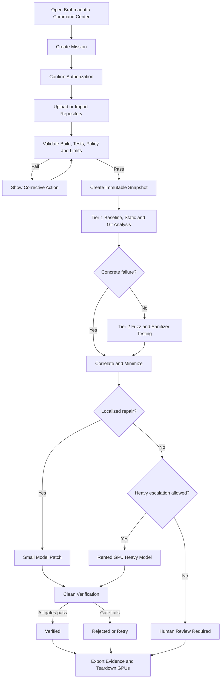
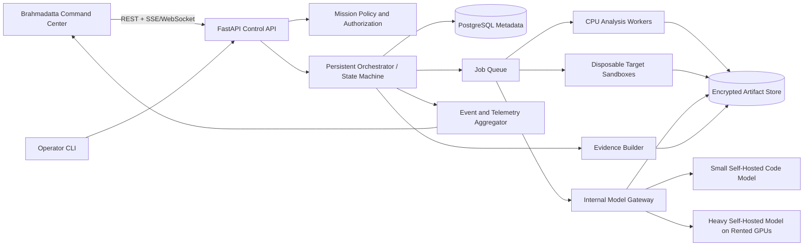
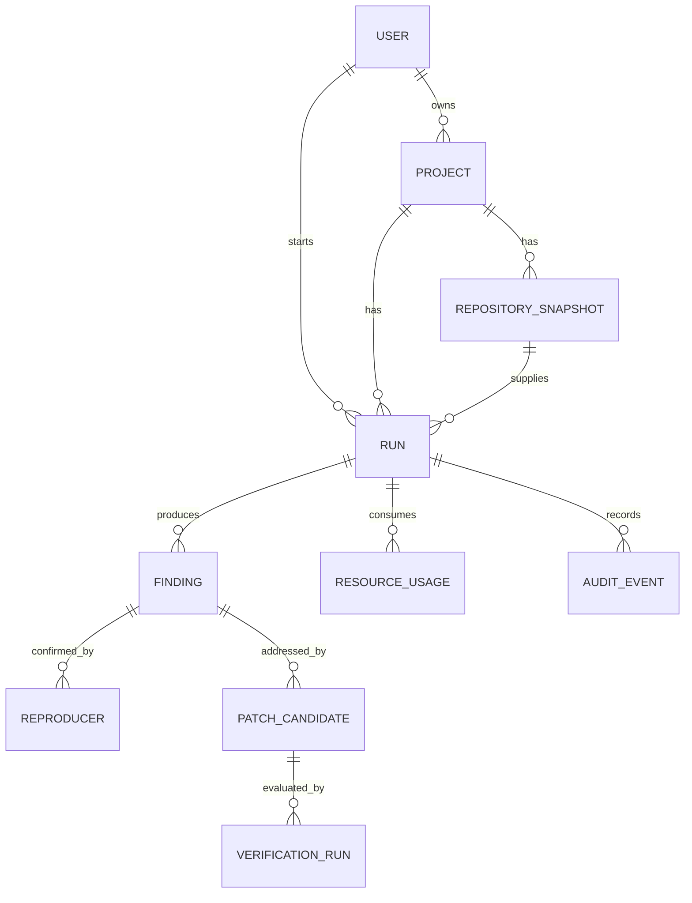

# Brahmadatta AI — Master Competition MVP Documentation

> Consolidated copy of every document in the focused competition pack.


---

# Section: Identity and scope


# Brahmadatta AI — Product Identity

| Field | Value |
|---|---|
| Product | Brahmadatta AI |
| Type | Autonomous defensive Cyber-Reasoning System |
| Release | Competition MVP |
| Compute | Self-hosted models on rented GPUs |
| Primary interface | Brahmadatta Command Center |
| Last updated | 2026-08-06 |

## Name direction

**Brahmadatta AI** is the final product and assistant name. The identity references a divine armor associated with Brahma in Hindu epic tradition, matching the system's purpose: surround software with layered, evidence-driven protection.

The product should be presented respectfully as a technology brand, not as a deity, religious authority, or claim of literal invincibility.

## Product statement

Brahmadatta AI autonomously investigates an authorized codebase, confirms a vulnerability with deterministic evidence, proposes a minimal patch, and proves whether the repair holds.

## Tagline options

Primary: **Autonomous Armor for Software.**

Competition subtitle: **Evidence-Driven Cyber Reasoning, Patching, and Verification.**

## Brand personality

- Formidable but controlled.
- Intelligent but evidence-bound.
- Cinematic but operational.
- Dense but understandable.
- Defensive, sovereign, and trustworthy.

## Naming rules

- Use **Brahmadatta AI** in titles and external communication.
- Use **Brahmadatta** in compact UI labels where space is limited.
- Use **Brahmadatta Command Center** for the dashboard.
- Use **Brahmadatta Core** for the central circular mission visualization.
- Use Brahmadatta AI consistently in every public-facing screen, slide, report, and repository title.

---

## Fixed MVP competition decisions

- **Product name:** Brahmadatta AI.
- **Product type:** an authorized, defensive Cyber-Reasoning System for the AI Kavach competition MVP.
- **Architecture:** three evidence-driven tiers: fast deterministic triage, destructive sandbox testing with lightweight patching, and heavy repository-level reasoning only when escalation is justified.
- **Interface:** a dense futuristic armor-command-center dashboard with a central mission core, live telemetry, drill-down panels, and operator controls. The visual language is original and does not copy third-party logos or branded interface assets.
- **Primary workflow:** authorize → ingest → baseline → analyze → correlate → stress-test → patch → verify → export evidence.
- **Compute:** CPU-first processing with self-hosted models on rented GPU infrastructure. Repository content is not sent to an external inference API.
- **MVP target:** C/C++ repositories first; Python support is optional.
- **Verification rule:** a patch is never accepted on model confidence alone. The original reproducer, regression tests, static checks, and renewed fuzzing determine the verdict.
- **Safety boundary:** authorized repositories and isolated environments only; no public-target scanning, no exploit deployment, and no automatic production merge.

## Open decisions / next review

- Assign the final three-person team roles.
- Lock the rented GPU provider and tested model-serving recipe.
- Replace estimated performance targets with benchmark results.
- Confirm the final competition demo repository and fallback recording.


---

# Section: Product requirements


# Project Vision

| Field | Value |
|---|---|
| Project | Brahmadatta AI |
| Version | 0.2 Competition MVP |
| Status | Working draft |
| Owner | TBD |
| Last updated | 2026-08-06 |

## Vision

Brahmadatta AI will demonstrate that autonomous vulnerability repair becomes more trustworthy and resource-efficient when deterministic evidence is gathered first, lightweight AI handles localized repairs, and heavy reasoning is reserved for confirmed complex cases.

## North-star demonstration

An authorized operator starts a mission from the Brahmadatta Command Center and receives a defensible evidence bundle containing:

- An immutable repository snapshot.
- A confirmed vulnerability or regression.
- A stable minimized reproducer.
- Relevant Git history and the suspected introducing commit.
- A minimal patch candidate.
- Before/after regression, static-analysis, and fuzzing results.
- Tool, model, prompt-schema, and resource-usage records.
- A final verdict of **Verified**, **Rejected**, or **Human Review Required**.

## Product principles

1. Evidence before intelligence.
2. Minimum necessary compute.
3. Fail closed when evidence is incomplete.
4. Prefer minimal diffs to broad refactors.
5. Verification is determined by tools, not model confidence.
6. Keep repository data inside team-controlled infrastructure.
7. Make every dashboard element operationally useful.
8. Preserve a credible path to future sovereign, air-gapped deployment.

## Competition promise

The system will not claim to find every vulnerability. It will prove one complete autonomous loop extremely well: discover, reproduce, locate, patch, and independently verify.

---

## Fixed MVP competition decisions

- **Product name:** Brahmadatta AI.
- **Product type:** an authorized, defensive Cyber-Reasoning System for the AI Kavach competition MVP.
- **Architecture:** three evidence-driven tiers: fast deterministic triage, destructive sandbox testing with lightweight patching, and heavy repository-level reasoning only when escalation is justified.
- **Interface:** a dense futuristic armor-command-center dashboard with a central mission core, live telemetry, drill-down panels, and operator controls. The visual language is original and does not copy third-party logos or branded interface assets.
- **Primary workflow:** authorize → ingest → baseline → analyze → correlate → stress-test → patch → verify → export evidence.
- **Compute:** CPU-first processing with self-hosted models on rented GPU infrastructure. Repository content is not sent to an external inference API.
- **MVP target:** C/C++ repositories first; Python support is optional.
- **Verification rule:** a patch is never accepted on model confidence alone. The original reproducer, regression tests, static checks, and renewed fuzzing determine the verdict.
- **Safety boundary:** authorized repositories and isolated environments only; no public-target scanning, no exploit deployment, and no automatic production merge.

## Open decisions / next review

- Assign the final three-person team roles.
- Lock the rented GPU provider and tested model-serving recipe.
- Replace estimated performance targets with benchmark results.
- Confirm the final competition demo repository and fallback recording.


# Product Requirements Document (PRD)

| Field | Value |
|---|---|
| Project | Brahmadatta AI |
| Version | 0.2 Competition MVP |
| Status | Working draft |
| Owner | TBD |
| Last updated | 2026-08-06 |

## Product summary

Brahmadatta AI combines existing tests, static analysis, Git history, coverage-guided fuzzing, sanitizer evidence, self-hosted code models, and deterministic verification in one autonomous defensive workflow operated through the Brahmadatta Command Center.

## Primary users

- Competition operator running the live demonstration.
- Security engineer reviewing findings and evidence.
- Developer evaluating the generated patch.
- Jury member observing methodology, efficiency, precision, and scalability.

## Functional requirements

### Mission intake
- Accept an authorized Git archive or approved repository URL.
- Create and display an immutable snapshot hash.
- Record build, test, adapter, network, and resource policies.
- Block execution until authorization and preflight validation pass.

### Tier 1 — deterministic triage
- Build and test the unchanged repository to establish a baseline.
- Run Semgrep/compiler checks and normalize findings.
- Summarize dependencies and Git history.
- Run automated `git bisect` when a deterministic pass/fail command exists.

### Tier 2 — stress test and lightweight repair
- Run targets in disposable, unprivileged, resource-limited sandboxes.
- Use sanitizers and AFL++ or libFuzzer to produce concrete failures.
- Minimize a stable reproducer when possible.
- Route localized confirmed issues to a small self-hosted code model.

### Tier 3 — heavy reasoning
- Escalate only confirmed, complex, cross-file cases.
- Use a self-hosted heavy model on rented dedicated GPU infrastructure.
- Send only approved repository context through an internal model gateway.
- Enforce a hard time limit and guaranteed GPU teardown.

### Patching and verification
- Require a constrained unified diff.
- Block restricted files, generated artifacts, broad refactors, and excessive changed lines.
- Rebuild from a clean worktree.
- Re-run the original reproducer, regression suite, static checks, and renewed fuzzing.
- Return Verified, Rejected, Human Review Required, Failed, or Cancelled.

### Command-center UI
- Show the full mission state through the central Brahmadatta Core.
- Display live repository, static, Git, fuzzing, patch, verification, alert, and GPU telemetry.
- Stream updates without page refresh.
- Provide drill-down evidence drawers and a presentation mode.
- Provide safe pause, cancellation, and emergency GPU teardown.
- Never imply that model confidence equals verification.

### Evidence export
- Export Markdown and JSON reports.
- Include hashes, configurations, timelines, evidence, diffs, test results, model/tool versions, and resource usage.

## Non-functional requirements

- CPU-first operation; GPU use is explicit, measured, and capped.
- No external inference API for repository content.
- Network denied by default inside target sandboxes.
- Workflow is resumable, deterministic where possible, and fully auditable.
- Dashboard remains usable at 1440 × 900 and degrades to tabbed rails below 1280 px.
- Critical UI updates appear within two seconds of backend state changes.

## MVP launch gate

- One controlled vulnerability is autonomously discovered, reproduced, patched, and verified.
- One incorrect patch is automatically rejected.
- One Git regression is isolated through bisect.
- The live command center presents the workflow without manual database or terminal intervention.
- Rented GPU resources are visibly released after the run.
- The complete demonstration fits the competition time limit and tested resource envelope.

---

## Fixed MVP competition decisions

- **Product name:** Brahmadatta AI.
- **Product type:** an authorized, defensive Cyber-Reasoning System for the AI Kavach competition MVP.
- **Architecture:** three evidence-driven tiers: fast deterministic triage, destructive sandbox testing with lightweight patching, and heavy repository-level reasoning only when escalation is justified.
- **Interface:** a dense futuristic armor-command-center dashboard with a central mission core, live telemetry, drill-down panels, and operator controls. The visual language is original and does not copy third-party logos or branded interface assets.
- **Primary workflow:** authorize → ingest → baseline → analyze → correlate → stress-test → patch → verify → export evidence.
- **Compute:** CPU-first processing with self-hosted models on rented GPU infrastructure. Repository content is not sent to an external inference API.
- **MVP target:** C/C++ repositories first; Python support is optional.
- **Verification rule:** a patch is never accepted on model confidence alone. The original reproducer, regression tests, static checks, and renewed fuzzing determine the verdict.
- **Safety boundary:** authorized repositories and isolated environments only; no public-target scanning, no exploit deployment, and no automatic production merge.

## Open decisions / next review

- Assign the final three-person team roles.
- Lock the rented GPU provider and tested model-serving recipe.
- Replace estimated performance targets with benchmark results.
- Confirm the final competition demo repository and fallback recording.


# MVP Scope Document

## In scope

- Single-team, single-operator competition deployment.
- Brahmadatta Command Center desktop dashboard.
- One persistent orchestrator, event stream, and job queue.
- C/C++ adapter supporting CMake/Make and CTest.
- Baseline build and regression testing.
- Semgrep and compiler/static checks.
- Sanitizer builds and AFL++ or libFuzzer.
- Crash capture, deduplication, minimization, and regression-test conversion when practical.
- Git summary and automated `git bisect`.
- Small self-hosted code model on one rented GPU.
- Limited heavy-model escalation on a short-lived rented GPU cluster.
- Patch policy, clean verification, evidence database, Markdown/JSON report, and safe teardown.
- Presentation mode and a pre-recorded fallback demonstration.

## Out of scope

- Public multi-tenant SaaS.
- Billing, subscriptions, commercial launch, or customer support operations.
- Legal-policy documents.
- Public-network scanning or unauthorized systems.
- Automatic merge or production deployment.
- Full pretraining of a frontier model from scratch.
- Every language, binary-only targets, distributed global fuzzing, or formal mathematical proof.
- Mobile editing experience.

## Required demo scenarios

1. **Memory-safety defect:** fuzzing produces a sanitizer-confirmed crash and minimized reproducer.
2. **Git regression:** automated bisect identifies the first bad commit.
3. **Verified repair:** a minimal patch removes the reproducer and preserves regression behavior.
4. **Rejected repair:** a tempting crash-only patch fails a regression gate and is rejected.
5. **Resource control:** heavy-model GPUs start only on escalation and are torn down at mission completion.

---

## Fixed MVP competition decisions

- **Product name:** Brahmadatta AI.
- **Product type:** an authorized, defensive Cyber-Reasoning System for the AI Kavach competition MVP.
- **Architecture:** three evidence-driven tiers: fast deterministic triage, destructive sandbox testing with lightweight patching, and heavy repository-level reasoning only when escalation is justified.
- **Interface:** a dense futuristic armor-command-center dashboard with a central mission core, live telemetry, drill-down panels, and operator controls. The visual language is original and does not copy third-party logos or branded interface assets.
- **Primary workflow:** authorize → ingest → baseline → analyze → correlate → stress-test → patch → verify → export evidence.
- **Compute:** CPU-first processing with self-hosted models on rented GPU infrastructure. Repository content is not sent to an external inference API.
- **MVP target:** C/C++ repositories first; Python support is optional.
- **Verification rule:** a patch is never accepted on model confidence alone. The original reproducer, regression tests, static checks, and renewed fuzzing determine the verdict.
- **Safety boundary:** authorized repositories and isolated environments only; no public-target scanning, no exploit deployment, and no automatic production merge.

## Open decisions / next review

- Assign the final three-person team roles.
- Lock the rented GPU provider and tested model-serving recipe.
- Replace estimated performance targets with benchmark results.
- Confirm the final competition demo repository and fallback recording.


# Target User Personas

| Field | Value |
|---|---|
| Project | Brahmadatta AI |
| Version | 0.1 |
| Status | Working draft |
| Owner | TBD |
| Last updated | 2026-08-06 |

## Purpose

Define and operationalize target user personas for the Brahmadatta AI competition MVP on rented GPUs.

## Competition operator
Needs predictable setup, one-command runs, visible stage progress, safe cancellation, and an exportable report.

## Security engineer
Needs reproducible findings, minimized evidence, strict isolation, configurable policy, and minimal patches.

## Repository developer
Needs a reviewable diff, the failing test/reproducer, affected history, and proof that normal behavior remains intact.

## Infrastructure administrator
Needs private networking, quotas, encrypted volumes, secrets isolation, health checks, and automatic GPU shutdown.

## Judge or mentor
Needs a clear novelty story, measured resource use, honest limitations, and evidence independent of model claims.

---

## Fixed MVP competition decisions

- **Product name:** Brahmadatta AI.
- **Product type:** an authorized, defensive Cyber-Reasoning System for the AI Kavach competition MVP.
- **Architecture:** three evidence-driven tiers: fast deterministic triage, destructive sandbox testing with lightweight patching, and heavy repository-level reasoning only when escalation is justified.
- **Interface:** a dense futuristic armor-command-center dashboard with a central mission core, live telemetry, drill-down panels, and operator controls. The visual language is original and does not copy third-party logos or branded interface assets.
- **Primary workflow:** authorize → ingest → baseline → analyze → correlate → stress-test → patch → verify → export evidence.
- **Compute:** CPU-first processing with self-hosted models on rented GPU infrastructure. Repository content is not sent to an external inference API.
- **MVP target:** C/C++ repositories first; Python support is optional.
- **Verification rule:** a patch is never accepted on model confidence alone. The original reproducer, regression tests, static checks, and renewed fuzzing determine the verdict.
- **Safety boundary:** authorized repositories and isolated environments only; no public-target scanning, no exploit deployment, and no automatic production merge.

## Open decisions / next review

- Assign the final three-person team roles.
- Lock the rented GPU provider and tested model-serving recipe.
- Replace estimated performance targets with benchmark results.
- Confirm the final competition demo repository and fallback recording.


# Problem Statement

| Field | Value |
|---|---|
| Project | Brahmadatta AI |
| Version | 0.1 |
| Status | Working draft |
| Owner | TBD |
| Last updated | 2026-08-06 |

## Purpose

Define and operationalize problem statement for the Brahmadatta AI competition MVP on rented GPUs.

Security tools often stop at alerts or crashes. Human experts must still reproduce a defect, locate its root cause, create a safe patch, and prove the patch does not cause regressions. LLM-only repair can be expensive, over-broad, and difficult to trust, while deterministic tools are reliable but limited in cross-file reasoning. The project must combine both approaches so that each confirmed defect receives the least expensive capable reasoning tier and every patch is accepted only through independent evidence.

---

## Fixed MVP competition decisions

- **Product name:** Brahmadatta AI.
- **Product type:** an authorized, defensive Cyber-Reasoning System for the AI Kavach competition MVP.
- **Architecture:** three evidence-driven tiers: fast deterministic triage, destructive sandbox testing with lightweight patching, and heavy repository-level reasoning only when escalation is justified.
- **Interface:** a dense futuristic armor-command-center dashboard with a central mission core, live telemetry, drill-down panels, and operator controls. The visual language is original and does not copy third-party logos or branded interface assets.
- **Primary workflow:** authorize → ingest → baseline → analyze → correlate → stress-test → patch → verify → export evidence.
- **Compute:** CPU-first processing with self-hosted models on rented GPU infrastructure. Repository content is not sent to an external inference API.
- **MVP target:** C/C++ repositories first; Python support is optional.
- **Verification rule:** a patch is never accepted on model confidence alone. The original reproducer, regression tests, static checks, and renewed fuzzing determine the verdict.
- **Safety boundary:** authorized repositories and isolated environments only; no public-target scanning, no exploit deployment, and no automatic production merge.

## Open decisions / next review

- Assign the final three-person team roles.
- Lock the rented GPU provider and tested model-serving recipe.
- Replace estimated performance targets with benchmark results.
- Confirm the final competition demo repository and fallback recording.


# Jobs to Be Done

| Field | Value |
|---|---|
| Project | Brahmadatta AI |
| Version | 0.1 |
| Status | Working draft |
| Owner | TBD |
| Last updated | 2026-08-06 |

## Purpose

Define and operationalize jobs to be done for the Brahmadatta AI competition MVP on rented GPUs.

1. When I receive an authorized repository, establish a trustworthy baseline.
2. When a tool reports a candidate, reproduce and minimize it before spending GPU time.
3. When history exists, isolate the introducing change.
4. When a defect is localized, attempt a fast small-model repair.
5. When a defect is complex, escalate to self-hosted Kimi K3 without sending source to a third-party API.
6. When a patch is produced, independently prove or reject it.
7. When a run ends, export concise evidence and resource use.
8. When resource use or runtime exceeds policy, cancel safely and release compute.

---

## Fixed MVP competition decisions

- **Product name:** Brahmadatta AI.
- **Product type:** an authorized, defensive Cyber-Reasoning System for the AI Kavach competition MVP.
- **Architecture:** three evidence-driven tiers: fast deterministic triage, destructive sandbox testing with lightweight patching, and heavy repository-level reasoning only when escalation is justified.
- **Interface:** a dense futuristic armor-command-center dashboard with a central mission core, live telemetry, drill-down panels, and operator controls. The visual language is original and does not copy third-party logos or branded interface assets.
- **Primary workflow:** authorize → ingest → baseline → analyze → correlate → stress-test → patch → verify → export evidence.
- **Compute:** CPU-first processing with self-hosted models on rented GPU infrastructure. Repository content is not sent to an external inference API.
- **MVP target:** C/C++ repositories first; Python support is optional.
- **Verification rule:** a patch is never accepted on model confidence alone. The original reproducer, regression tests, static checks, and renewed fuzzing determine the verdict.
- **Safety boundary:** authorized repositories and isolated environments only; no public-target scanning, no exploit deployment, and no automatic production merge.

## Open decisions / next review

- Assign the final three-person team roles.
- Lock the rented GPU provider and tested model-serving recipe.
- Replace estimated performance targets with benchmark results.
- Confirm the final competition demo repository and fallback recording.


# User Stories

| Field | Value |
|---|---|
| Project | Brahmadatta AI |
| Version | 0.1 |
| Status | Working draft |
| Owner | TBD |
| Last updated | 2026-08-06 |

## Purpose

Define and operationalize user stories for the Brahmadatta AI competition MVP on rented GPUs.

## Intake
- As an operator, I must confirm authorization before a run starts.
- As a reviewer, I can see the immutable snapshot hash and policy used.

## Discovery
- As a security engineer, I see baseline failures separately from new evidence.
- As a developer, I see deduplicated static findings, a minimized reproducer, and any first bad commit.

## Patching
- As an operator, I see why Tier 2 or Tier 3 was selected.
- As a developer, I receive a constrained unified diff limited to approved files.

## Verification
- As a reviewer, I compare before/after reproducer behavior and regression results.
- As an operator, I receive a clear verified, rejected, or needs-review verdict.

## Operations
- As an administrator, I cap GPU time/lease duration and safely cancel a run.

---

## Fixed MVP competition decisions

- **Product name:** Brahmadatta AI.
- **Product type:** an authorized, defensive Cyber-Reasoning System for the AI Kavach competition MVP.
- **Architecture:** three evidence-driven tiers: fast deterministic triage, destructive sandbox testing with lightweight patching, and heavy repository-level reasoning only when escalation is justified.
- **Interface:** a dense futuristic armor-command-center dashboard with a central mission core, live telemetry, drill-down panels, and operator controls. The visual language is original and does not copy third-party logos or branded interface assets.
- **Primary workflow:** authorize → ingest → baseline → analyze → correlate → stress-test → patch → verify → export evidence.
- **Compute:** CPU-first processing with self-hosted models on rented GPU infrastructure. Repository content is not sent to an external inference API.
- **MVP target:** C/C++ repositories first; Python support is optional.
- **Verification rule:** a patch is never accepted on model confidence alone. The original reproducer, regression tests, static checks, and renewed fuzzing determine the verdict.
- **Safety boundary:** authorized repositories and isolated environments only; no public-target scanning, no exploit deployment, and no automatic production merge.

## Open decisions / next review

- Assign the final three-person team roles.
- Lock the rented GPU provider and tested model-serving recipe.
- Replace estimated performance targets with benchmark results.
- Confirm the final competition demo repository and fallback recording.


# Acceptance Criteria

| Field | Value |
|---|---|
| Project | Brahmadatta AI |
| Version | 0.1 |
| Status | Working draft |
| Owner | TBD |
| Last updated | 2026-08-06 |

## Purpose

Define and operationalize acceptance criteria for the Brahmadatta AI competition MVP on rented GPUs.

- Authorization and immutable snapshot are recorded.
- Target code runs in a disposable network-denied environment.
- Baseline test results are stored before modification.
- A finding is patchable only after stable reproduction.
- A patch is machine-applyable and passes path/size policy.
- Verification occurs in a clean checkout.
- The original reproducer no longer causes the failure.
- Regression results are at least as good as baseline.
- Configured static and fuzz regression gates pass.
- Tool/model versions, hashes, times, and resource use are recorded.
- Unsafe or broken patches are rejected automatically.
- No repository content is sent to an external inference API.

---

## Fixed MVP competition decisions

- **Product name:** Brahmadatta AI.
- **Product type:** an authorized, defensive Cyber-Reasoning System for the AI Kavach competition MVP.
- **Architecture:** three evidence-driven tiers: fast deterministic triage, destructive sandbox testing with lightweight patching, and heavy repository-level reasoning only when escalation is justified.
- **Interface:** a dense futuristic armor-command-center dashboard with a central mission core, live telemetry, drill-down panels, and operator controls. The visual language is original and does not copy third-party logos or branded interface assets.
- **Primary workflow:** authorize → ingest → baseline → analyze → correlate → stress-test → patch → verify → export evidence.
- **Compute:** CPU-first processing with self-hosted models on rented GPU infrastructure. Repository content is not sent to an external inference API.
- **MVP target:** C/C++ repositories first; Python support is optional.
- **Verification rule:** a patch is never accepted on model confidence alone. The original reproducer, regression tests, static checks, and renewed fuzzing determine the verdict.
- **Safety boundary:** authorized repositories and isolated environments only; no public-target scanning, no exploit deployment, and no automatic production merge.

## Open decisions / next review

- Assign the final three-person team roles.
- Lock the rented GPU provider and tested model-serving recipe.
- Replace estimated performance targets with benchmark results.
- Confirm the final competition demo repository and fallback recording.


# Feature List

| Field | Value |
|---|---|
| Project | Brahmadatta AI |
| Version | 0.1 |
| Status | Working draft |
| Owner | TBD |
| Last updated | 2026-08-06 |

## Purpose

Define and operationalize feature list for the Brahmadatta AI competition MVP on rented GPUs.

## P0
Authorization, snapshot, sandboxed build/test, static analysis, C/C++ fuzzing, sanitizer triage, reproducer minimization, Git bisect, tier routing, two self-hosted model tiers, patch policy, clean verification, evidence export, CLI/dashboard, quotas, cancellation, and GPU teardown.

## P1
Python adapter, guided seed generation, patch ranking, coverage visualization, hash-manifested, tamper-evident evidence bundles, offline deployment bundle.

## P2
More languages, distributed fuzzing, repository pull-request integration, formal verification, and on-premises deployment manager.

---

## Fixed MVP competition decisions

- **Product name:** Brahmadatta AI.
- **Product type:** an authorized, defensive Cyber-Reasoning System for the AI Kavach competition MVP.
- **Architecture:** three evidence-driven tiers: fast deterministic triage, destructive sandbox testing with lightweight patching, and heavy repository-level reasoning only when escalation is justified.
- **Interface:** a dense futuristic armor-command-center dashboard with a central mission core, live telemetry, drill-down panels, and operator controls. The visual language is original and does not copy third-party logos or branded interface assets.
- **Primary workflow:** authorize → ingest → baseline → analyze → correlate → stress-test → patch → verify → export evidence.
- **Compute:** CPU-first processing with self-hosted models on rented GPU infrastructure. Repository content is not sent to an external inference API.
- **MVP target:** C/C++ repositories first; Python support is optional.
- **Verification rule:** a patch is never accepted on model confidence alone. The original reproducer, regression tests, static checks, and renewed fuzzing determine the verdict.
- **Safety boundary:** authorized repositories and isolated environments only; no public-target scanning, no exploit deployment, and no automatic production merge.

## Open decisions / next review

- Assign the final three-person team roles.
- Lock the rented GPU provider and tested model-serving recipe.
- Replace estimated performance targets with benchmark results.
- Confirm the final competition demo repository and fallback recording.


# Product Roadmap

| Field | Value |
|---|---|
| Project | Brahmadatta AI |
| Version | 0.1 |
| Status | Working draft |
| Owner | TBD |
| Last updated | 2026-08-06 |

## Purpose

Define and operationalize product roadmap for the Brahmadatta AI competition MVP on rented GPUs.

1. Freeze scope, benchmarks, security controls, and five-slide story.
2. Build deterministic intake, baseline, static analysis, Git, state machine, and evidence.
3. Add sanitizer builds, fuzzing, reproduction, and minimization.
4. Add small-model constrained patching and verification.
5. Validate Kimi K3 serving on rented GPUs and integrate limited escalation.
6. Harden dashboard, reports, startup, cleanup, offline cache, and failure modes.
7. Rehearse competition demo and 36-hour plan.
8. After MVP, move toward on-premises air-gapped deployment.

---

## Fixed MVP competition decisions

- **Product name:** Brahmadatta AI.
- **Product type:** an authorized, defensive Cyber-Reasoning System for the AI Kavach competition MVP.
- **Architecture:** three evidence-driven tiers: fast deterministic triage, destructive sandbox testing with lightweight patching, and heavy repository-level reasoning only when escalation is justified.
- **Interface:** a dense futuristic armor-command-center dashboard with a central mission core, live telemetry, drill-down panels, and operator controls. The visual language is original and does not copy third-party logos or branded interface assets.
- **Primary workflow:** authorize → ingest → baseline → analyze → correlate → stress-test → patch → verify → export evidence.
- **Compute:** CPU-first processing with self-hosted models on rented GPU infrastructure. Repository content is not sent to an external inference API.
- **MVP target:** C/C++ repositories first; Python support is optional.
- **Verification rule:** a patch is never accepted on model confidence alone. The original reproducer, regression tests, static checks, and renewed fuzzing determine the verdict.
- **Safety boundary:** authorized repositories and isolated environments only; no public-target scanning, no exploit deployment, and no automatic production merge.

## Open decisions / next review

- Assign the final three-person team roles.
- Lock the rented GPU provider and tested model-serving recipe.
- Replace estimated performance targets with benchmark results.
- Confirm the final competition demo repository and fallback recording.


# Success Metrics

| Field | Value |
|---|---|
| Project | Brahmadatta AI |
| Version | 0.1 |
| Status | Working draft |
| Owner | TBD |
| Last updated | 2026-08-06 |

## Purpose

Define and operationalize success metrics for the Brahmadatta AI competition MVP on rented GPUs.

Rows below are targets until the benchmark case set in `.project/evidence/d8-benchmark-case-set.json`
has a measured run attached.

| Metric | MVP target | Publication status |
|---|---:|---|
| Confirmed-finding precision on chosen benchmarks | ≥80% | Target - not measured |
| Reproducer elimination for accepted patches | 100% | Enumerated on BD-001-A; not a percentage benchmark |
| Regression preservation for accepted patches | 100% | Enumerated on BD-001-A; not a percentage benchmark |
| Verified patch rate on selected solvable cases | ≥50% | Target - not measured |
| Median time to first confirmed finding | ≤30 min | Target - not measured |
| Median confirmation-to-verdict time | ≤45 min | Target - not measured |
| Tier 3 escalation rate | ≤30% | Not applicable to the CPU/local-model MVP cut |
| Complete evidence reports | 100% | Target - not measured |
| Unauthorized target network calls | 0 | Target - guarded by topology tests; full benchmark pending |
| Unreleased GPU idle time after run | <10 min | Not applicable to the CPU/local-model MVP cut |

---

## Fixed MVP competition decisions

- **Product name:** Brahmadatta AI.
- **Product type:** an authorized, defensive Cyber-Reasoning System for the AI Kavach competition MVP.
- **Architecture:** three evidence-driven tiers: fast deterministic triage, destructive sandbox testing with lightweight patching, and heavy repository-level reasoning only when escalation is justified.
- **Interface:** a dense futuristic armor-command-center dashboard with a central mission core, live telemetry, drill-down panels, and operator controls. The visual language is original and does not copy third-party logos or branded interface assets.
- **Primary workflow:** authorize → ingest → baseline → analyze → correlate → stress-test → patch → verify → export evidence.
- **Compute:** CPU-first processing with self-hosted models on rented GPU infrastructure. Repository content is not sent to an external inference API.
- **MVP target:** C/C++ repositories first; Python support is optional.
- **Verification rule:** a patch is never accepted on model confidence alone. The original reproducer, regression tests, static checks, and renewed fuzzing determine the verdict.
- **Safety boundary:** authorized repositories and isolated environments only; no public-target scanning, no exploit deployment, and no automatic production merge.

## Open decisions / next review

- Assign the final three-person team roles.
- Lock the rented GPU provider and tested model-serving recipe.
- Replace estimated performance targets with benchmark results.
- Confirm the final competition demo repository and fallback recording.


# Competitor Analysis

| Field | Value |
|---|---|
| Project | Brahmadatta AI |
| Version | 0.1 |
| Status | Working draft |
| Owner | TBD |
| Last updated | 2026-08-06 |

## Purpose

Define and operationalize competitor analysis for the Brahmadatta AI competition MVP on rented GPUs.

| Approach | Strength | Limitation | Brahmadatta AI difference |
|---|---|---|---|
| Static-only | Fast and deterministic | Stops at alerts | Reproduces, patches, and verifies |
| Fuzzer-only | Concrete crashes | Needs manual repair | Connects crash, Git history, AI, and proof |
| General coding agent | Flexible | Broad context and self-judgment | Constrained tools and independent gates |
| LLM-only scanner | Easy prototype | Cost and hallucination risk | Evidence-first tier routing |
| Manual expert | Strong judgment | Slow and scarce | Automates repeatable evidence work |

The novelty is the orchestration policy, Git-aware context reduction, compute escalation, evidence contract, and sovereign deployment path—not invention of the underlying tools.

---

## Fixed MVP competition decisions

- **Product name:** Brahmadatta AI.
- **Product type:** an authorized, defensive Cyber-Reasoning System for the AI Kavach competition MVP.
- **Architecture:** three evidence-driven tiers: fast deterministic triage, destructive sandbox testing with lightweight patching, and heavy repository-level reasoning only when escalation is justified.
- **Interface:** a dense futuristic armor-command-center dashboard with a central mission core, live telemetry, drill-down panels, and operator controls. The visual language is original and does not copy third-party logos or branded interface assets.
- **Primary workflow:** authorize → ingest → baseline → analyze → correlate → stress-test → patch → verify → export evidence.
- **Compute:** CPU-first processing with self-hosted models on rented GPU infrastructure. Repository content is not sent to an external inference API.
- **MVP target:** C/C++ repositories first; Python support is optional.
- **Verification rule:** a patch is never accepted on model confidence alone. The original reproducer, regression tests, static checks, and renewed fuzzing determine the verdict.
- **Safety boundary:** authorized repositories and isolated environments only; no public-target scanning, no exploit deployment, and no automatic production merge.

## Open decisions / next review

- Assign the final three-person team roles.
- Lock the rented GPU provider and tested model-serving recipe.
- Replace estimated performance targets with benchmark results.
- Confirm the final competition demo repository and fallback recording.


---

# Section: UI and operator experience


# UI Design Direction

| Field | Value |
|---|---|
| Product | Brahmadatta AI |
| Interface | Brahmadatta Command Center |
| Visual direction | Futuristic armored-assistant mission control |
| Primary viewport | Desktop, 1440 × 900 and above |
| Last updated | 2026-08-06 |

## Design goal

Create a dashboard that feels like an advanced armored operating system: visually impressive, information-dense, and immediately useful during a live cyber-reasoning run. The interface may evoke the general feeling of cinematic suit-control systems, but it must use original geometry, icons, wording, and branding.

## Core visual language

- Near-black and deep navy background.
- Cyan, ice-blue, and white as primary information colors.
- Green for verified or operational states.
- Amber for warnings, escalation, and medium severity.
- Red only for critical findings, failed gates, or unsafe conditions.
- Thin luminous borders, nested glass panels, subtle grids, precise typography, and restrained glow.
- Circular instrumentation at the center; rectangular evidence panels around it.
- Charts, counters, and animations must display real system telemetry. Decorative fake metrics are prohibited.

## Information architecture

### Top command bar

- Brahmadatta AI identity and release label.
- System state: idle, operational, degraded, paused, or failed.
- Mission elapsed time.
- Active repository and branch/snapshot.
- Current threat level derived from confirmed findings.
- AI confidence shown only beside its source and never as a verification result.
- UTC clock and operator identity.

### Left analysis rail

- Repository status and immutable snapshot hash.
- Baseline build and regression status.
- Static-analysis findings by severity.
- Dependency and compiler health.
- Coverage and risky-change summaries.

### Central Brahmadatta Core

The central radial component shows the active mission phase:

1. **Ingest**
2. **Analyze**
3. **Correlate**
4. **Stress Test**
5. **Remediate**
6. **Verify**

The center displays the final mission state: protected, investigating, vulnerability confirmed, patching, verified, rejected, human review, or failed.

### Right remediation rail

- Prioritized vulnerability queue.
- Live fuzzing executions, crashes, unique findings, and coverage.
- Patch-generation attempts and their state.
- Model routing: deterministic, lightweight model, or heavy model.
- Verification gate summary.

### Lower evidence deck

- Git bisect timeline.
- System alerts and operator-required actions.
- Rented GPU utilization, memory, active lease time, and teardown state.
- Regression-test results.
- Evidence-bundle readiness and export control.

### Footer control strip

- Secure-session status.
- Operator and mission ID.
- Command palette.
- Log-stream rate.
- Artifact-vault state.
- Safe pause, cancel, and emergency teardown controls.

## Complexity rules

- Use progressive disclosure: summary first, evidence drawer second, raw logs third.
- Keep no more than one dominant visual focal point.
- Do not show a metric unless the operator can act on it or use it as evidence.
- Critical controls require labels, confirmation, and visible consequences.
- Use motion to communicate state changes, not to decorate idle screens.

## Responsive scope

The competition MVP is desktop-first. At widths below 1280 px, collapse side rails into tabbed drawers and preserve the central mission core. Mobile is read-only and out of scope.

---

## Fixed MVP competition decisions

- **Product name:** Brahmadatta AI.
- **Product type:** an authorized, defensive Cyber-Reasoning System for the AI Kavach competition MVP.
- **Architecture:** three evidence-driven tiers: fast deterministic triage, destructive sandbox testing with lightweight patching, and heavy repository-level reasoning only when escalation is justified.
- **Interface:** a dense futuristic armor-command-center dashboard with a central mission core, live telemetry, drill-down panels, and operator controls. The visual language is original and does not copy third-party logos or branded interface assets.
- **Primary workflow:** authorize → ingest → baseline → analyze → correlate → stress-test → patch → verify → export evidence.
- **Compute:** CPU-first processing with self-hosted models on rented GPU infrastructure. Repository content is not sent to an external inference API.
- **MVP target:** C/C++ repositories first; Python support is optional.
- **Verification rule:** a patch is never accepted on model confidence alone. The original reproducer, regression tests, static checks, and renewed fuzzing determine the verdict.
- **Safety boundary:** authorized repositories and isolated environments only; no public-target scanning, no exploit deployment, and no automatic production merge.

## Open decisions / next review

- Assign the final three-person team roles.
- Lock the rented GPU provider and tested model-serving recipe.
- Replace estimated performance targets with benchmark results.
- Confirm the final competition demo repository and fallback recording.


# User Flow Diagrams

## Primary competition flow



## Finding drill-down flow

```text
Vulnerability Queue
  → Finding Summary
  → Reproducer and Trace
  → Related Code and Git History
  → Routing Explanation
  → Patch Attempt
  → Verification Matrix
```

## Safe cancellation flow

```text
Operator requests cancellation
  → stop scheduling new work
  → terminate current sandbox at safe boundary
  → persist logs and partial evidence
  → terminate model jobs
  → release rented GPUs and temporary disks
  → mark mission Cancelled
```

---

## Fixed MVP competition decisions

- **Product name:** Brahmadatta AI.
- **Product type:** an authorized, defensive Cyber-Reasoning System for the AI Kavach competition MVP.
- **Architecture:** three evidence-driven tiers: fast deterministic triage, destructive sandbox testing with lightweight patching, and heavy repository-level reasoning only when escalation is justified.
- **Interface:** a dense futuristic armor-command-center dashboard with a central mission core, live telemetry, drill-down panels, and operator controls. The visual language is original and does not copy third-party logos or branded interface assets.
- **Primary workflow:** authorize → ingest → baseline → analyze → correlate → stress-test → patch → verify → export evidence.
- **Compute:** CPU-first processing with self-hosted models on rented GPU infrastructure. Repository content is not sent to an external inference API.
- **MVP target:** C/C++ repositories first; Python support is optional.
- **Verification rule:** a patch is never accepted on model confidence alone. The original reproducer, regression tests, static checks, and renewed fuzzing determine the verdict.
- **Safety boundary:** authorized repositories and isolated environments only; no public-target scanning, no exploit deployment, and no automatic production merge.

## Open decisions / next review

- Assign the final three-person team roles.
- Lock the rented GPU provider and tested model-serving recipe.
- Replace estimated performance targets with benchmark results.
- Confirm the final competition demo repository and fallback recording.


# Wireframes

## 1. Mission Setup

```text
┌ BRAHMADATTA AI ─ CREATE MISSION ─────────────────────────────────────────────┐
│ Repository [Upload / Approved URL]     Snapshot [pending]                    │
│ Authorization [✓]                                                          │
│ Adapter [C/C++] Build [cmake ...] Tests [ctest ...]                         │
│ Network [Denied] CPU [8] RAM [16 GB] Time [90m]                             │
│ Lightweight GPU [30m] Heavy escalation [Enabled, max 20m]                   │
│ [Run Preflight]                                            [Start Mission]   │
└──────────────────────────────────────────────────────────────────────────────┘
```

## 2. Live Brahmadatta Command Center

```text
┌ Identity / status / mission time / active repo / threat / UTC ──────────────┐
├ Repository & static ───┬──────────── BRAHMADATTA CORE ─────────┬ Queue ─────┤
│ baseline               │       INGEST • ANALYZE • CORRELATE     │ findings   │
│ findings               │       STRESS TEST • PATCH • VERIFY     │ fuzzing    │
│ dependencies           │       central state and progress       │ patches    │
├ Git bisect ────────────┼ Alerts ──────────┬ Rented GPU health ──┼ Tests ─────┤
│ commit timeline        │ operator actions │ lease / VRAM / util  │ pass/fail  │
├ secure session / command palette / logs / artifact vault / safe cancel ─────┤
└──────────────────────────────────────────────────────────────────────────────┘
```

## 3. Finding Drawer

```text
CVE/Rule • Severity • Confirmed by • Source location
Reproducer | Sanitizer trace | Code context | Git origin
Routing: Tier 2 because localized in one function
[Open Patch Attempt] [Export Finding]
```

## 4. Patch and Verification

```text
Unified Diff                  Verification Matrix
+ bounds check                Compile       PASS
+ length validation           Reproducer    PASS: no crash
Changed lines: 8              Regression    PASS
Restricted files: none        Static delta  PASS
Model tier: Lightweight       Renewed fuzz  PASS
                              FINAL: VERIFIED
```

## 5. Presentation Mode

```text
[Large Brahmadatta Core]
Current phase • confirmed evidence • first bad commit • patch • final verdict
Resource efficiency: CPU stages / GPU escalation / lease teardown
```

---

## Fixed MVP competition decisions

- **Product name:** Brahmadatta AI.
- **Product type:** an authorized, defensive Cyber-Reasoning System for the AI Kavach competition MVP.
- **Architecture:** three evidence-driven tiers: fast deterministic triage, destructive sandbox testing with lightweight patching, and heavy repository-level reasoning only when escalation is justified.
- **Interface:** a dense futuristic armor-command-center dashboard with a central mission core, live telemetry, drill-down panels, and operator controls. The visual language is original and does not copy third-party logos or branded interface assets.
- **Primary workflow:** authorize → ingest → baseline → analyze → correlate → stress-test → patch → verify → export evidence.
- **Compute:** CPU-first processing with self-hosted models on rented GPU infrastructure. Repository content is not sent to an external inference API.
- **MVP target:** C/C++ repositories first; Python support is optional.
- **Verification rule:** a patch is never accepted on model confidence alone. The original reproducer, regression tests, static checks, and renewed fuzzing determine the verdict.
- **Safety boundary:** authorized repositories and isolated environments only; no public-target scanning, no exploit deployment, and no automatic production merge.

## Open decisions / next review

- Assign the final three-person team roles.
- Lock the rented GPU provider and tested model-serving recipe.
- Replace estimated performance targets with benchmark results.
- Confirm the final competition demo repository and fallback recording.


# Accessibility Requirements

| Field | Value |
|---|---|
| Project | Brahmadatta AI |
| Version | 0.1 |
| Status | Working draft |
| Owner | TBD |
| Last updated | 2026-08-06 |

## Purpose

Define and operationalize accessibility requirements for the Brahmadatta AI competition MVP on rented GPUs.

Aim for WCAG 2.2 AA on critical flows. All actions must be keyboard reachable; focus must be visible; forms need persistent labels and linked errors; status must use text/icon rather than color alone; tables need headers; live updates must be polite and pausable; diff additions/removals need textual labels; destructive actions require clear confirmation; support 200% zoom and reduced motion.

---

## Fixed MVP competition decisions

- **Product name:** Brahmadatta AI.
- **Product type:** an authorized, defensive Cyber-Reasoning System for the AI Kavach competition MVP.
- **Architecture:** three evidence-driven tiers: fast deterministic triage, destructive sandbox testing with lightweight patching, and heavy repository-level reasoning only when escalation is justified.
- **Interface:** a dense futuristic armor-command-center dashboard with a central mission core, live telemetry, drill-down panels, and operator controls. The visual language is original and does not copy third-party logos or branded interface assets.
- **Primary workflow:** authorize → ingest → baseline → analyze → correlate → stress-test → patch → verify → export evidence.
- **Compute:** CPU-first processing with self-hosted models on rented GPU infrastructure. Repository content is not sent to an external inference API.
- **MVP target:** C/C++ repositories first; Python support is optional.
- **Verification rule:** a patch is never accepted on model confidence alone. The original reproducer, regression tests, static checks, and renewed fuzzing determine the verdict.
- **Safety boundary:** authorized repositories and isolated environments only; no public-target scanning, no exploit deployment, and no automatic production merge.

## Open decisions / next review

- Assign the final three-person team roles.
- Lock the rented GPU provider and tested model-serving recipe.
- Replace estimated performance targets with benchmark results.
- Confirm the final competition demo repository and fallback recording.


# Dashboard Screen Specification

## Screen 1 — Mission Setup

Purpose: configure one authorized repository run.

Required controls:
- Repository archive or approved repository URL.
- Authorization confirmation.
- Immutable snapshot preview.
- Language/build/test adapter.
- Time, CPU, memory, storage, and GPU limits.
- Network policy, denied by default.
- Heavy-model escalation toggle and maximum lease time.
- Preflight validation and Start Mission actions.

Exit condition: the snapshot, commands, policy, and resource ceilings validate successfully.

## Screen 2 — Live Command Center

Purpose: monitor the autonomous workflow and intervene safely.

Primary elements:
- Central Brahmadatta Core with phase progress.
- Repository, static, fuzzing, patch, test, Git, alert, and GPU panels.
- Live event stream through server-sent events or WebSocket.
- Mission controls: pause after current stage, cancel safely, emergency GPU teardown.
- Click any panel to open a detailed evidence drawer.

## Screen 3 — Finding Detail

Sections:
- Severity, confidence source, location, analyzer, and deduplication group.
- Sanitizer trace or concrete failing test.
- Minimized reproducer.
- Related code slice and dependency graph.
- Suspected introducing commit and Git diff.
- Routing explanation and next stage.

## Screen 4 — Patch Review

Sections:
- Unified diff with changed-line count and restricted-file warnings.
- Model tier and exact context used.
- Patch rationale separated from evidence.
- Compile result, reproducer result, regression result, static delta, and fuzz delta.
- Verdict: verified, rejected, or human review required.
- No merge-to-production control in the MVP.

## Screen 5 — Evidence Report

Sections:
- Repository snapshot and configuration.
- Chronological mission timeline.
- Confirmed finding and reproducer.
- Git history and root-cause evidence.
- Proposed patch.
- Before/after verification matrix.
- Tool/model versions and prompts/schema hashes.
- CPU/GPU usage and teardown confirmation.
- Export to Markdown and JSON.

## Screen 6 — System and GPU Health

Sections:
- CPU worker pool.
- Sandboxes and active resource limits.
- Small-model server health.
- Heavy-model rented cluster status.
- GPU memory, utilization, queue, lease timer, and last heartbeat.
- One-click safe teardown with confirmation.

---

## Fixed MVP competition decisions

- **Product name:** Brahmadatta AI.
- **Product type:** an authorized, defensive Cyber-Reasoning System for the AI Kavach competition MVP.
- **Architecture:** three evidence-driven tiers: fast deterministic triage, destructive sandbox testing with lightweight patching, and heavy repository-level reasoning only when escalation is justified.
- **Interface:** a dense futuristic armor-command-center dashboard with a central mission core, live telemetry, drill-down panels, and operator controls. The visual language is original and does not copy third-party logos or branded interface assets.
- **Primary workflow:** authorize → ingest → baseline → analyze → correlate → stress-test → patch → verify → export evidence.
- **Compute:** CPU-first processing with self-hosted models on rented GPU infrastructure. Repository content is not sent to an external inference API.
- **MVP target:** C/C++ repositories first; Python support is optional.
- **Verification rule:** a patch is never accepted on model confidence alone. The original reproducer, regression tests, static checks, and renewed fuzzing determine the verdict.
- **Safety boundary:** authorized repositories and isolated environments only; no public-target scanning, no exploit deployment, and no automatic production merge.

## Open decisions / next review

- Assign the final three-person team roles.
- Lock the rented GPU provider and tested model-serving recipe.
- Replace estimated performance targets with benchmark results.
- Confirm the final competition demo repository and fallback recording.


# Operator Interaction Model

## Operating principle

Brahmadatta AI is autonomous inside a fixed policy, while the human operator controls authorization, resource ceilings, escalation permission, cancellation, and final review.

## Main interaction path

```text
Create Mission
  → Validate Authorization and Repository
  → Confirm Resource Policy
  → Start Mission
  → Observe Brahmadatta Core
  → Inspect Confirmed Finding
  → Observe Patch and Verification
  → Export Evidence
  → Mark for Human Review
```

## Command palette

Open with `Ctrl/Cmd + K`. Suggested commands:

- Open mission setup.
- Focus current stage.
- Open vulnerability queue.
- Show Git bisect.
- Show verification matrix.
- Pause after current stage.
- Cancel mission safely.
- Tear down idle rented GPUs.
- Export evidence.

Destructive commands always require confirmation and display the cleanup steps that will occur.

## Panel behavior

- Single click: select and summarize.
- Double click or Enter: open detail drawer.
- Escape: close drawer without changing mission state.
- Pin: keep a panel visible during phase transitions.
- Compare: place before/after evidence side by side.

## System feedback

- Every operator action receives an immediate acknowledgement.
- Long tasks expose stage, elapsed time, latest heartbeat, and cancel behavior.
- Failure messages state what failed, what remains safe, and the next recovery action.
- Model confidence is visually distinct from verified evidence.
- A successful patch displays **Verified** only after all required gates pass.

## Presentation mode

A competition presentation toggle hides setup complexity and enlarges:
- The central mission core.
- Current stage and elapsed time.
- Confirmed evidence.
- Git root cause.
- Patch diff.
- Verification result.
- GPU/resource-efficiency summary.

---

## Fixed MVP competition decisions

- **Product name:** Brahmadatta AI.
- **Product type:** an authorized, defensive Cyber-Reasoning System for the AI Kavach competition MVP.
- **Architecture:** three evidence-driven tiers: fast deterministic triage, destructive sandbox testing with lightweight patching, and heavy repository-level reasoning only when escalation is justified.
- **Interface:** a dense futuristic armor-command-center dashboard with a central mission core, live telemetry, drill-down panels, and operator controls. The visual language is original and does not copy third-party logos or branded interface assets.
- **Primary workflow:** authorize → ingest → baseline → analyze → correlate → stress-test → patch → verify → export evidence.
- **Compute:** CPU-first processing with self-hosted models on rented GPU infrastructure. Repository content is not sent to an external inference API.
- **MVP target:** C/C++ repositories first; Python support is optional.
- **Verification rule:** a patch is never accepted on model confidence alone. The original reproducer, regression tests, static checks, and renewed fuzzing determine the verdict.
- **Safety boundary:** authorized repositories and isolated environments only; no public-target scanning, no exploit deployment, and no automatic production merge.

## Open decisions / next review

- Assign the final three-person team roles.
- Lock the rented GPU provider and tested model-serving recipe.
- Replace estimated performance targets with benchmark results.
- Confirm the final competition demo repository and fallback recording.


# UI Component Inventory

## Global components

- `CommandBar`
- `MissionStatusBadge`
- `ThreatLevelIndicator`
- `ElapsedMissionTimer`
- `SecureSessionIndicator`
- `CommandPalette`
- `ConfirmationDialog`
- `EvidenceDrawer`
- `ToastAndAlertStack`

## Mission components

- `BrahmadattaCore`
- `PhaseRing`
- `MissionProgressRail`
- `RepositoryStatusPanel`
- `BaselineHealthPanel`
- `StaticFindingsPanel`
- `VulnerabilityQueue`
- `FuzzingActivityPanel`
- `PatchGenerationPanel`
- `VerificationMatrix`
- `GitBisectTimeline`
- `SystemAlertPanel`
- `GpuClusterHealthPanel`
- `RegressionTestPanel`
- `ArtifactVaultPanel`

## Visualization components

- Severity donut.
- Coverage sparkline.
- Execution-rate waveform.
- Test-results ring.
- GPU utilization and memory graph.
- Commit timeline.
- Diff viewer.
- State-machine timeline.

## Component requirements

Each component must support loading, empty, active, degraded, error, and complete states; keyboard focus; test identifiers; reduced motion; and mock data for the pitch demonstration.

---

## Fixed MVP competition decisions

- **Product name:** Brahmadatta AI.
- **Product type:** an authorized, defensive Cyber-Reasoning System for the AI Kavach competition MVP.
- **Architecture:** three evidence-driven tiers: fast deterministic triage, destructive sandbox testing with lightweight patching, and heavy repository-level reasoning only when escalation is justified.
- **Interface:** a dense futuristic armor-command-center dashboard with a central mission core, live telemetry, drill-down panels, and operator controls. The visual language is original and does not copy third-party logos or branded interface assets.
- **Primary workflow:** authorize → ingest → baseline → analyze → correlate → stress-test → patch → verify → export evidence.
- **Compute:** CPU-first processing with self-hosted models on rented GPU infrastructure. Repository content is not sent to an external inference API.
- **MVP target:** C/C++ repositories first; Python support is optional.
- **Verification rule:** a patch is never accepted on model confidence alone. The original reproducer, regression tests, static checks, and renewed fuzzing determine the verdict.
- **Safety boundary:** authorized repositories and isolated environments only; no public-target scanning, no exploit deployment, and no automatic production merge.

## Open decisions / next review

- Assign the final three-person team roles.
- Lock the rented GPU provider and tested model-serving recipe.
- Replace estimated performance targets with benchmark results.
- Confirm the final competition demo repository and fallback recording.


# UI State and Motion Specification

## Mission states

| State | Core behavior | Primary color | Operator meaning |
|---|---|---|---|
| Idle | Slow static ring | Blue | Ready for a mission |
| Validating | Inward scan pulse | Cyan | Checking configuration |
| Analyzing | Rotating segmented ring | Cyan | Deterministic tools running |
| Stress testing | Rapid outer waveform | Amber | Sandboxed fuzzing active |
| Patching | Focused inner pulse | Blue-white | Patch candidate being produced |
| Verifying | Alternating before/after arcs | Cyan/green | Required gates executing |
| Verified | Stable shield lock | Green | All gates passed |
| Rejected | Broken patch arc | Red | Candidate failed evidence gates |
| Human review | Paused amber halo | Amber | Policy requires a person |
| Failed | Static red alert ring | Red | Mission cannot continue safely |

## Motion rules

- Default transitions: 150–300 ms.
- Long-running phase motion should be slow and non-distracting.
- No flashing above safe accessibility thresholds.
- Reduced-motion mode replaces rotation and pulses with progress bars and state text.
- A severity change may animate once, then become static.
- Critical alerts may use a single border pulse, never continuous flashing.

## Sound

Sound is off by default. Optional competition mode may use a subtle completion tone and critical alert tone; neither is required for operation.

---

## Fixed MVP competition decisions

- **Product name:** Brahmadatta AI.
- **Product type:** an authorized, defensive Cyber-Reasoning System for the AI Kavach competition MVP.
- **Architecture:** three evidence-driven tiers: fast deterministic triage, destructive sandbox testing with lightweight patching, and heavy repository-level reasoning only when escalation is justified.
- **Interface:** a dense futuristic armor-command-center dashboard with a central mission core, live telemetry, drill-down panels, and operator controls. The visual language is original and does not copy third-party logos or branded interface assets.
- **Primary workflow:** authorize → ingest → baseline → analyze → correlate → stress-test → patch → verify → export evidence.
- **Compute:** CPU-first processing with self-hosted models on rented GPU infrastructure. Repository content is not sent to an external inference API.
- **MVP target:** C/C++ repositories first; Python support is optional.
- **Verification rule:** a patch is never accepted on model confidence alone. The original reproducer, regression tests, static checks, and renewed fuzzing determine the verdict.
- **Safety boundary:** authorized repositories and isolated environments only; no public-target scanning, no exploit deployment, and no automatic production merge.

## Open decisions / next review

- Assign the final three-person team roles.
- Lock the rented GPU provider and tested model-serving recipe.
- Replace estimated performance targets with benchmark results.
- Confirm the final competition demo repository and fallback recording.


---

# Section: Architecture and security engineering


# System Architecture Document

## Architecture



## Three-tier execution architecture

### Tier 1 — Speed and sanity
- Baseline build and tests.
- Static analysis and compiler diagnostics.
- Dependency inventory.
- Git history and automated bisect.
- CPU-first and always attempted before model escalation.

### Tier 2 — Destructive testing and lightweight patching
- Sanitizer-enabled builds.
- AFL++ or libFuzzer.
- Crash deduplication and minimization.
- Small self-hosted code model for localized defects.

### Tier 3 — Heavy repository reasoning
- Only receives confirmed complex cases.
- Runs through an internal model gateway on rented dedicated GPUs.
- Uses a bounded context package, time limit, diff schema, and policy checks.
- Returns a patch candidate, never a verification verdict.

## Trust boundaries

1. Operator browser to control API.
2. Control plane to worker network.
3. Disposable target execution boundary.
4. Model network receiving approved context only.
5. Artifact and evidence storage boundary.
6. Rented GPU provider boundary with temporary credentials and teardown controls.

## Mission state machine

`CREATED → VALIDATING → SNAPSHOTTED → BASELINE → TRIAGE → STRESS_TEST → CORRELATE → PATCH → VERIFY → VERIFIED / REJECTED / HUMAN_REVIEW / FAILED / CANCELLED`

## UI event model

Every state transition emits an immutable event containing mission ID, sequence number, timestamp, stage, status, user-safe message, evidence references, and metrics. The UI reconstructs the command-center state from the event stream and periodic summary snapshots.

## Authority model

Models cannot merge code, change policy, access provider credentials, widen network access, suppress failed tests, or declare verification. The orchestrator owns all tools and final state transitions.

---

## Fixed MVP competition decisions

- **Product name:** Brahmadatta AI.
- **Product type:** an authorized, defensive Cyber-Reasoning System for the AI Kavach competition MVP.
- **Architecture:** three evidence-driven tiers: fast deterministic triage, destructive sandbox testing with lightweight patching, and heavy repository-level reasoning only when escalation is justified.
- **Interface:** a dense futuristic armor-command-center dashboard with a central mission core, live telemetry, drill-down panels, and operator controls. The visual language is original and does not copy third-party logos or branded interface assets.
- **Primary workflow:** authorize → ingest → baseline → analyze → correlate → stress-test → patch → verify → export evidence.
- **Compute:** CPU-first processing with self-hosted models on rented GPU infrastructure. Repository content is not sent to an external inference API.
- **MVP target:** C/C++ repositories first; Python support is optional.
- **Verification rule:** a patch is never accepted on model confidence alone. The original reproducer, regression tests, static checks, and renewed fuzzing determine the verdict.
- **Safety boundary:** authorized repositories and isolated environments only; no public-target scanning, no exploit deployment, and no automatic production merge.

## Open decisions / next review

- Assign the final three-person team roles.
- Lock the rented GPU provider and tested model-serving recipe.
- Replace estimated performance targets with benchmark results.
- Confirm the final competition demo repository and fallback recording.


# Technology Stack Document

| Layer | Competition MVP choice |
|---|---|
| Command-center frontend | React, TypeScript, Vite, CSS variables/Tailwind-style utilities |
| Visualization | SVG/Canvas for the Brahmadatta Core; chart library for telemetry; syntax-highlighted diff viewer |
| Live updates | Server-sent events by default; WebSocket only where bidirectional streaming is necessary |
| Control API | Python, FastAPI, Pydantic schemas |
| Orchestration | Explicit persistent state machine |
| Queue | Redis with RQ/Celery or a DB-backed queue |
| Metadata | PostgreSQL; SQLite permitted for the earliest single-machine prototype |
| Artifacts | Encrypted S3-compatible storage or encrypted volume |
| Isolation | Rootless Docker/Podman; microVM/VM adapter for higher-risk targets |
| Static analysis | Semgrep, compiler warnings, optional CodeQL/Joern adapter |
| Dynamic analysis | AFL++, libFuzzer, Address/UndefinedBehavior sanitizers; optional Atheris |
| Tests | CTest/PyTest and configured command adapter |
| Git | Native Git CLI and `git bisect run` wrapper |
| Small-model serving | Self-hosted inference engine on one rented GPU |
| Heavy-model serving | Validated self-hosted engine on a short-lived rented multi-GPU cluster |
| Observability | Structured JSON logs, trace IDs, Prometheus-compatible metrics |
| Packaging | Docker Compose for development; scripted competition deployment |

## Frontend implementation notes

- Build the central Brahmadatta Core in SVG before considering WebGL.
- Use design tokens for color, glow, spacing, typography, and motion.
- Virtualize long event, finding, and log lists.
- Separate mission state from visual animation state.
- Provide deterministic mock telemetry for rehearsals and screenshots.

## Reproducibility requirements

Pin container images, tool versions, model artifacts, prompts, JSON schemas, and dependency lockfiles. Record all identifiers in the evidence report.

---

## Fixed MVP competition decisions

- **Product name:** Brahmadatta AI.
- **Product type:** an authorized, defensive Cyber-Reasoning System for the AI Kavach competition MVP.
- **Architecture:** three evidence-driven tiers: fast deterministic triage, destructive sandbox testing with lightweight patching, and heavy repository-level reasoning only when escalation is justified.
- **Interface:** a dense futuristic armor-command-center dashboard with a central mission core, live telemetry, drill-down panels, and operator controls. The visual language is original and does not copy third-party logos or branded interface assets.
- **Primary workflow:** authorize → ingest → baseline → analyze → correlate → stress-test → patch → verify → export evidence.
- **Compute:** CPU-first processing with self-hosted models on rented GPU infrastructure. Repository content is not sent to an external inference API.
- **MVP target:** C/C++ repositories first; Python support is optional.
- **Verification rule:** a patch is never accepted on model confidence alone. The original reproducer, regression tests, static checks, and renewed fuzzing determine the verdict.
- **Safety boundary:** authorized repositories and isolated environments only; no public-target scanning, no exploit deployment, and no automatic production merge.

## Open decisions / next review

- Assign the final three-person team roles.
- Lock the rented GPU provider and tested model-serving recipe.
- Replace estimated performance targets with benchmark results.
- Confirm the final competition demo repository and fallback recording.


# Database Schema

| Field | Value |
|---|---|
| Project | Brahmadatta AI |
| Version | 0.1 |
| Status | Working draft |
| Owner | TBD |
| Last updated | 2026-08-06 |

## Purpose

Define and operationalize database schema for the Brahmadatta AI competition MVP on rented GPUs.

## Core tables
- `users(id, email, role, created_at)`
- `projects(id, owner_id, name, authorization_statement, language_adapter)`
- `repository_snapshots(id, project_id, commit_sha, archive_sha256, artifact_uri)`
- `runs(id, project_id, snapshot_id, state, policy_json, final_status, timestamps)`
- `findings(id, run_id, tool, category, severity, file_path, fingerprint, reproducible, evidence_json)`
- `reproducers(id, finding_id, artifact_uri, test_command, minimized, expected_failure_json)`
- `patch_candidates(id, finding_id, tier, model_name, diff_uri, files_changed, lines_changed, policy_status)`
- `verification_runs(id, patch_id, reproducer_pass, regression_json, static_json, fuzz_json, accepted, rejection_reason)`
- `resource_usage(id, run_id, component, cpu_seconds, gpu_seconds, peak_memory_mb, estimated_cost_usd)`
- `audit_events(id, run_id, actor_id, event_type, sanitized_details, created_at)`

Store structured summaries in the database and large source/log/diff artifacts in encrypted object storage.

---

## Fixed MVP competition decisions

- **Product name:** Brahmadatta AI.
- **Product type:** an authorized, defensive Cyber-Reasoning System for the AI Kavach competition MVP.
- **Architecture:** three evidence-driven tiers: fast deterministic triage, destructive sandbox testing with lightweight patching, and heavy repository-level reasoning only when escalation is justified.
- **Interface:** a dense futuristic armor-command-center dashboard with a central mission core, live telemetry, drill-down panels, and operator controls. The visual language is original and does not copy third-party logos or branded interface assets.
- **Primary workflow:** authorize → ingest → baseline → analyze → correlate → stress-test → patch → verify → export evidence.
- **Compute:** CPU-first processing with self-hosted models on rented GPU infrastructure. Repository content is not sent to an external inference API.
- **MVP target:** C/C++ repositories first; Python support is optional.
- **Verification rule:** a patch is never accepted on model confidence alone. The original reproducer, regression tests, static checks, and renewed fuzzing determine the verdict.
- **Safety boundary:** authorized repositories and isolated environments only; no public-target scanning, no exploit deployment, and no automatic production merge.

## Open decisions / next review

- Assign the final three-person team roles.
- Lock the rented GPU provider and tested model-serving recipe.
- Replace estimated performance targets with benchmark results.
- Confirm the final competition demo repository and fallback recording.


# Entity Relationship Diagram (ERD)

| Field | Value |
|---|---|
| Project | Brahmadatta AI |
| Version | 0.1 |
| Status | Working draft |
| Owner | TBD |
| Last updated | 2026-08-06 |

## Purpose

Define and operationalize entity relationship diagram (erd) for the Brahmadatta AI competition MVP on rented GPUs.



---

## Fixed MVP competition decisions

- **Product name:** Brahmadatta AI.
- **Product type:** an authorized, defensive Cyber-Reasoning System for the AI Kavach competition MVP.
- **Architecture:** three evidence-driven tiers: fast deterministic triage, destructive sandbox testing with lightweight patching, and heavy repository-level reasoning only when escalation is justified.
- **Interface:** a dense futuristic armor-command-center dashboard with a central mission core, live telemetry, drill-down panels, and operator controls. The visual language is original and does not copy third-party logos or branded interface assets.
- **Primary workflow:** authorize → ingest → baseline → analyze → correlate → stress-test → patch → verify → export evidence.
- **Compute:** CPU-first processing with self-hosted models on rented GPU infrastructure. Repository content is not sent to an external inference API.
- **MVP target:** C/C++ repositories first; Python support is optional.
- **Verification rule:** a patch is never accepted on model confidence alone. The original reproducer, regression tests, static checks, and renewed fuzzing determine the verdict.
- **Safety boundary:** authorized repositories and isolated environments only; no public-target scanning, no exploit deployment, and no automatic production merge.

## Open decisions / next review

- Assign the final three-person team roles.
- Lock the rented GPU provider and tested model-serving recipe.
- Replace estimated performance targets with benchmark results.
- Confirm the final competition demo repository and fallback recording.


# Data Dictionary

| Field | Value |
|---|---|
| Project | Brahmadatta AI |
| Version | 0.1 |
| Status | Working draft |
| Owner | TBD |
| Last updated | 2026-08-06 |

## Purpose

Define and operationalize data dictionary for the Brahmadatta AI competition MVP on rented GPUs.

| Field | Meaning | Classification |
|---|---|---|
| authorization_statement | Operator declaration of authority/scope | Audit |
| archive_sha256 | Immutable snapshot integrity hash | Internal |
| artifact_uri | Opaque pointer to encrypted artifact | Restricted |
| run.policy_json | Time, network, file, model, and resource limits | Internal |
| finding.fingerprint | Stable deduplication key | Internal |
| finding.evidence_json | Sanitized tool/crash summary | Restricted |
| reproducer.artifact_uri | Minimized controlled input/test | Restricted |
| patch.diff_uri | Proposed source-code diff | Restricted |
| verification.accepted | Deterministic final verdict | Internal |
| resource.gpu_seconds | Heavy/light model GPU use | Internal financial |
| audit.details | Sanitized event metadata | Audit |

Classification levels: public, internal, restricted, and secret. Secrets never enter evidence records.

---

## Fixed MVP competition decisions

- **Product name:** Brahmadatta AI.
- **Product type:** an authorized, defensive Cyber-Reasoning System for the AI Kavach competition MVP.
- **Architecture:** three evidence-driven tiers: fast deterministic triage, destructive sandbox testing with lightweight patching, and heavy repository-level reasoning only when escalation is justified.
- **Interface:** a dense futuristic armor-command-center dashboard with a central mission core, live telemetry, drill-down panels, and operator controls. The visual language is original and does not copy third-party logos or branded interface assets.
- **Primary workflow:** authorize → ingest → baseline → analyze → correlate → stress-test → patch → verify → export evidence.
- **Compute:** CPU-first processing with self-hosted models on rented GPU infrastructure. Repository content is not sent to an external inference API.
- **MVP target:** C/C++ repositories first; Python support is optional.
- **Verification rule:** a patch is never accepted on model confidence alone. The original reproducer, regression tests, static checks, and renewed fuzzing determine the verdict.
- **Safety boundary:** authorized repositories and isolated environments only; no public-target scanning, no exploit deployment, and no automatic production merge.

## Open decisions / next review

- Assign the final three-person team roles.
- Lock the rented GPU provider and tested model-serving recipe.
- Replace estimated performance targets with benchmark results.
- Confirm the final competition demo repository and fallback recording.


# API Specification

## Mission API

- `POST /api/v1/missions` — create a mission draft.
- `POST /api/v1/missions/{id}/snapshot` — upload or import an immutable repository snapshot.
- `POST /api/v1/missions/{id}/preflight` — validate authorization, commands, adapter, and limits.
- `POST /api/v1/missions/{id}/start` — start the autonomous workflow.
- `GET /api/v1/missions/{id}` — current state, phase, progress, and summary metrics.
- `GET /api/v1/missions/{id}/events` — ordered event stream through SSE.
- `POST /api/v1/missions/{id}/pause` — pause after the current safe boundary.
- `POST /api/v1/missions/{id}/cancel` — cancel and clean resources.

## Evidence API

- `GET /api/v1/missions/{id}/findings`
- `GET /api/v1/missions/{id}/findings/{finding_id}`
- `GET /api/v1/missions/{id}/git-bisect`
- `GET /api/v1/missions/{id}/fuzzing`
- `GET /api/v1/missions/{id}/patches`
- `GET /api/v1/missions/{id}/patches/{patch_id}/verification`
- `GET /api/v1/missions/{id}/evidence`
- `POST /api/v1/missions/{id}/export`

## Infrastructure API

- `GET /api/v1/system/health`
- `GET /api/v1/system/workers`
- `GET /api/v1/system/gpu-leases`
- `POST /api/v1/system/gpu-leases/{id}/teardown` — operator-confirmed emergency teardown.

## Event schema

```json
{
  "mission_id": "uuid",
  "sequence": 142,
  "timestamp": "ISO-8601",
  "phase": "STRESS_TEST",
  "status": "RUNNING",
  "severity": "INFO",
  "message": "Minimized sanitizer reproducer created",
  "evidence_refs": ["artifact://..."],
  "metrics": {"coverage_percent": 78.6}
}
```

## Error codes

`INVALID_AUTHORIZATION`, `UNSUPPORTED_REPOSITORY`, `PREFLIGHT_FAILED`, `BASELINE_BUILD_FAILED`, `BASELINE_FLAKY`, `SANDBOX_POLICY_VIOLATION`, `NO_REPRODUCIBLE_FINDING`, `PATCH_POLICY_REJECTED`, `MODEL_CAPACITY_UNAVAILABLE`, `GPU_LIMIT_EXCEEDED`, `VERIFICATION_FAILED`, `SAFE_CANCELLATION_IN_PROGRESS`.

## API rules

- All mutations are idempotent or carry an idempotency key.
- Every response includes a trace ID.
- Raw secrets and unrestricted source archives are never returned to the browser.
- The UI uses sanitized evidence endpoints and signed short-lived artifact links.

---

## Fixed MVP competition decisions

- **Product name:** Brahmadatta AI.
- **Product type:** an authorized, defensive Cyber-Reasoning System for the AI Kavach competition MVP.
- **Architecture:** three evidence-driven tiers: fast deterministic triage, destructive sandbox testing with lightweight patching, and heavy repository-level reasoning only when escalation is justified.
- **Interface:** a dense futuristic armor-command-center dashboard with a central mission core, live telemetry, drill-down panels, and operator controls. The visual language is original and does not copy third-party logos or branded interface assets.
- **Primary workflow:** authorize → ingest → baseline → analyze → correlate → stress-test → patch → verify → export evidence.
- **Compute:** CPU-first processing with self-hosted models on rented GPU infrastructure. Repository content is not sent to an external inference API.
- **MVP target:** C/C++ repositories first; Python support is optional.
- **Verification rule:** a patch is never accepted on model confidence alone. The original reproducer, regression tests, static checks, and renewed fuzzing determine the verdict.
- **Safety boundary:** authorized repositories and isolated environments only; no public-target scanning, no exploit deployment, and no automatic production merge.

## Open decisions / next review

- Assign the final three-person team roles.
- Lock the rented GPU provider and tested model-serving recipe.
- Replace estimated performance targets with benchmark results.
- Confirm the final competition demo repository and fallback recording.


# Authentication and Authorization Plan

| Field | Value |
|---|---|
| Project | Brahmadatta AI |
| Version | 0.1 |
| Status | Working draft |
| Owner | TBD |
| Last updated | 2026-08-06 |

## Purpose

Define and operationalize authentication and authorization plan for the Brahmadatta AI competition MVP on rented GPUs.

| Role | Permissions |
|---|---|
| Operator | Create authorized projects, submit snapshots, start/cancel own runs, view sanitized results |
| Reviewer | View assigned source snippets, patches, and complete evidence |
| Administrator | Manage users, policies, quotas, model endpoints, workers, and retention |

Use short secure sessions or bearer tokens, MFA for administrators where available, and separate service credentials. Every artifact request checks project membership and role. Target sandboxes receive only one-time job credentials and never receive database, model, storage-listing, or provider credentials. Audit sign-in, authorization acceptance, run start/cancel, sensitive artifact access, role changes, policy changes, and export.

---

## Fixed MVP competition decisions

- **Product name:** Brahmadatta AI.
- **Product type:** an authorized, defensive Cyber-Reasoning System for the AI Kavach competition MVP.
- **Architecture:** three evidence-driven tiers: fast deterministic triage, destructive sandbox testing with lightweight patching, and heavy repository-level reasoning only when escalation is justified.
- **Interface:** a dense futuristic armor-command-center dashboard with a central mission core, live telemetry, drill-down panels, and operator controls. The visual language is original and does not copy third-party logos or branded interface assets.
- **Primary workflow:** authorize → ingest → baseline → analyze → correlate → stress-test → patch → verify → export evidence.
- **Compute:** CPU-first processing with self-hosted models on rented GPU infrastructure. Repository content is not sent to an external inference API.
- **MVP target:** C/C++ repositories first; Python support is optional.
- **Verification rule:** a patch is never accepted on model confidence alone. The original reproducer, regression tests, static checks, and renewed fuzzing determine the verdict.
- **Safety boundary:** authorized repositories and isolated environments only; no public-target scanning, no exploit deployment, and no automatic production merge.

## Open decisions / next review

- Assign the final three-person team roles.
- Lock the rented GPU provider and tested model-serving recipe.
- Replace estimated performance targets with benchmark results.
- Confirm the final competition demo repository and fallback recording.


# Security Plan

| Field | Value |
|---|---|
| Project | Brahmadatta AI |
| Version | 0.1 |
| Status | Working draft |
| Owner | TBD |
| Last updated | 2026-08-06 |

## Purpose

Protect the control plane, rented infrastructure, model services, repository data, and target sandboxes.

## Objectives
Prevent target code from reaching the host, control plane, model service, credentials, or public networks; prevent source leakage; constrain models; preserve evidence integrity.

## Controls
- Unprivileged disposable sandbox, no privileged mode, host mounts, Docker socket, or cloud metadata.
- Outbound network denied by default.
- CPU, RAM, disk, process, file-size, syscall, and wall-clock limits.
- Private service networks and least-privilege service identities.
- Signed/pinned images and verified model artifacts.
- Models receive allowlisted redacted context and return structured diffs only.
- Patch policy blocks restricted paths, excessive changes, binary files, and configuration/credential edits.
- Input snapshot, reproducer, diff, configuration, and report are hashed.
- Provider credentials stay outside workers and model prompts.

## Threats explicitly tested
Sandbox escape attempt, cloud-metadata access, prompt injection in source comments, model request to change policy, unauthorized repository submission, secret/log leakage, and orphaned rented GPU resources.

---

## Fixed MVP competition decisions

- **Product name:** Brahmadatta AI.
- **Product type:** an authorized, defensive Cyber-Reasoning System for the AI Kavach competition MVP.
- **Architecture:** three evidence-driven tiers: fast deterministic triage, destructive sandbox testing with lightweight patching, and heavy repository-level reasoning only when escalation is justified.
- **Interface:** a dense futuristic armor-command-center dashboard with a central mission core, live telemetry, drill-down panels, and operator controls. The visual language is original and does not copy third-party logos or branded interface assets.
- **Primary workflow:** authorize → ingest → baseline → analyze → correlate → stress-test → patch → verify → export evidence.
- **Compute:** CPU-first processing with self-hosted models on rented GPU infrastructure. Repository content is not sent to an external inference API.
- **MVP target:** C/C++ repositories first; Python support is optional.
- **Verification rule:** a patch is never accepted on model confidence alone. The original reproducer, regression tests, static checks, and renewed fuzzing determine the verdict.
- **Safety boundary:** authorized repositories and isolated environments only; no public-target scanning, no exploit deployment, and no automatic production merge.

## Open decisions / next review

- Assign the final three-person team roles.
- Lock the rented GPU provider and tested model-serving recipe.
- Replace estimated performance targets with benchmark results.
- Confirm the final competition demo repository and fallback recording.


# Privacy and Data-Handling Plan

| Field | Value |
|---|---|
| Project | Brahmadatta AI |
| Version | 0.1 |
| Status | Working draft |
| Owner | TBD |
| Last updated | 2026-08-06 |

## Purpose

Define and operationalize privacy and data-handling plan for the Brahmadatta AI competition MVP on rented GPUs.

Collect only account identity, authorization, source snapshot, configuration, findings, patches, verification, audit events, and resource telemetry required for the MVP. Treat repository data, prompts, crash inputs, and diffs as restricted. Encrypt data in transit and at rest, provide models only minimum context, redact logs, and use lifecycle deletion. Rented infrastructure uses private networking, encrypted volumes, MFA, access logs, and automatic destruction. Do not call the environment physically air-gapped. Users can request export/deletion subject to limited security audit retention.

---

## Fixed MVP competition decisions

- **Product name:** Brahmadatta AI.
- **Product type:** an authorized, defensive Cyber-Reasoning System for the AI Kavach competition MVP.
- **Architecture:** three evidence-driven tiers: fast deterministic triage, destructive sandbox testing with lightweight patching, and heavy repository-level reasoning only when escalation is justified.
- **Interface:** a dense futuristic armor-command-center dashboard with a central mission core, live telemetry, drill-down panels, and operator controls. The visual language is original and does not copy third-party logos or branded interface assets.
- **Primary workflow:** authorize → ingest → baseline → analyze → correlate → stress-test → patch → verify → export evidence.
- **Compute:** CPU-first processing with self-hosted models on rented GPU infrastructure. Repository content is not sent to an external inference API.
- **MVP target:** C/C++ repositories first; Python support is optional.
- **Verification rule:** a patch is never accepted on model confidence alone. The original reproducer, regression tests, static checks, and renewed fuzzing determine the verdict.
- **Safety boundary:** authorized repositories and isolated environments only; no public-target scanning, no exploit deployment, and no automatic production merge.

## Open decisions / next review

- Assign the final three-person team roles.
- Lock the rented GPU provider and tested model-serving recipe.
- Replace estimated performance targets with benchmark results.
- Confirm the final competition demo repository and fallback recording.


# Third-Party Integrations Document

| Field | Value |
|---|---|
| Project | Brahmadatta AI |
| Version | 0.1 |
| Status | Working draft |
| Owner | TBD |
| Last updated | 2026-08-06 |

## Purpose

Define and operationalize third-party integrations document for the Brahmadatta AI competition MVP on rented GPUs.

## Allowed
- Rented GPU provider for team-operated model servers.
- Authorized source-control import with short-lived read token.
- Private container registry and encrypted object storage.
- Optional identity provider with minimum scopes.
- Local open-source security tools inside controlled workers.

## Prohibited
- Third-party inference APIs receiving repository content.
- Public paste/telemetry services containing source or prompts.
- Unapproved hosted scanning services.
- Webhooks that trigger tests on arbitrary external targets.

Review and record every tool, model, dataset, and benchmark license before redistribution or deployment.

---

## Fixed MVP competition decisions

- **Product name:** Brahmadatta AI.
- **Product type:** an authorized, defensive Cyber-Reasoning System for the AI Kavach competition MVP.
- **Architecture:** three evidence-driven tiers: fast deterministic triage, destructive sandbox testing with lightweight patching, and heavy repository-level reasoning only when escalation is justified.
- **Interface:** a dense futuristic armor-command-center dashboard with a central mission core, live telemetry, drill-down panels, and operator controls. The visual language is original and does not copy third-party logos or branded interface assets.
- **Primary workflow:** authorize → ingest → baseline → analyze → correlate → stress-test → patch → verify → export evidence.
- **Compute:** CPU-first processing with self-hosted models on rented GPU infrastructure. Repository content is not sent to an external inference API.
- **MVP target:** C/C++ repositories first; Python support is optional.
- **Verification rule:** a patch is never accepted on model confidence alone. The original reproducer, regression tests, static checks, and renewed fuzzing determine the verdict.
- **Safety boundary:** authorized repositories and isolated environments only; no public-target scanning, no exploit deployment, and no automatic production merge.

## Open decisions / next review

- Assign the final three-person team roles.
- Lock the rented GPU provider and tested model-serving recipe.
- Replace estimated performance targets with benchmark results.
- Confirm the final competition demo repository and fallback recording.


# Infrastructure and Hosting Plan

## Deployment shape

### Always-on control plane
- FastAPI control API and orchestrator.
- PostgreSQL metadata database.
- Redis or database-backed job queue.
- Encrypted artifact store.
- Command-center frontend.
- CPU workers for Tier 1 analysis and report generation.

### Disposable execution plane
- Unprivileged target sandboxes.
- Fuzzing and sanitizer workers.
- Temporary worktrees and minimized reproducer storage.
- Network denied by default.

### Rented GPU plane
- One single-GPU instance for the lightweight code model during active development and demonstrations.
- A short-lived multi-GPU cluster for heavy-model escalation tests only.
- Private networking between the control plane and model gateway.
- Temporary credentials, encrypted attached storage, and automatic idle shutdown.

## Required controls

- Infrastructure-as-code or repeatable scripts.
- Region and provider selected before model artifacts are uploaded.
- Provider metadata endpoint blocked from target sandboxes.
- Hard GPU lease timer and idle timeout.
- Model endpoint accessible only through the internal gateway.
- Teardown job runs on complete, rejected, failed, and cancelled terminal states.
- Dashboard visibly reports lease state, heartbeat, memory, utilization, and teardown confirmation.

## Competition deployment wording

The MVP is **cloud-isolated on rented infrastructure**, not physically air-gapped. The architecture is designed so that the same components can later be packaged for an on-premises air-gapped environment.

---

## Fixed MVP competition decisions

- **Product name:** Brahmadatta AI.
- **Product type:** an authorized, defensive Cyber-Reasoning System for the AI Kavach competition MVP.
- **Architecture:** three evidence-driven tiers: fast deterministic triage, destructive sandbox testing with lightweight patching, and heavy repository-level reasoning only when escalation is justified.
- **Interface:** a dense futuristic armor-command-center dashboard with a central mission core, live telemetry, drill-down panels, and operator controls. The visual language is original and does not copy third-party logos or branded interface assets.
- **Primary workflow:** authorize → ingest → baseline → analyze → correlate → stress-test → patch → verify → export evidence.
- **Compute:** CPU-first processing with self-hosted models on rented GPU infrastructure. Repository content is not sent to an external inference API.
- **MVP target:** C/C++ repositories first; Python support is optional.
- **Verification rule:** a patch is never accepted on model confidence alone. The original reproducer, regression tests, static checks, and renewed fuzzing determine the verdict.
- **Safety boundary:** authorized repositories and isolated environments only; no public-target scanning, no exploit deployment, and no automatic production merge.

## Open decisions / next review

- Assign the final three-person team roles.
- Lock the rented GPU provider and tested model-serving recipe.
- Replace estimated performance targets with benchmark results.
- Confirm the final competition demo repository and fallback recording.


# Architecture Decision Records

| Field | Value |
|---|---|
| Project | Brahmadatta AI |
| Version | 0.1 |
| Status | Working draft |
| Owner | TBD |
| Last updated | 2026-08-06 |

## Purpose

Define and operationalize architecture decision records for the Brahmadatta AI competition MVP on rented GPUs.

- **ADR-001 Accepted:** deterministic evidence → small model → Kimi K3 escalation.
- **ADR-002 Accepted:** self-host all models; no external inference API.
- **ADR-003 Accepted:** “trained by us” means adapter/domain specialization, not full base-model pretraining.
- **ADR-004 Accepted:** C/C++ first for strong sanitizer/fuzzer evidence.
- **ADR-005 Accepted:** orchestrator owns tools; models return proposals only.
- **ADR-006 Accepted:** cloud-isolated MVP and separate future air-gapped phase.
- **ADR-007 Proposed:** PostgreSQL for team deployment; SQLite allowed for earliest local prototype.

---

## Fixed MVP competition decisions

- **Product name:** Brahmadatta AI.
- **Product type:** an authorized, defensive Cyber-Reasoning System for the AI Kavach competition MVP.
- **Architecture:** three evidence-driven tiers: fast deterministic triage, destructive sandbox testing with lightweight patching, and heavy repository-level reasoning only when escalation is justified.
- **Interface:** a dense futuristic armor-command-center dashboard with a central mission core, live telemetry, drill-down panels, and operator controls. The visual language is original and does not copy third-party logos or branded interface assets.
- **Primary workflow:** authorize → ingest → baseline → analyze → correlate → stress-test → patch → verify → export evidence.
- **Compute:** CPU-first processing with self-hosted models on rented GPU infrastructure. Repository content is not sent to an external inference API.
- **MVP target:** C/C++ repositories first; Python support is optional.
- **Verification rule:** a patch is never accepted on model confidence alone. The original reproducer, regression tests, static checks, and renewed fuzzing determine the verdict.
- **Safety boundary:** authorized repositories and isolated environments only; no public-target scanning, no exploit deployment, and no automatic production merge.

## Open decisions / next review

- Assign the final three-person team roles.
- Lock the rented GPU provider and tested model-serving recipe.
- Replace estimated performance targets with benchmark results.
- Confirm the final competition demo repository and fallback recording.


# Error-Handling Specification

| Field | Value |
|---|---|
| Project | Brahmadatta AI |
| Version | 0.1 |
| Status | Working draft |
| Owner | TBD |
| Last updated | 2026-08-06 |

## Purpose

Define and operationalize error-handling specification for the Brahmadatta AI competition MVP on rented GPUs.

Fail closed on policy violations, preserve partial evidence, distinguish configuration/target/infrastructure/model failures, retry only idempotent operations, and release rented resources on every terminal path. One transport retry is allowed for a model request; malformed output is not blindly retried. Build/test/fuzz steps are not retried unless nondeterminism policy explicitly permits it. User errors explain what failed, what evidence remains, and the next safe action without exposing secrets or unsafe raw payloads.

---

## Fixed MVP competition decisions

- **Product name:** Brahmadatta AI.
- **Product type:** an authorized, defensive Cyber-Reasoning System for the AI Kavach competition MVP.
- **Architecture:** three evidence-driven tiers: fast deterministic triage, destructive sandbox testing with lightweight patching, and heavy repository-level reasoning only when escalation is justified.
- **Interface:** a dense futuristic armor-command-center dashboard with a central mission core, live telemetry, drill-down panels, and operator controls. The visual language is original and does not copy third-party logos or branded interface assets.
- **Primary workflow:** authorize → ingest → baseline → analyze → correlate → stress-test → patch → verify → export evidence.
- **Compute:** CPU-first processing with self-hosted models on rented GPU infrastructure. Repository content is not sent to an external inference API.
- **MVP target:** C/C++ repositories first; Python support is optional.
- **Verification rule:** a patch is never accepted on model confidence alone. The original reproducer, regression tests, static checks, and renewed fuzzing determine the verdict.
- **Safety boundary:** authorized repositories and isolated environments only; no public-target scanning, no exploit deployment, and no automatic production merge.

## Open decisions / next review

- Assign the final three-person team roles.
- Lock the rented GPU provider and tested model-serving recipe.
- Replace estimated performance targets with benchmark results.
- Confirm the final competition demo repository and fallback recording.


# Performance Requirements

| Field | Value |
|---|---|
| Project | Brahmadatta AI |
| Version | 0.1 |
| Status | Working draft |
| Owner | TBD |
| Last updated | 2026-08-06 |

## Purpose

Define and operationalize performance requirements for the Brahmadatta AI competition MVP on rented GPUs.

These rows are planning targets, not measured results. They may not be quoted as benchmark
performance until a measured run against `.project/evidence/d8-benchmark-case-set.json`
records hardware, versions, corpus, repetitions, and outputs. Runtime deadlines in code come
from `MissionPolicy` and the recorded mission bundle, never from this table.

| Stage | Planning target | Planning hard cap | Publication status |
|---|---:|---:|---|
| Snapshot/validation | 2m | 5m | Target - not measured |
| Baseline build/test | 8m | 15m | Target - not measured |
| Static triage | 3m | 10m | Target - not measured |
| Initial fuzzing | 20m | 45m | Target - not measured |
| Reproducer minimization | 5m | 15m | Target - not measured |
| Git bisect | 10m | 25m | Target - not measured |
| Small-model candidate | 2m | 5m | Target - not measured |
| Kimi K3 candidate | 10m | 20m | Target - not measured |
| Final verification | 15m | 30m | Target - not measured |
| Evidence export | 30s | 2m | Target - not measured |

MVP concurrency: one heavy request and two CPU/sandbox jobs. Record wall time, CPU/GPU seconds, peak memory, storage, context/output tokens, and GPU lease duration.

---

## Fixed MVP competition decisions

- **Product name:** Brahmadatta AI.
- **Product type:** an authorized, defensive Cyber-Reasoning System for the AI Kavach competition MVP.
- **Architecture:** three evidence-driven tiers: fast deterministic triage, destructive sandbox testing with lightweight patching, and heavy repository-level reasoning only when escalation is justified.
- **Interface:** a dense futuristic armor-command-center dashboard with a central mission core, live telemetry, drill-down panels, and operator controls. The visual language is original and does not copy third-party logos or branded interface assets.
- **Primary workflow:** authorize → ingest → baseline → analyze → correlate → stress-test → patch → verify → export evidence.
- **Compute:** CPU-first processing with self-hosted models on rented GPU infrastructure. Repository content is not sent to an external inference API.
- **MVP target:** C/C++ repositories first; Python support is optional.
- **Verification rule:** a patch is never accepted on model confidence alone. The original reproducer, regression tests, static checks, and renewed fuzzing determine the verdict.
- **Safety boundary:** authorized repositories and isolated environments only; no public-target scanning, no exploit deployment, and no automatic production merge.

## Open decisions / next review

- Assign the final three-person team roles.
- Lock the rented GPU provider and tested model-serving recipe.
- Replace estimated performance targets with benchmark results.
- Confirm the final competition demo repository and fallback recording.


---

# Section: Implementation workflow


# Development Setup Guide

| Field | Value |
|---|---|
| Project | Brahmadatta AI |
| Version | 0.1 |
| Status | Working draft |
| Owner | TBD |
| Last updated | 2026-08-06 |

## Purpose

Define and operationalize development setup guide for the Brahmadatta AI competition MVP on rented GPUs.

```bash
git clone <team-repository>
cd brahmadatta-ai
cp .env.example .env
python -m venv .venv
source .venv/bin/activate
pip install -r requirements-dev.txt
docker compose up -d db redis object-store
python -m alembic upgrade head
make api   # separate terminal: make worker / make dashboard
```
Local development uses a mocked model gateway by default. Use only included controlled fixtures; never point local commands at public systems. Common checks: `make format lint typecheck test test-integration demo-smoke`.

---

## Fixed MVP competition decisions

- **Product name:** Brahmadatta AI.
- **Product type:** an authorized, defensive Cyber-Reasoning System for the AI Kavach competition MVP.
- **Architecture:** three evidence-driven tiers: fast deterministic triage, destructive sandbox testing with lightweight patching, and heavy repository-level reasoning only when escalation is justified.
- **Interface:** a dense futuristic armor-command-center dashboard with a central mission core, live telemetry, drill-down panels, and operator controls. The visual language is original and does not copy third-party logos or branded interface assets.
- **Primary workflow:** authorize → ingest → baseline → analyze → correlate → stress-test → patch → verify → export evidence.
- **Compute:** CPU-first processing with self-hosted models on rented GPU infrastructure. Repository content is not sent to an external inference API.
- **MVP target:** C/C++ repositories first; Python support is optional.
- **Verification rule:** a patch is never accepted on model confidence alone. The original reproducer, regression tests, static checks, and renewed fuzzing determine the verdict.
- **Safety boundary:** authorized repositories and isolated environments only; no public-target scanning, no exploit deployment, and no automatic production merge.

## Open decisions / next review

- Assign the final three-person team roles.
- Lock the rented GPU provider and tested model-serving recipe.
- Replace estimated performance targets with benchmark results.
- Confirm the final competition demo repository and fallback recording.


# Repository README

| Field | Value |
|---|---|
| Project | Brahmadatta AI |
| Version | 0.1 |
| Status | Working draft |
| Owner | TBD |
| Last updated | 2026-08-06 |

## Purpose

Define and operationalize repository readme for the Brahmadatta AI competition MVP on rented GPUs.

Brahmadatta AI is a defensive three-tier Cyber-Reasoning System that discovers a reproducible code defect, proposes a constrained patch, and independently proves whether the patch holds. Tier 1 uses tests/static/Git, Tier 2 uses sandboxed fuzzing plus a small self-hosted code model, and Tier 3 uses self-hosted Kimi K3 on rented GPUs. Use only on authorized repositories. Quick start: copy `.env.example`, run `docker compose up -d`, migrate, and execute `make demo-smoke`. See `/docs/README.md` for the full pack.

---

## Fixed MVP competition decisions

- **Product name:** Brahmadatta AI.
- **Product type:** an authorized, defensive Cyber-Reasoning System for the AI Kavach competition MVP.
- **Architecture:** three evidence-driven tiers: fast deterministic triage, destructive sandbox testing with lightweight patching, and heavy repository-level reasoning only when escalation is justified.
- **Interface:** a dense futuristic armor-command-center dashboard with a central mission core, live telemetry, drill-down panels, and operator controls. The visual language is original and does not copy third-party logos or branded interface assets.
- **Primary workflow:** authorize → ingest → baseline → analyze → correlate → stress-test → patch → verify → export evidence.
- **Compute:** CPU-first processing with self-hosted models on rented GPU infrastructure. Repository content is not sent to an external inference API.
- **MVP target:** C/C++ repositories first; Python support is optional.
- **Verification rule:** a patch is never accepted on model confidence alone. The original reproducer, regression tests, static checks, and renewed fuzzing determine the verdict.
- **Safety boundary:** authorized repositories and isolated environments only; no public-target scanning, no exploit deployment, and no automatic production merge.

## Open decisions / next review

- Assign the final three-person team roles.
- Lock the rented GPU provider and tested model-serving recipe.
- Replace estimated performance targets with benchmark results.
- Confirm the final competition demo repository and fallback recording.


# Environment Variables Guide

| Field | Value |
|---|---|
| Project | Brahmadatta AI |
| Version | 0.1 |
| Status | Working draft |
| Owner | TBD |
| Last updated | 2026-08-06 |

## Purpose

Define and operationalize environment variables guide for the Brahmadatta AI competition MVP on rented GPUs.

```dotenv
APP_ENV=development
APP_SECRET_KEY=<secret>
DATABASE_URL=postgresql://...
REDIS_URL=redis://...
ARTIFACT_STORE_URL=s3://...
SANDBOX_RUNTIME=podman
SANDBOX_NETWORK=deny
SANDBOX_CPU_LIMIT=4
SANDBOX_MEMORY_MB=8192
SANDBOX_MAX_SECONDS=5400
SMALL_MODEL_BASE_URL=http://small-model.internal:8000/v1
TIER3_BASE_URL=http://kimi-k3.internal:8000/v1
TIER3_MODEL_NAME=kimi-k3
RUN_MAX_USD=<approved-cap>
TIER3_MAX_MINUTES=20
GPU_IDLE_SHUTDOWN_MINUTES=10
ARTIFACT_RETENTION_DAYS=14
```
Never commit `.env`. Provider credentials are injected through protected secrets and never passed to target sandboxes.

---

## Fixed MVP competition decisions

- **Product name:** Brahmadatta AI.
- **Product type:** an authorized, defensive Cyber-Reasoning System for the AI Kavach competition MVP.
- **Architecture:** three evidence-driven tiers: fast deterministic triage, destructive sandbox testing with lightweight patching, and heavy repository-level reasoning only when escalation is justified.
- **Interface:** a dense futuristic armor-command-center dashboard with a central mission core, live telemetry, drill-down panels, and operator controls. The visual language is original and does not copy third-party logos or branded interface assets.
- **Primary workflow:** authorize → ingest → baseline → analyze → correlate → stress-test → patch → verify → export evidence.
- **Compute:** CPU-first processing with self-hosted models on rented GPU infrastructure. Repository content is not sent to an external inference API.
- **MVP target:** C/C++ repositories first; Python support is optional.
- **Verification rule:** a patch is never accepted on model confidence alone. The original reproducer, regression tests, static checks, and renewed fuzzing determine the verdict.
- **Safety boundary:** authorized repositories and isolated environments only; no public-target scanning, no exploit deployment, and no automatic production merge.

## Open decisions / next review

- Assign the final three-person team roles.
- Lock the rented GPU provider and tested model-serving recipe.
- Replace estimated performance targets with benchmark results.
- Confirm the final competition demo repository and fallback recording.


# Coding Standards

| Field | Value |
|---|---|
| Project | Brahmadatta AI |
| Version | 0.1 |
| Status | Working draft |
| Owner | TBD |
| Last updated | 2026-08-06 |

## Purpose

Define and operationalize coding standards for the Brahmadatta AI competition MVP on rented GPUs.

Use typed Python, validated schemas, small deterministic functions, explicit timeouts, structured redacted logging, and domain-specific errors. Never build shell commands by concatenating untrusted strings; prefer argument arrays and allowlisted commands. Separate orchestration, tool adapters, policy, persistence, and presentation. No unrestricted model-generated command execution. Any change to sandboxing, auth, secrets, model tool access, patch policy, or retention requires security review.

---

## Fixed MVP competition decisions

- **Product name:** Brahmadatta AI.
- **Product type:** an authorized, defensive Cyber-Reasoning System for the AI Kavach competition MVP.
- **Architecture:** three evidence-driven tiers: fast deterministic triage, destructive sandbox testing with lightweight patching, and heavy repository-level reasoning only when escalation is justified.
- **Interface:** a dense futuristic armor-command-center dashboard with a central mission core, live telemetry, drill-down panels, and operator controls. The visual language is original and does not copy third-party logos or branded interface assets.
- **Primary workflow:** authorize → ingest → baseline → analyze → correlate → stress-test → patch → verify → export evidence.
- **Compute:** CPU-first processing with self-hosted models on rented GPU infrastructure. Repository content is not sent to an external inference API.
- **MVP target:** C/C++ repositories first; Python support is optional.
- **Verification rule:** a patch is never accepted on model confidence alone. The original reproducer, regression tests, static checks, and renewed fuzzing determine the verdict.
- **Safety boundary:** authorized repositories and isolated environments only; no public-target scanning, no exploit deployment, and no automatic production merge.

## Open decisions / next review

- Assign the final three-person team roles.
- Lock the rented GPU provider and tested model-serving recipe.
- Replace estimated performance targets with benchmark results.
- Confirm the final competition demo repository and fallback recording.


# Project Folder Structure

```text
brahmadatta-ai/
├── apps/
│   ├── command-center/       # React + TypeScript UI
│   ├── control-api/          # FastAPI REST and event streaming
│   └── operator-cli/         # scripted and emergency operations
├── services/
│   ├── orchestrator/         # persistent mission state machine
│   ├── model-gateway/        # context policy and self-hosted model routing
│   ├── evidence-builder/     # Markdown/JSON reports
│   └── telemetry/            # metrics and UI event aggregation
├── workers/
│   ├── baseline/
│   ├── static-analysis/
│   ├── git-analysis/
│   ├── fuzzing/
│   ├── patching/
│   └── verification/
├── adapters/
│   ├── cpp/
│   └── python/               # optional MVP extension
├── packages/
│   ├── schemas/
│   ├── policy/
│   ├── ui-components/
│   └── test-fixtures/
├── infrastructure/
│   ├── compose/
│   ├── gpu/
│   └── scripts/
├── demo/
│   ├── repositories/
│   ├── expected-evidence/
│   └── presentation-mode/
├── docs/
└── tests/
    ├── unit/
    ├── integration/
    ├── e2e/
    ├── security/
    └── performance/
```

## Repository rule

Frontend visual state, backend mission state, model output schemas, and evidence schemas must be versioned independently but tested together through shared contracts.

---

## Fixed MVP competition decisions

- **Product name:** Brahmadatta AI.
- **Product type:** an authorized, defensive Cyber-Reasoning System for the AI Kavach competition MVP.
- **Architecture:** three evidence-driven tiers: fast deterministic triage, destructive sandbox testing with lightweight patching, and heavy repository-level reasoning only when escalation is justified.
- **Interface:** a dense futuristic armor-command-center dashboard with a central mission core, live telemetry, drill-down panels, and operator controls. The visual language is original and does not copy third-party logos or branded interface assets.
- **Primary workflow:** authorize → ingest → baseline → analyze → correlate → stress-test → patch → verify → export evidence.
- **Compute:** CPU-first processing with self-hosted models on rented GPU infrastructure. Repository content is not sent to an external inference API.
- **MVP target:** C/C++ repositories first; Python support is optional.
- **Verification rule:** a patch is never accepted on model confidence alone. The original reproducer, regression tests, static checks, and renewed fuzzing determine the verdict.
- **Safety boundary:** authorized repositories and isolated environments only; no public-target scanning, no exploit deployment, and no automatic production merge.

## Open decisions / next review

- Assign the final three-person team roles.
- Lock the rented GPU provider and tested model-serving recipe.
- Replace estimated performance targets with benchmark results.
- Confirm the final competition demo repository and fallback recording.


# Git Workflow

| Field | Value |
|---|---|
| Project | Brahmadatta AI |
| Version | 0.1 |
| Status | Working draft |
| Owner | TBD |
| Last updated | 2026-08-06 |

## Purpose

Define and operationalize git workflow for the Brahmadatta AI competition MVP on rented GPUs.

Create an issue with acceptance criteria, branch from protected `main`, make small coherent commits, open a pull request, run gates, obtain review, and tag demo-safe releases. No direct pushes to `main`. Security-sensitive changes require the security owner. Hotfixes start from a release tag, include a regression test, and cannot weaken isolation or verification.

---

## Fixed MVP competition decisions

- **Product name:** Brahmadatta AI.
- **Product type:** an authorized, defensive Cyber-Reasoning System for the AI Kavach competition MVP.
- **Architecture:** three evidence-driven tiers: fast deterministic triage, destructive sandbox testing with lightweight patching, and heavy repository-level reasoning only when escalation is justified.
- **Interface:** a dense futuristic armor-command-center dashboard with a central mission core, live telemetry, drill-down panels, and operator controls. The visual language is original and does not copy third-party logos or branded interface assets.
- **Primary workflow:** authorize → ingest → baseline → analyze → correlate → stress-test → patch → verify → export evidence.
- **Compute:** CPU-first processing with self-hosted models on rented GPU infrastructure. Repository content is not sent to an external inference API.
- **MVP target:** C/C++ repositories first; Python support is optional.
- **Verification rule:** a patch is never accepted on model confidence alone. The original reproducer, regression tests, static checks, and renewed fuzzing determine the verdict.
- **Safety boundary:** authorized repositories and isolated environments only; no public-target scanning, no exploit deployment, and no automatic production merge.

## Open decisions / next review

- Assign the final three-person team roles.
- Lock the rented GPU provider and tested model-serving recipe.
- Replace estimated performance targets with benchmark results.
- Confirm the final competition demo repository and fallback recording.


# Branch-Naming Guide

| Field | Value |
|---|---|
| Project | Brahmadatta AI |
| Version | 0.1 |
| Status | Working draft |
| Owner | TBD |
| Last updated | 2026-08-06 |

## Purpose

Define and operationalize branch-naming guide for the Brahmadatta AI competition MVP on rented GPUs.

Pattern: `<type>/<issue>-<short-description>`. Types: `feature`, `fix`, `security`, `test`, `docs`, `infra`, `experiment`. Examples: `feature/42-run-state-machine`, `security/57-deny-sandbox-egress`, `fix/63-release-gpu-on-cancel`, `experiment/91-kimi-k3-serving`.

---

## Fixed MVP competition decisions

- **Product name:** Brahmadatta AI.
- **Product type:** an authorized, defensive Cyber-Reasoning System for the AI Kavach competition MVP.
- **Architecture:** three evidence-driven tiers: fast deterministic triage, destructive sandbox testing with lightweight patching, and heavy repository-level reasoning only when escalation is justified.
- **Interface:** a dense futuristic armor-command-center dashboard with a central mission core, live telemetry, drill-down panels, and operator controls. The visual language is original and does not copy third-party logos or branded interface assets.
- **Primary workflow:** authorize → ingest → baseline → analyze → correlate → stress-test → patch → verify → export evidence.
- **Compute:** CPU-first processing with self-hosted models on rented GPU infrastructure. Repository content is not sent to an external inference API.
- **MVP target:** C/C++ repositories first; Python support is optional.
- **Verification rule:** a patch is never accepted on model confidence alone. The original reproducer, regression tests, static checks, and renewed fuzzing determine the verdict.
- **Safety boundary:** authorized repositories and isolated environments only; no public-target scanning, no exploit deployment, and no automatic production merge.

## Open decisions / next review

- Assign the final three-person team roles.
- Lock the rented GPU provider and tested model-serving recipe.
- Replace estimated performance targets with benchmark results.
- Confirm the final competition demo repository and fallback recording.


# Commit-Message Guide

| Field | Value |
|---|---|
| Project | Brahmadatta AI |
| Version | 0.1 |
| Status | Working draft |
| Owner | TBD |
| Last updated | 2026-08-06 |

## Purpose

Define and operationalize commit-message guide for the Brahmadatta AI competition MVP on rented GPUs.

Format: `<type>(<scope>): <imperative summary>`. Types: `feat`, `fix`, `security`, `test`, `docs`, `refactor`, `perf`, `infra`, `chore`. Keep one logical change per commit, explain security consequences, and never include private source, secrets, or unsafe raw evidence in messages.

---

## Fixed MVP competition decisions

- **Product name:** Brahmadatta AI.
- **Product type:** an authorized, defensive Cyber-Reasoning System for the AI Kavach competition MVP.
- **Architecture:** three evidence-driven tiers: fast deterministic triage, destructive sandbox testing with lightweight patching, and heavy repository-level reasoning only when escalation is justified.
- **Interface:** a dense futuristic armor-command-center dashboard with a central mission core, live telemetry, drill-down panels, and operator controls. The visual language is original and does not copy third-party logos or branded interface assets.
- **Primary workflow:** authorize → ingest → baseline → analyze → correlate → stress-test → patch → verify → export evidence.
- **Compute:** CPU-first processing with self-hosted models on rented GPU infrastructure. Repository content is not sent to an external inference API.
- **MVP target:** C/C++ repositories first; Python support is optional.
- **Verification rule:** a patch is never accepted on model confidence alone. The original reproducer, regression tests, static checks, and renewed fuzzing determine the verdict.
- **Safety boundary:** authorized repositories and isolated environments only; no public-target scanning, no exploit deployment, and no automatic production merge.

## Open decisions / next review

- Assign the final three-person team roles.
- Lock the rented GPU provider and tested model-serving recipe.
- Replace estimated performance targets with benchmark results.
- Confirm the final competition demo repository and fallback recording.


# Contribution Guide

| Field | Value |
|---|---|
| Project | Brahmadatta AI |
| Version | 0.1 |
| Status | Working draft |
| Owner | TBD |
| Last updated | 2026-08-06 |

## Purpose

Define and operationalize contribution guide for the Brahmadatta AI competition MVP on rented GPUs.

Read the vision, scope, architecture, security plan, and definition of done. Work from an owned issue, add tests, run all relevant gates, update docs/config, and open a PR with evidence and rollback notes. Controlled benchmark contributions need clear licensing and safe manifests. Model experiments record model/version, quantization, prompt/schema, dataset provenance, hardware, repeated results, and resource usage.

---

## Fixed MVP competition decisions

- **Product name:** Brahmadatta AI.
- **Product type:** an authorized, defensive Cyber-Reasoning System for the AI Kavach competition MVP.
- **Architecture:** three evidence-driven tiers: fast deterministic triage, destructive sandbox testing with lightweight patching, and heavy repository-level reasoning only when escalation is justified.
- **Interface:** a dense futuristic armor-command-center dashboard with a central mission core, live telemetry, drill-down panels, and operator controls. The visual language is original and does not copy third-party logos or branded interface assets.
- **Primary workflow:** authorize → ingest → baseline → analyze → correlate → stress-test → patch → verify → export evidence.
- **Compute:** CPU-first processing with self-hosted models on rented GPU infrastructure. Repository content is not sent to an external inference API.
- **MVP target:** C/C++ repositories first; Python support is optional.
- **Verification rule:** a patch is never accepted on model confidence alone. The original reproducer, regression tests, static checks, and renewed fuzzing determine the verdict.
- **Safety boundary:** authorized repositories and isolated environments only; no public-target scanning, no exploit deployment, and no automatic production merge.

## Open decisions / next review

- Assign the final three-person team roles.
- Lock the rented GPU provider and tested model-serving recipe.
- Replace estimated performance targets with benchmark results.
- Confirm the final competition demo repository and fallback recording.


# Definition of Done

| Field | Value |
|---|---|
| Project | Brahmadatta AI |
| Version | 0.1 |
| Status | Working draft |
| Owner | TBD |
| Last updated | 2026-08-06 |

## Purpose

Define and operationalize definition of done for the Brahmadatta AI competition MVP on rented GPUs.

A feature is done only when acceptance criteria pass; code is formatted/linted/typed/reviewed; unit and relevant integration/E2E tests pass; failure and timeout paths are tested; security/data impacts are reviewed; no secrets/private target data leak; docs/config/migrations are updated; monitoring is adequate; cleanup works on success/failure/cancel; staging works from a clean setup; and a rollback path exists. Patch features additionally need one accepted and one correctly rejected controlled example.

---

## Fixed MVP competition decisions

- **Product name:** Brahmadatta AI.
- **Product type:** an authorized, defensive Cyber-Reasoning System for the AI Kavach competition MVP.
- **Architecture:** three evidence-driven tiers: fast deterministic triage, destructive sandbox testing with lightweight patching, and heavy repository-level reasoning only when escalation is justified.
- **Interface:** a dense futuristic armor-command-center dashboard with a central mission core, live telemetry, drill-down panels, and operator controls. The visual language is original and does not copy third-party logos or branded interface assets.
- **Primary workflow:** authorize → ingest → baseline → analyze → correlate → stress-test → patch → verify → export evidence.
- **Compute:** CPU-first processing with self-hosted models on rented GPU infrastructure. Repository content is not sent to an external inference API.
- **MVP target:** C/C++ repositories first; Python support is optional.
- **Verification rule:** a patch is never accepted on model confidence alone. The original reproducer, regression tests, static checks, and renewed fuzzing determine the verdict.
- **Safety boundary:** authorized repositories and isolated environments only; no public-target scanning, no exploit deployment, and no automatic production merge.

## Open decisions / next review

- Assign the final three-person team roles.
- Lock the rented GPU provider and tested model-serving recipe.
- Replace estimated performance targets with benchmark results.
- Confirm the final competition demo repository and fallback recording.


# Issue Template

| Field | Value |
|---|---|
| Project | Brahmadatta AI |
| Version | 0.1 |
| Status | Working draft |
| Owner | TBD |
| Last updated | 2026-08-06 |

## Purpose

Define and operationalize issue template for the Brahmadatta AI competition MVP on rented GPUs.

## Goal
## Context and competition value
## In scope / out of scope
## Acceptance criteria
- [ ]
## Security and data impact
## Test/evidence plan
## Dependencies
## Owner, milestone, priority

---

## Fixed MVP competition decisions

- **Product name:** Brahmadatta AI.
- **Product type:** an authorized, defensive Cyber-Reasoning System for the AI Kavach competition MVP.
- **Architecture:** three evidence-driven tiers: fast deterministic triage, destructive sandbox testing with lightweight patching, and heavy repository-level reasoning only when escalation is justified.
- **Interface:** a dense futuristic armor-command-center dashboard with a central mission core, live telemetry, drill-down panels, and operator controls. The visual language is original and does not copy third-party logos or branded interface assets.
- **Primary workflow:** authorize → ingest → baseline → analyze → correlate → stress-test → patch → verify → export evidence.
- **Compute:** CPU-first processing with self-hosted models on rented GPU infrastructure. Repository content is not sent to an external inference API.
- **MVP target:** C/C++ repositories first; Python support is optional.
- **Verification rule:** a patch is never accepted on model confidence alone. The original reproducer, regression tests, static checks, and renewed fuzzing determine the verdict.
- **Safety boundary:** authorized repositories and isolated environments only; no public-target scanning, no exploit deployment, and no automatic production merge.

## Open decisions / next review

- Assign the final three-person team roles.
- Lock the rented GPU provider and tested model-serving recipe.
- Replace estimated performance targets with benchmark results.
- Confirm the final competition demo repository and fallback recording.


# Pull Request Template

| Field | Value |
|---|---|
| Project | Brahmadatta AI |
| Version | 0.1 |
| Status | Working draft |
| Owner | TBD |
| Last updated | 2026-08-06 |

## Purpose

Define and operationalize pull request template for the Brahmadatta AI competition MVP on rented GPUs.

## Summary and linked issue
## Evidence
- [ ] Unit/integration/E2E as relevant
- [ ] Sanitized screenshots/reports
## Security
- [ ] No secrets/private source
- [ ] No unapproved sandbox/model/network change
- [ ] Cleanup works on failure/cancel
## Performance/resource impact
## Docs/migrations
## Rollback
## Reviewer approval

---

## Fixed MVP competition decisions

- **Product name:** Brahmadatta AI.
- **Product type:** an authorized, defensive Cyber-Reasoning System for the AI Kavach competition MVP.
- **Architecture:** three evidence-driven tiers: fast deterministic triage, destructive sandbox testing with lightweight patching, and heavy repository-level reasoning only when escalation is justified.
- **Interface:** a dense futuristic armor-command-center dashboard with a central mission core, live telemetry, drill-down panels, and operator controls. The visual language is original and does not copy third-party logos or branded interface assets.
- **Primary workflow:** authorize → ingest → baseline → analyze → correlate → stress-test → patch → verify → export evidence.
- **Compute:** CPU-first processing with self-hosted models on rented GPU infrastructure. Repository content is not sent to an external inference API.
- **MVP target:** C/C++ repositories first; Python support is optional.
- **Verification rule:** a patch is never accepted on model confidence alone. The original reproducer, regression tests, static checks, and renewed fuzzing determine the verdict.
- **Safety boundary:** authorized repositories and isolated environments only; no public-target scanning, no exploit deployment, and no automatic production merge.

## Open decisions / next review

- Assign the final three-person team roles.
- Lock the rented GPU provider and tested model-serving recipe.
- Replace estimated performance targets with benchmark results.
- Confirm the final competition demo repository and fallback recording.


---

# Section: Verification and quality


# Testing Strategy

| Field | Value |
|---|---|
| Project | Brahmadatta AI |
| Version | 0.1 |
| Status | Working draft |
| Owner | TBD |
| Last updated | 2026-08-06 |

## Purpose

Define how deterministic code, model behavior, isolation, performance, and evidence are tested.

## Layers
Unit tests for policy/parsers/state; contract tests for adapters/model schemas; integration tests for DB/queue/Git/container/model/storage; E2E controlled repository runs; security tests for isolation/auth/data/prompt injection; performance tests for time/resource/cleanup; and model evaluation for patch validity/minimality/regression preservation.

## Golden fixtures
Memory-safety defect, known bad Git commit, non-reproducible static warning, simple Tier 2 repair, complex Tier 3 case, crash-fixing-but-regression-breaking patch, and clean repository.

A release is blocked by any failure in authorization, isolation, cleanup, accepted/rejected patch behavior, or evidence integrity.

---

## Fixed MVP competition decisions

- **Product name:** Brahmadatta AI.
- **Product type:** an authorized, defensive Cyber-Reasoning System for the AI Kavach competition MVP.
- **Architecture:** three evidence-driven tiers: fast deterministic triage, destructive sandbox testing with lightweight patching, and heavy repository-level reasoning only when escalation is justified.
- **Interface:** a dense futuristic armor-command-center dashboard with a central mission core, live telemetry, drill-down panels, and operator controls. The visual language is original and does not copy third-party logos or branded interface assets.
- **Primary workflow:** authorize → ingest → baseline → analyze → correlate → stress-test → patch → verify → export evidence.
- **Compute:** CPU-first processing with self-hosted models on rented GPU infrastructure. Repository content is not sent to an external inference API.
- **MVP target:** C/C++ repositories first; Python support is optional.
- **Verification rule:** a patch is never accepted on model confidence alone. The original reproducer, regression tests, static checks, and renewed fuzzing determine the verdict.
- **Safety boundary:** authorized repositories and isolated environments only; no public-target scanning, no exploit deployment, and no automatic production merge.

## Open decisions / next review

- Assign the final three-person team roles.
- Lock the rented GPU provider and tested model-serving recipe.
- Replace estimated performance targets with benchmark results.
- Confirm the final competition demo repository and fallback recording.


# Unit Testing Plan

| Field | Value |
|---|---|
| Project | Brahmadatta AI |
| Version | 0.1 |
| Status | Working draft |
| Owner | TBD |
| Last updated | 2026-08-06 |

## Purpose

Define and operationalize unit testing plan for the Brahmadatta AI competition MVP on rented GPUs.

Prioritize state transitions, default-deny policy, command validation, finding normalization, crash parsing/redaction, reproducer stability, bisect parsing, tier routing, diff/path/size policy, baseline comparison, evidence hashing, GPU lease-duration calculation, and secret redaction. Tests run without external network. Aim for at least 85% coverage on policy/orchestration with branch coverage on critical rejection paths.

---

## Fixed MVP competition decisions

- **Product name:** Brahmadatta AI.
- **Product type:** an authorized, defensive Cyber-Reasoning System for the AI Kavach competition MVP.
- **Architecture:** three evidence-driven tiers: fast deterministic triage, destructive sandbox testing with lightweight patching, and heavy repository-level reasoning only when escalation is justified.
- **Interface:** a dense futuristic armor-command-center dashboard with a central mission core, live telemetry, drill-down panels, and operator controls. The visual language is original and does not copy third-party logos or branded interface assets.
- **Primary workflow:** authorize → ingest → baseline → analyze → correlate → stress-test → patch → verify → export evidence.
- **Compute:** CPU-first processing with self-hosted models on rented GPU infrastructure. Repository content is not sent to an external inference API.
- **MVP target:** C/C++ repositories first; Python support is optional.
- **Verification rule:** a patch is never accepted on model confidence alone. The original reproducer, regression tests, static checks, and renewed fuzzing determine the verdict.
- **Safety boundary:** authorized repositories and isolated environments only; no public-target scanning, no exploit deployment, and no automatic production merge.

## Open decisions / next review

- Assign the final three-person team roles.
- Lock the rented GPU provider and tested model-serving recipe.
- Replace estimated performance targets with benchmark results.
- Confirm the final competition demo repository and fallback recording.


# Integration Testing Plan

| Field | Value |
|---|---|
| Project | Brahmadatta AI |
| Version | 0.1 |
| Status | Working draft |
| Owner | TBD |
| Last updated | 2026-08-06 |

## Purpose

Define and operationalize integration testing plan for the Brahmadatta AI competition MVP on rented GPUs.

Test API↔DB authorization/idempotency, orchestrator↔queue retries/cancel, worker↔sandbox limits/egress/cleanup, worker↔static/Git/fuzzer structured outputs, gateway↔small/Kimi services schema/timeout/resource metrics, and evidence↔storage encryption/access/hashes. Use controlled fixtures. Release requires no duplicate patch application, leaked credential, orphaned sandbox/GPU, unauthorized artifact access, or inconsistent final state.

---

## Fixed MVP competition decisions

- **Product name:** Brahmadatta AI.
- **Product type:** an authorized, defensive Cyber-Reasoning System for the AI Kavach competition MVP.
- **Architecture:** three evidence-driven tiers: fast deterministic triage, destructive sandbox testing with lightweight patching, and heavy repository-level reasoning only when escalation is justified.
- **Interface:** a dense futuristic armor-command-center dashboard with a central mission core, live telemetry, drill-down panels, and operator controls. The visual language is original and does not copy third-party logos or branded interface assets.
- **Primary workflow:** authorize → ingest → baseline → analyze → correlate → stress-test → patch → verify → export evidence.
- **Compute:** CPU-first processing with self-hosted models on rented GPU infrastructure. Repository content is not sent to an external inference API.
- **MVP target:** C/C++ repositories first; Python support is optional.
- **Verification rule:** a patch is never accepted on model confidence alone. The original reproducer, regression tests, static checks, and renewed fuzzing determine the verdict.
- **Safety boundary:** authorized repositories and isolated environments only; no public-target scanning, no exploit deployment, and no automatic production merge.

## Open decisions / next review

- Assign the final three-person team roles.
- Lock the rented GPU provider and tested model-serving recipe.
- Replace estimated performance targets with benchmark results.
- Confirm the final competition demo repository and fallback recording.


# End-to-End Testing Plan

| Field | Value |
|---|---|
| Project | Brahmadatta AI |
| Version | 0.1 |
| Status | Working draft |
| Owner | TBD |
| Last updated | 2026-08-06 |

## Purpose

Define and operationalize end-to-end testing plan for the Brahmadatta AI competition MVP on rented GPUs.

1. Tier 2 success without heavy model.
2. Tier 3 escalation on controlled cross-file case.
3. Bad patch rejected because regression breaks.
4. Git bisect returns expected first bad commit.
5. Clean repository ends with no reproducible finding and no GPU use.
6. Cancellation during fuzzing and model inference releases all resources.
7. Harmless policy-violation fixture is blocked without host impact.

---

## Fixed MVP competition decisions

- **Product name:** Brahmadatta AI.
- **Product type:** an authorized, defensive Cyber-Reasoning System for the AI Kavach competition MVP.
- **Architecture:** three evidence-driven tiers: fast deterministic triage, destructive sandbox testing with lightweight patching, and heavy repository-level reasoning only when escalation is justified.
- **Interface:** a dense futuristic armor-command-center dashboard with a central mission core, live telemetry, drill-down panels, and operator controls. The visual language is original and does not copy third-party logos or branded interface assets.
- **Primary workflow:** authorize → ingest → baseline → analyze → correlate → stress-test → patch → verify → export evidence.
- **Compute:** CPU-first processing with self-hosted models on rented GPU infrastructure. Repository content is not sent to an external inference API.
- **MVP target:** C/C++ repositories first; Python support is optional.
- **Verification rule:** a patch is never accepted on model confidence alone. The original reproducer, regression tests, static checks, and renewed fuzzing determine the verdict.
- **Safety boundary:** authorized repositories and isolated environments only; no public-target scanning, no exploit deployment, and no automatic production merge.

## Open decisions / next review

- Assign the final three-person team roles.
- Lock the rented GPU provider and tested model-serving recipe.
- Replace estimated performance targets with benchmark results.
- Confirm the final competition demo repository and fallback recording.


# Test Cases

| Field | Value |
|---|---|
| Project | Brahmadatta AI |
| Version | 0.1 |
| Status | Working draft |
| Owner | TBD |
| Last updated | 2026-08-06 |

## Purpose

Define and operationalize test cases for the Brahmadatta AI competition MVP on rented GPUs.

- **TC-001:** run blocked without authorization.
- **TC-002:** baseline failures are distinguished from new regressions.
- **TC-003:** patch touching restricted path is rejected before execution.
- **TC-004:** accepted patch removes the controlled reproducer failure.
- **TC-005:** crash-removing patch is rejected when functional tests regress.
- **TC-006:** localized defect routes to Tier 2 first.
- **TC-007:** Kimi request cancels at lease limit and cleanup runs.
- **TC-008:** target outbound connection is blocked and logged.
- **TC-009:** prompt injection in source cannot alter tool permissions.
- **TC-010:** modified evidence artifact fails hash verification.

---

## Fixed MVP competition decisions

- **Product name:** Brahmadatta AI.
- **Product type:** an authorized, defensive Cyber-Reasoning System for the AI Kavach competition MVP.
- **Architecture:** three evidence-driven tiers: fast deterministic triage, destructive sandbox testing with lightweight patching, and heavy repository-level reasoning only when escalation is justified.
- **Interface:** a dense futuristic armor-command-center dashboard with a central mission core, live telemetry, drill-down panels, and operator controls. The visual language is original and does not copy third-party logos or branded interface assets.
- **Primary workflow:** authorize → ingest → baseline → analyze → correlate → stress-test → patch → verify → export evidence.
- **Compute:** CPU-first processing with self-hosted models on rented GPU infrastructure. Repository content is not sent to an external inference API.
- **MVP target:** C/C++ repositories first; Python support is optional.
- **Verification rule:** a patch is never accepted on model confidence alone. The original reproducer, regression tests, static checks, and renewed fuzzing determine the verdict.
- **Safety boundary:** authorized repositories and isolated environments only; no public-target scanning, no exploit deployment, and no automatic production merge.

## Open decisions / next review

- Assign the final three-person team roles.
- Lock the rented GPU provider and tested model-serving recipe.
- Replace estimated performance targets with benchmark results.
- Confirm the final competition demo repository and fallback recording.


# Security Testing Checklist

| Field | Value |
|---|---|
| Project | Brahmadatta AI |
| Version | 0.1 |
| Status | Working draft |
| Owner | TBD |
| Last updated | 2026-08-06 |

## Purpose

Define and operationalize security testing checklist for the Brahmadatta AI competition MVP on rented GPUs.

- [ ] Authorization and object-level access checks pass.
- [ ] Unprivileged sandbox cannot access host/container socket/cloud metadata.
- [ ] Target egress and resource limits are enforced.
- [ ] Commands are allowlisted and injection-safe.
- [ ] Logs/reports redact secrets and bounded source.
- [ ] Models have no provider, DB, storage, or deployment credentials.
- [ ] Source prompt injection cannot change policy.
- [ ] Diff policy blocks restricted/excessive changes.
- [ ] Artifact links are short-lived and role-checked.
- [ ] Images/dependencies/model artifacts are pinned and verified.
- [ ] Cancellation releases processes, disks, and GPUs.
- [ ] Evidence hashes verify.

---

## Fixed MVP competition decisions

- **Product name:** Brahmadatta AI.
- **Product type:** an authorized, defensive Cyber-Reasoning System for the AI Kavach competition MVP.
- **Architecture:** three evidence-driven tiers: fast deterministic triage, destructive sandbox testing with lightweight patching, and heavy repository-level reasoning only when escalation is justified.
- **Interface:** a dense futuristic armor-command-center dashboard with a central mission core, live telemetry, drill-down panels, and operator controls. The visual language is original and does not copy third-party logos or branded interface assets.
- **Primary workflow:** authorize → ingest → baseline → analyze → correlate → stress-test → patch → verify → export evidence.
- **Compute:** CPU-first processing with self-hosted models on rented GPU infrastructure. Repository content is not sent to an external inference API.
- **MVP target:** C/C++ repositories first; Python support is optional.
- **Verification rule:** a patch is never accepted on model confidence alone. The original reproducer, regression tests, static checks, and renewed fuzzing determine the verdict.
- **Safety boundary:** authorized repositories and isolated environments only; no public-target scanning, no exploit deployment, and no automatic production merge.

## Open decisions / next review

- Assign the final three-person team roles.
- Lock the rented GPU provider and tested model-serving recipe.
- Replace estimated performance targets with benchmark results.
- Confirm the final competition demo repository and fallback recording.


# Accessibility Testing Checklist

| Field | Value |
|---|---|
| Project | Brahmadatta AI |
| Version | 0.1 |
| Status | Working draft |
| Owner | TBD |
| Last updated | 2026-08-06 |

## Purpose

Define and operationalize accessibility testing checklist for the Brahmadatta AI competition MVP on rented GPUs.

- [ ] Project creation, run, cancel, review, and export work by keyboard.
- [ ] Focus order/visibility are correct.
- [ ] Inputs have labels and linked errors.
- [ ] Status does not depend on color.
- [ ] Live updates do not overwhelm assistive technology.
- [ ] Tables and diff views have textual structure.
- [ ] Interface works at 200% zoom and reduced motion.
- [ ] Exported report has headings and table headers.

---

## Fixed MVP competition decisions

- **Product name:** Brahmadatta AI.
- **Product type:** an authorized, defensive Cyber-Reasoning System for the AI Kavach competition MVP.
- **Architecture:** three evidence-driven tiers: fast deterministic triage, destructive sandbox testing with lightweight patching, and heavy repository-level reasoning only when escalation is justified.
- **Interface:** a dense futuristic armor-command-center dashboard with a central mission core, live telemetry, drill-down panels, and operator controls. The visual language is original and does not copy third-party logos or branded interface assets.
- **Primary workflow:** authorize → ingest → baseline → analyze → correlate → stress-test → patch → verify → export evidence.
- **Compute:** CPU-first processing with self-hosted models on rented GPU infrastructure. Repository content is not sent to an external inference API.
- **MVP target:** C/C++ repositories first; Python support is optional.
- **Verification rule:** a patch is never accepted on model confidence alone. The original reproducer, regression tests, static checks, and renewed fuzzing determine the verdict.
- **Safety boundary:** authorized repositories and isolated environments only; no public-target scanning, no exploit deployment, and no automatic production merge.

## Open decisions / next review

- Assign the final three-person team roles.
- Lock the rented GPU provider and tested model-serving recipe.
- Replace estimated performance targets with benchmark results.
- Confirm the final competition demo repository and fallback recording.


# Performance Testing Plan

| Field | Value |
|---|---|
| Project | Brahmadatta AI |
| Version | 0.1 |
| Status | Working draft |
| Owner | TBD |
| Last updated | 2026-08-06 |

## Purpose

Define and operationalize performance testing plan for the Brahmadatta AI competition MVP on rented GPUs.

Test a small C/C++ fixture, a medium repository for context slicing, predictable fuzz workload, two simultaneous CPU jobs, small/Kimi requests near configured context limits, and cancellation under load. Measure stage times, CPU/RAM/disk, fuzz executions and coverage, GPU startup/latency/shutdown, tokens, GPU time, API p50/p95, queue wait, retries, and orphaned resources. Report actual hardware and serving configuration.

---

## Fixed MVP competition decisions

- **Product name:** Brahmadatta AI.
- **Product type:** an authorized, defensive Cyber-Reasoning System for the AI Kavach competition MVP.
- **Architecture:** three evidence-driven tiers: fast deterministic triage, destructive sandbox testing with lightweight patching, and heavy repository-level reasoning only when escalation is justified.
- **Interface:** a dense futuristic armor-command-center dashboard with a central mission core, live telemetry, drill-down panels, and operator controls. The visual language is original and does not copy third-party logos or branded interface assets.
- **Primary workflow:** authorize → ingest → baseline → analyze → correlate → stress-test → patch → verify → export evidence.
- **Compute:** CPU-first processing with self-hosted models on rented GPU infrastructure. Repository content is not sent to an external inference API.
- **MVP target:** C/C++ repositories first; Python support is optional.
- **Verification rule:** a patch is never accepted on model confidence alone. The original reproducer, regression tests, static checks, and renewed fuzzing determine the verdict.
- **Safety boundary:** authorized repositories and isolated environments only; no public-target scanning, no exploit deployment, and no automatic production merge.

## Open decisions / next review

- Assign the final three-person team roles.
- Lock the rented GPU provider and tested model-serving recipe.
- Replace estimated performance targets with benchmark results.
- Confirm the final competition demo repository and fallback recording.


# User Acceptance Testing Plan

| Field | Value |
|---|---|
| Project | Brahmadatta AI |
| Version | 0.1 |
| Status | Working draft |
| Owner | TBD |
| Last updated | 2026-08-06 |

## Purpose

Define and operationalize user acceptance testing plan for the Brahmadatta AI competition MVP on rented GPUs.

Participants: one security-minded developer, one operator unfamiliar with internals, and one reviewer/mentor. Tasks: create an authorized project, run the demo, explain tiers, inspect finding/reproducer/diff, interpret verification, export evidence, and cancel another run. Acceptance: two of three complete the main flow without coaching and no participant confuses model confidence with proof or cloud isolation with physical air-gap.

---

## Fixed MVP competition decisions

- **Product name:** Brahmadatta AI.
- **Product type:** an authorized, defensive Cyber-Reasoning System for the AI Kavach competition MVP.
- **Architecture:** three evidence-driven tiers: fast deterministic triage, destructive sandbox testing with lightweight patching, and heavy repository-level reasoning only when escalation is justified.
- **Interface:** a dense futuristic armor-command-center dashboard with a central mission core, live telemetry, drill-down panels, and operator controls. The visual language is original and does not copy third-party logos or branded interface assets.
- **Primary workflow:** authorize → ingest → baseline → analyze → correlate → stress-test → patch → verify → export evidence.
- **Compute:** CPU-first processing with self-hosted models on rented GPU infrastructure. Repository content is not sent to an external inference API.
- **MVP target:** C/C++ repositories first; Python support is optional.
- **Verification rule:** a patch is never accepted on model confidence alone. The original reproducer, regression tests, static checks, and renewed fuzzing determine the verdict.
- **Safety boundary:** authorized repositories and isolated environments only; no public-target scanning, no exploit deployment, and no automatic production merge.

## Open decisions / next review

- Assign the final three-person team roles.
- Lock the rented GPU provider and tested model-serving recipe.
- Replace estimated performance targets with benchmark results.
- Confirm the final competition demo repository and fallback recording.


# Bug-Reporting Template

| Field | Value |
|---|---|
| Project | Brahmadatta AI |
| Version | 0.1 |
| Status | Working draft |
| Owner | TBD |
| Last updated | 2026-08-06 |

## Purpose

Define and operationalize bug-reporting template for the Brahmadatta AI competition MVP on rented GPUs.

## Summary
## Environment (version, deployment, worker/model)
## Steps to reproduce
## Expected result
## Actual result
## Run ID and sanitized evidence
## Impact/severity
## Safe workaround
## Security handling
Do not paste secrets, private source, or unsafe raw payloads into public issues. Confidentially escalate isolation, authorization, source exposure, credential, or unsafe-execution bugs.

---

## Fixed MVP competition decisions

- **Product name:** Brahmadatta AI.
- **Product type:** an authorized, defensive Cyber-Reasoning System for the AI Kavach competition MVP.
- **Architecture:** three evidence-driven tiers: fast deterministic triage, destructive sandbox testing with lightweight patching, and heavy repository-level reasoning only when escalation is justified.
- **Interface:** a dense futuristic armor-command-center dashboard with a central mission core, live telemetry, drill-down panels, and operator controls. The visual language is original and does not copy third-party logos or branded interface assets.
- **Primary workflow:** authorize → ingest → baseline → analyze → correlate → stress-test → patch → verify → export evidence.
- **Compute:** CPU-first processing with self-hosted models on rented GPU infrastructure. Repository content is not sent to an external inference API.
- **MVP target:** C/C++ repositories first; Python support is optional.
- **Verification rule:** a patch is never accepted on model confidence alone. The original reproducer, regression tests, static checks, and renewed fuzzing determine the verdict.
- **Safety boundary:** authorized repositories and isolated environments only; no public-target scanning, no exploit deployment, and no automatic production merge.

## Open decisions / next review

- Assign the final three-person team roles.
- Lock the rented GPU provider and tested model-serving recipe.
- Replace estimated performance targets with benchmark results.
- Confirm the final competition demo repository and fallback recording.


---

# Section: Competition deployment and operations


# Deployment Guide

| Field | Value |
|---|---|
| Project | Brahmadatta AI |
| Version | 0.1 |
| Status | Working draft |
| Owner | TBD |
| Last updated | 2026-08-06 |

## Purpose

Define and operationalize deployment guide for the Brahmadatta AI competition MVP on rented GPUs.

1. Select signed/tagged release and verify checksums.
2. Confirm provider account, capacity, quotas, region, private networking, and encrypted storage.
3. Deploy DB, queue, API, orchestrator, artifacts, and dashboard.
4. Deploy restricted CPU workers and verify no cloud metadata/egress.
5. Start small-model GPU and register its private endpoint.
6. Start Kimi K3 cluster only in scheduled windows using a validated recipe.
7. Run clean, Tier 2, cancellation, export, and access-control smoke tests.
8. After use, stop models, terminate GPUs, delete temporary disks/snapshots, revoke temporary credentials, and confirm teardown and final resource ledger.

---

## Fixed MVP competition decisions

- **Product name:** Brahmadatta AI.
- **Product type:** an authorized, defensive Cyber-Reasoning System for the AI Kavach competition MVP.
- **Architecture:** three evidence-driven tiers: fast deterministic triage, destructive sandbox testing with lightweight patching, and heavy repository-level reasoning only when escalation is justified.
- **Interface:** a dense futuristic armor-command-center dashboard with a central mission core, live telemetry, drill-down panels, and operator controls. The visual language is original and does not copy third-party logos or branded interface assets.
- **Primary workflow:** authorize → ingest → baseline → analyze → correlate → stress-test → patch → verify → export evidence.
- **Compute:** CPU-first processing with self-hosted models on rented GPU infrastructure. Repository content is not sent to an external inference API.
- **MVP target:** C/C++ repositories first; Python support is optional.
- **Verification rule:** a patch is never accepted on model confidence alone. The original reproducer, regression tests, static checks, and renewed fuzzing determine the verdict.
- **Safety boundary:** authorized repositories and isolated environments only; no public-target scanning, no exploit deployment, and no automatic production merge.

## Open decisions / next review

- Assign the final three-person team roles.
- Lock the rented GPU provider and tested model-serving recipe.
- Replace estimated performance targets with benchmark results.
- Confirm the final competition demo repository and fallback recording.


# CI-CD Plan

| Field | Value |
|---|---|
| Project | Brahmadatta AI |
| Version | 0.1 |
| Status | Working draft |
| Owner | TBD |
| Last updated | 2026-08-06 |

## Purpose

Define and operationalize ci-cd plan for the Brahmadatta AI competition MVP on rented GPUs.

CI: lock check → format → lint → typecheck → unit tests → product security scan → build immutable images → controlled integration fixtures. Shared CI never runs arbitrary target repositories. Release tags deploy to staging, run E2E/security/performance/cleanup gates, then require manual approval for competition environment. Provider credentials are protected and short-lived. Block release on isolation, authorization, accepted/rejected patch, evidence-integrity, or orphan-resource failures.

---

## Fixed MVP competition decisions

- **Product name:** Brahmadatta AI.
- **Product type:** an authorized, defensive Cyber-Reasoning System for the AI Kavach competition MVP.
- **Architecture:** three evidence-driven tiers: fast deterministic triage, destructive sandbox testing with lightweight patching, and heavy repository-level reasoning only when escalation is justified.
- **Interface:** a dense futuristic armor-command-center dashboard with a central mission core, live telemetry, drill-down panels, and operator controls. The visual language is original and does not copy third-party logos or branded interface assets.
- **Primary workflow:** authorize → ingest → baseline → analyze → correlate → stress-test → patch → verify → export evidence.
- **Compute:** CPU-first processing with self-hosted models on rented GPU infrastructure. Repository content is not sent to an external inference API.
- **MVP target:** C/C++ repositories first; Python support is optional.
- **Verification rule:** a patch is never accepted on model confidence alone. The original reproducer, regression tests, static checks, and renewed fuzzing determine the verdict.
- **Safety boundary:** authorized repositories and isolated environments only; no public-target scanning, no exploit deployment, and no automatic production merge.

## Open decisions / next review

- Assign the final three-person team roles.
- Lock the rented GPU provider and tested model-serving recipe.
- Replace estimated performance targets with benchmark results.
- Confirm the final competition demo repository and fallback recording.


# Staging Environment Guide

| Field | Value |
|---|---|
| Project | Brahmadatta AI |
| Version | 0.1 |
| Status | Working draft |
| Owner | TBD |
| Last updated | 2026-08-06 |

## Purpose

Define and operationalize staging environment guide for the Brahmadatta AI competition MVP on rented GPUs.

Staging mirrors the architecture with smaller quotas, synthetic users, controlled benchmark repositories, private networking, disposable egress-denied workers, short retention, and mocked Kimi K3 by default. Scheduled release-candidate windows use the real rented service. Promotion requires E2E, security, cancellation, cleanup, evidence, and resource telemetry to pass with recorded image/model versions.

---

## Fixed MVP competition decisions

- **Product name:** Brahmadatta AI.
- **Product type:** an authorized, defensive Cyber-Reasoning System for the AI Kavach competition MVP.
- **Architecture:** three evidence-driven tiers: fast deterministic triage, destructive sandbox testing with lightweight patching, and heavy repository-level reasoning only when escalation is justified.
- **Interface:** a dense futuristic armor-command-center dashboard with a central mission core, live telemetry, drill-down panels, and operator controls. The visual language is original and does not copy third-party logos or branded interface assets.
- **Primary workflow:** authorize → ingest → baseline → analyze → correlate → stress-test → patch → verify → export evidence.
- **Compute:** CPU-first processing with self-hosted models on rented GPU infrastructure. Repository content is not sent to an external inference API.
- **MVP target:** C/C++ repositories first; Python support is optional.
- **Verification rule:** a patch is never accepted on model confidence alone. The original reproducer, regression tests, static checks, and renewed fuzzing determine the verdict.
- **Safety boundary:** authorized repositories and isolated environments only; no public-target scanning, no exploit deployment, and no automatic production merge.

## Open decisions / next review

- Assign the final three-person team roles.
- Lock the rented GPU provider and tested model-serving recipe.
- Replace estimated performance targets with benchmark results.
- Confirm the final competition demo repository and fallback recording.


# Competition Finale Environment Guide

This document replaces a commercial production guide. It defines the environment used for the judged MVP demonstration.

## Required environments

1. **Local developer environment** — feature work and unit tests.
2. **Rehearsal environment** — mirrors the finale topology with smaller model capacity.
3. **Finale environment** — frozen, tagged, monitored, and limited to demo targets.

## Finale topology

- One frontend/API control node.
- One database/queue service.
- One or more CPU analysis workers.
- Disposable target sandbox worker.
- Lightweight model GPU.
- Heavy model cluster only when the approved demo path requires it.
- Encrypted artifact volume.

## Freeze policy

- Freeze major features 48 hours before travel or final submission.
- Freeze model weights, prompts, and schemas after the final full rehearsal.
- Permit only blocker fixes with two-person review.
- Keep a known-good release tag and offline deployment bundle.

## Demo data

Use authorized controlled repositories with known defects. Never depend on live access to a public target or an untested third-party repository during judging.

## Fallbacks

- Pre-built container image cache.
- Local copies of tool packages and model manifests.
- Smaller fallback model.
- Known-good static/fuzzing evidence bundle.
- Short pre-recorded end-to-end run for infrastructure failure only; clearly label it as recorded.

---

## Fixed MVP competition decisions

- **Product name:** Brahmadatta AI.
- **Product type:** an authorized, defensive Cyber-Reasoning System for the AI Kavach competition MVP.
- **Architecture:** three evidence-driven tiers: fast deterministic triage, destructive sandbox testing with lightweight patching, and heavy repository-level reasoning only when escalation is justified.
- **Interface:** a dense futuristic armor-command-center dashboard with a central mission core, live telemetry, drill-down panels, and operator controls. The visual language is original and does not copy third-party logos or branded interface assets.
- **Primary workflow:** authorize → ingest → baseline → analyze → correlate → stress-test → patch → verify → export evidence.
- **Compute:** CPU-first processing with self-hosted models on rented GPU infrastructure. Repository content is not sent to an external inference API.
- **MVP target:** C/C++ repositories first; Python support is optional.
- **Verification rule:** a patch is never accepted on model confidence alone. The original reproducer, regression tests, static checks, and renewed fuzzing determine the verdict.
- **Safety boundary:** authorized repositories and isolated environments only; no public-target scanning, no exploit deployment, and no automatic production merge.

## Open decisions / next review

- Assign the final three-person team roles.
- Lock the rented GPU provider and tested model-serving recipe.
- Replace estimated performance targets with benchmark results.
- Confirm the final competition demo repository and fallback recording.


# Release Checklist

| Field | Value |
|---|---|
| Project | Brahmadatta AI |
| Version | 0.1 |
| Status | Working draft |
| Owner | TBD |
| Last updated | 2026-08-06 |

## Purpose

Define and operationalize release checklist for the Brahmadatta AI competition MVP on rented GPUs.

- [ ] P0 complete and scope frozen.
- [ ] Create/run/cancel/review/export flows work.
- [ ] Tier routing reason is visible.
- [ ] Accepted and rejected patch demos work.
- [ ] Authorization/RBAC/isolation/egress/limits/redaction tests pass.
- [ ] No external inference endpoint configured.
- [ ] Secrets rotated; evidence hashes verify.
- [ ] Rented GPU capacity, resource limits, alerting, and teardown verified.
- [ ] All quality gates and rollback pass.
- [ ] Five slides match the implementation.
- [ ] Demo and transparent fallback rehearsed three times.

---

## Fixed MVP competition decisions

- **Product name:** Brahmadatta AI.
- **Product type:** an authorized, defensive Cyber-Reasoning System for the AI Kavach competition MVP.
- **Architecture:** three evidence-driven tiers: fast deterministic triage, destructive sandbox testing with lightweight patching, and heavy repository-level reasoning only when escalation is justified.
- **Interface:** a dense futuristic armor-command-center dashboard with a central mission core, live telemetry, drill-down panels, and operator controls. The visual language is original and does not copy third-party logos or branded interface assets.
- **Primary workflow:** authorize → ingest → baseline → analyze → correlate → stress-test → patch → verify → export evidence.
- **Compute:** CPU-first processing with self-hosted models on rented GPU infrastructure. Repository content is not sent to an external inference API.
- **MVP target:** C/C++ repositories first; Python support is optional.
- **Verification rule:** a patch is never accepted on model confidence alone. The original reproducer, regression tests, static checks, and renewed fuzzing determine the verdict.
- **Safety boundary:** authorized repositories and isolated environments only; no public-target scanning, no exploit deployment, and no automatic production merge.

## Open decisions / next review

- Assign the final three-person team roles.
- Lock the rented GPU provider and tested model-serving recipe.
- Replace estimated performance targets with benchmark results.
- Confirm the final competition demo repository and fallback recording.


# Rollback Plan

| Field | Value |
|---|---|
| Project | Brahmadatta AI |
| Version | 0.1 |
| Status | Working draft |
| Owner | TBD |
| Last updated | 2026-08-06 |

## Purpose

Define and operationalize rollback plan for the Brahmadatta AI competition MVP on rented GPUs.

Rollback on isolation/auth/data/model-endpoint/verification/cleanup failure. Redeploy the previous signed image set and compatible DB state; pin the prior model, quantization, prompt/schema, and adapter; restore versioned configuration; terminate failed GPU resources before investigation; run smoke/security/E2E tests; record reason, operator, timing, data impact, and validation. Any rollback that weakens security requires explicit security approval.

---

## Fixed MVP competition decisions

- **Product name:** Brahmadatta AI.
- **Product type:** an authorized, defensive Cyber-Reasoning System for the AI Kavach competition MVP.
- **Architecture:** three evidence-driven tiers: fast deterministic triage, destructive sandbox testing with lightweight patching, and heavy repository-level reasoning only when escalation is justified.
- **Interface:** a dense futuristic armor-command-center dashboard with a central mission core, live telemetry, drill-down panels, and operator controls. The visual language is original and does not copy third-party logos or branded interface assets.
- **Primary workflow:** authorize → ingest → baseline → analyze → correlate → stress-test → patch → verify → export evidence.
- **Compute:** CPU-first processing with self-hosted models on rented GPU infrastructure. Repository content is not sent to an external inference API.
- **MVP target:** C/C++ repositories first; Python support is optional.
- **Verification rule:** a patch is never accepted on model confidence alone. The original reproducer, regression tests, static checks, and renewed fuzzing determine the verdict.
- **Safety boundary:** authorized repositories and isolated environments only; no public-target scanning, no exploit deployment, and no automatic production merge.

## Open decisions / next review

- Assign the final three-person team roles.
- Lock the rented GPU provider and tested model-serving recipe.
- Replace estimated performance targets with benchmark results.
- Confirm the final competition demo repository and fallback recording.


# Monitoring and Logging Plan

| Field | Value |
|---|---|
| Project | Brahmadatta AI |
| Version | 0.1 |
| Status | Working draft |
| Owner | TBD |
| Last updated | 2026-08-06 |

## Purpose

Define and operationalize monitoring and logging plan for the Brahmadatta AI competition MVP on rented GPUs.

Metrics: run/stage duration, queue depth, worker health, sandbox resources/policy events, fuzz speed/coverage, model tier/tokens/latency/errors/GPU seconds/lease duration, patch verdicts, storage lifecycle, and orphan-resource checks. Logs are structured, bounded, and sanitized; they exclude full source, secrets, unrestricted prompts, and unsafe target output. Alert on isolation/access violations, unapproved model endpoint, lease/duration threshold, heartbeat loss, storage/DB failures, and resources remaining after teardown.

---

## Fixed MVP competition decisions

- **Product name:** Brahmadatta AI.
- **Product type:** an authorized, defensive Cyber-Reasoning System for the AI Kavach competition MVP.
- **Architecture:** three evidence-driven tiers: fast deterministic triage, destructive sandbox testing with lightweight patching, and heavy repository-level reasoning only when escalation is justified.
- **Interface:** a dense futuristic armor-command-center dashboard with a central mission core, live telemetry, drill-down panels, and operator controls. The visual language is original and does not copy third-party logos or branded interface assets.
- **Primary workflow:** authorize → ingest → baseline → analyze → correlate → stress-test → patch → verify → export evidence.
- **Compute:** CPU-first processing with self-hosted models on rented GPU infrastructure. Repository content is not sent to an external inference API.
- **MVP target:** C/C++ repositories first; Python support is optional.
- **Verification rule:** a patch is never accepted on model confidence alone. The original reproducer, regression tests, static checks, and renewed fuzzing determine the verdict.
- **Safety boundary:** authorized repositories and isolated environments only; no public-target scanning, no exploit deployment, and no automatic production merge.

## Open decisions / next review

- Assign the final three-person team roles.
- Lock the rented GPU provider and tested model-serving recipe.
- Replace estimated performance targets with benchmark results.
- Confirm the final competition demo repository and fallback recording.


# Backup and Recovery Plan

| Field | Value |
|---|---|
| Project | Brahmadatta AI |
| Version | 0.1 |
| Status | Working draft |
| Owner | TBD |
| Last updated | 2026-08-06 |

## Purpose

Define and operationalize backup and recovery plan for the Brahmadatta AI competition MVP on rented GPUs.

Back up encrypted DB metadata, configuration/policies, release manifests/checksums, and selected final evidence. Do not unnecessarily back up private source, raw crash corpora, prompts, or temporary GPU volumes. Daily DB backup during active development, release-time configuration backup, rehearsal evidence copy, weekly restore test. Recovery: provision clean infrastructure, restore metadata/config, verify artifacts, deploy signed images, reconnect approved models, run smoke/access tests.

---

## Fixed MVP competition decisions

- **Product name:** Brahmadatta AI.
- **Product type:** an authorized, defensive Cyber-Reasoning System for the AI Kavach competition MVP.
- **Architecture:** three evidence-driven tiers: fast deterministic triage, destructive sandbox testing with lightweight patching, and heavy repository-level reasoning only when escalation is justified.
- **Interface:** a dense futuristic armor-command-center dashboard with a central mission core, live telemetry, drill-down panels, and operator controls. The visual language is original and does not copy third-party logos or branded interface assets.
- **Primary workflow:** authorize → ingest → baseline → analyze → correlate → stress-test → patch → verify → export evidence.
- **Compute:** CPU-first processing with self-hosted models on rented GPU infrastructure. Repository content is not sent to an external inference API.
- **MVP target:** C/C++ repositories first; Python support is optional.
- **Verification rule:** a patch is never accepted on model confidence alone. The original reproducer, regression tests, static checks, and renewed fuzzing determine the verdict.
- **Safety boundary:** authorized repositories and isolated environments only; no public-target scanning, no exploit deployment, and no automatic production merge.

## Open decisions / next review

- Assign the final three-person team roles.
- Lock the rented GPU provider and tested model-serving recipe.
- Replace estimated performance targets with benchmark results.
- Confirm the final competition demo repository and fallback recording.


# Incident Response Plan

| Field | Value |
|---|---|
| Project | Brahmadatta AI |
| Version | 0.1 |
| Status | Working draft |
| Owner | TBD |
| Last updated | 2026-08-06 |

## Purpose

Define and operationalize incident response plan for the Brahmadatta AI competition MVP on rented GPUs.

Incidents: unauthorized access/source exposure, sandbox escape, secret leak, unapproved network/model endpoint, runaway GPU lease, false patch acceptance, or dependency/model integrity failure. Steps: contain, preserve minimal sanitized evidence, assess, revoke/rotate/rebuild, recover with trusted release, communicate to affected owners/organizers, and conduct review. Source exposure or sandbox escape stops all demos until resolved. Platform/security lead is incident commander.

---

## Fixed MVP competition decisions

- **Product name:** Brahmadatta AI.
- **Product type:** an authorized, defensive Cyber-Reasoning System for the AI Kavach competition MVP.
- **Architecture:** three evidence-driven tiers: fast deterministic triage, destructive sandbox testing with lightweight patching, and heavy repository-level reasoning only when escalation is justified.
- **Interface:** a dense futuristic armor-command-center dashboard with a central mission core, live telemetry, drill-down panels, and operator controls. The visual language is original and does not copy third-party logos or branded interface assets.
- **Primary workflow:** authorize → ingest → baseline → analyze → correlate → stress-test → patch → verify → export evidence.
- **Compute:** CPU-first processing with self-hosted models on rented GPU infrastructure. Repository content is not sent to an external inference API.
- **MVP target:** C/C++ repositories first; Python support is optional.
- **Verification rule:** a patch is never accepted on model confidence alone. The original reproducer, regression tests, static checks, and renewed fuzzing determine the verdict.
- **Safety boundary:** authorized repositories and isolated environments only; no public-target scanning, no exploit deployment, and no automatic production merge.

## Open decisions / next review

- Assign the final three-person team roles.
- Lock the rented GPU provider and tested model-serving recipe.
- Replace estimated performance targets with benchmark results.
- Confirm the final competition demo repository and fallback recording.


# Operations Runbook

| Field | Value |
|---|---|
| Project | Brahmadatta AI |
| Version | 0.1 |
| Status | Working draft |
| Owner | TBD |
| Last updated | 2026-08-06 |

## Purpose

Define and operationalize operations runbook for the Brahmadatta AI competition MVP on rented GPUs.

Start: verify tag/hash, start control services/CPU workers, run isolation health checks, start small model, start Kimi only if needed, confirm budgets, run clean fixture. Cancel: stop new work, terminate sandbox/model request, persist partial evidence, release GPUs/volumes, confirm cancelled state. Stuck run: inspect orchestrator, queue lease, heartbeat, process group, model health, artifact write; never blindly repeat non-idempotent patching. Shutdown GPUs: drain, record usage, terminate, delete disks/snapshots, confirm no reservation. Never present prerecorded evidence as a live run.

---

## Fixed MVP competition decisions

- **Product name:** Brahmadatta AI.
- **Product type:** an authorized, defensive Cyber-Reasoning System for the AI Kavach competition MVP.
- **Architecture:** three evidence-driven tiers: fast deterministic triage, destructive sandbox testing with lightweight patching, and heavy repository-level reasoning only when escalation is justified.
- **Interface:** a dense futuristic armor-command-center dashboard with a central mission core, live telemetry, drill-down panels, and operator controls. The visual language is original and does not copy third-party logos or branded interface assets.
- **Primary workflow:** authorize → ingest → baseline → analyze → correlate → stress-test → patch → verify → export evidence.
- **Compute:** CPU-first processing with self-hosted models on rented GPU infrastructure. Repository content is not sent to an external inference API.
- **MVP target:** C/C++ repositories first; Python support is optional.
- **Verification rule:** a patch is never accepted on model confidence alone. The original reproducer, regression tests, static checks, and renewed fuzzing determine the verdict.
- **Safety boundary:** authorized repositories and isolated environments only; no public-target scanning, no exploit deployment, and no automatic production merge.

## Open decisions / next review

- Assign the final three-person team roles.
- Lock the rented GPU provider and tested model-serving recipe.
- Replace estimated performance targets with benchmark results.
- Confirm the final competition demo repository and fallback recording.


---

# Section: Execution planning


# Risk Register

| Field | Value |
|---|---|
| Project | Brahmadatta AI |
| Version | 0.1 |
| Status | Working draft |
| Owner | TBD |
| Last updated | 2026-08-06 |

## Purpose

Track technical, safety, schedule, resource, and competition risks with owners and mitigations.

| Risk | Likelihood | Impact | Mitigation |
|---|---:|---:|---|
| Kimi K3 cannot fit available rented cluster | High | High | Feasibility test first; reserve capacity; smaller self-hosted fallback for pipeline continuity |
| Adapter tuning exceeds the time/resource envelope | Medium | High | Tune small model first; treat Kimi adapter as optional |
| Target does not build | High | High | Strict baseline validation and prebuilt demo fixture |
| Fuzzer cannot reach defect | Medium | High | Harness templates, seeds, dictionaries, static-guided targeting |
| Patch overfits reproducer | Medium | High | Full regression, negative cases, static checks, renewed fuzzing |
| Model changes unrelated files | Medium | High | Path allowlist, diff cap, policy rejection |
| Sandbox attacks host/control plane | Medium | Critical | Unprivileged disposable isolation, egress deny, limits, separate credentials |
| Source leaks through logs/provider | Low/Med | Critical | Self-host models, encryption, redaction, private networking |
| GPU lease remains active unexpectedly | Medium | High | Wall-clock and lease caps, alerts, one heavy run, auto-stop |
| Cloud is incorrectly called air-gapped | Medium | High | Use accurate cloud-isolated wording |
| Competition target differs | High | High | Adapter interface, offline assets, diagnostics, known demo |

---

## Fixed MVP competition decisions

- **Product name:** Brahmadatta AI.
- **Product type:** an authorized, defensive Cyber-Reasoning System for the AI Kavach competition MVP.
- **Architecture:** three evidence-driven tiers: fast deterministic triage, destructive sandbox testing with lightweight patching, and heavy repository-level reasoning only when escalation is justified.
- **Interface:** a dense futuristic armor-command-center dashboard with a central mission core, live telemetry, drill-down panels, and operator controls. The visual language is original and does not copy third-party logos or branded interface assets.
- **Primary workflow:** authorize → ingest → baseline → analyze → correlate → stress-test → patch → verify → export evidence.
- **Compute:** CPU-first processing with self-hosted models on rented GPU infrastructure. Repository content is not sent to an external inference API.
- **MVP target:** C/C++ repositories first; Python support is optional.
- **Verification rule:** a patch is never accepted on model confidence alone. The original reproducer, regression tests, static checks, and renewed fuzzing determine the verdict.
- **Safety boundary:** authorized repositories and isolated environments only; no public-target scanning, no exploit deployment, and no automatic production merge.

## Open decisions / next review

- Assign the final three-person team roles.
- Lock the rented GPU provider and tested model-serving recipe.
- Replace estimated performance targets with benchmark results.
- Confirm the final competition demo repository and fallback recording.


# Project Timeline

| Week | Focus | Exit output |
|---|---|---|
| 1 | Freeze scope, Brahmadatta brand, architecture, UI system, and demo repositories | Approved P0 scope and screen map |
| 2 | Mission intake, state machine, event stream, database, and sandbox baseline | Live mission setup and baseline status in UI |
| 3 | Static evidence, Git analysis, and dashboard analysis rail | Normalized findings and bisect demo |
| 4 | Sanitizers, fuzzing, minimization, and live telemetry panels | Stable controlled reproducer in UI |
| 5 | Lightweight model, patch policy, diff view, and rejection gates | Tier 2 accepted and rejected examples |
| 6 | Heavy rented-GPU integration and teardown automation | Private escalation run and visible teardown |
| 7 | Evidence report, presentation mode, security and performance tests | Demo-quality release candidate |
| 8 | Full rehearsals, five-slide submission, fallback assets, and code freeze | Competition-ready package |

## Critical path

State machine → controlled reproducer → patch policy → clean verification → live dashboard → full rehearsal.

---

## Fixed MVP competition decisions

- **Product name:** Brahmadatta AI.
- **Product type:** an authorized, defensive Cyber-Reasoning System for the AI Kavach competition MVP.
- **Architecture:** three evidence-driven tiers: fast deterministic triage, destructive sandbox testing with lightweight patching, and heavy repository-level reasoning only when escalation is justified.
- **Interface:** a dense futuristic armor-command-center dashboard with a central mission core, live telemetry, drill-down panels, and operator controls. The visual language is original and does not copy third-party logos or branded interface assets.
- **Primary workflow:** authorize → ingest → baseline → analyze → correlate → stress-test → patch → verify → export evidence.
- **Compute:** CPU-first processing with self-hosted models on rented GPU infrastructure. Repository content is not sent to an external inference API.
- **MVP target:** C/C++ repositories first; Python support is optional.
- **Verification rule:** a patch is never accepted on model confidence alone. The original reproducer, regression tests, static checks, and renewed fuzzing determine the verdict.
- **Safety boundary:** authorized repositories and isolated environments only; no public-target scanning, no exploit deployment, and no automatic production merge.

## Open decisions / next review

- Assign the final three-person team roles.
- Lock the rented GPU provider and tested model-serving recipe.
- Replace estimated performance targets with benchmark results.
- Confirm the final competition demo repository and fallback recording.


# Milestone Plan

| Field | Value |
|---|---|
| Project | Brahmadatta AI |
| Version | 0.1 |
| Status | Working draft |
| Owner | TBD |
| Last updated | 2026-08-06 |

## Purpose

Define and operationalize milestone plan for the Brahmadatta AI competition MVP on rented GPUs.

- **M1 Safe skeleton:** authorized snapshot builds/tests and cleans up.
- **M2 Discovery:** normalized static/dynamic evidence and minimized reproducer.
- **M3 Git root cause:** expected first bad commit found.
- **M4 Tier 2 loop:** one accepted and one rejected patch.
- **M5 Tier 3:** self-hosted Kimi K3 request is bounded, audited, and torn down.
- **M6 Release candidate:** dashboard, evidence, metrics, security tests, offline assets, slides, and rehearsals complete.

---

## Fixed MVP competition decisions

- **Product name:** Brahmadatta AI.
- **Product type:** an authorized, defensive Cyber-Reasoning System for the AI Kavach competition MVP.
- **Architecture:** three evidence-driven tiers: fast deterministic triage, destructive sandbox testing with lightweight patching, and heavy repository-level reasoning only when escalation is justified.
- **Interface:** a dense futuristic armor-command-center dashboard with a central mission core, live telemetry, drill-down panels, and operator controls. The visual language is original and does not copy third-party logos or branded interface assets.
- **Primary workflow:** authorize → ingest → baseline → analyze → correlate → stress-test → patch → verify → export evidence.
- **Compute:** CPU-first processing with self-hosted models on rented GPU infrastructure. Repository content is not sent to an external inference API.
- **MVP target:** C/C++ repositories first; Python support is optional.
- **Verification rule:** a patch is never accepted on model confidence alone. The original reproducer, regression tests, static checks, and renewed fuzzing determine the verdict.
- **Safety boundary:** authorized repositories and isolated environments only; no public-target scanning, no exploit deployment, and no automatic production merge.

## Open decisions / next review

- Assign the final three-person team roles.
- Lock the rented GPU provider and tested model-serving recipe.
- Replace estimated performance targets with benchmark results.
- Confirm the final competition demo repository and fallback recording.


# Task Breakdown

| Field | Value |
|---|---|
| Project | Brahmadatta AI |
| Version | 0.1 |
| Status | Working draft |
| Owner | TBD |
| Last updated | 2026-08-06 |

## Purpose

Define and operationalize task breakdown for the Brahmadatta AI competition MVP on rented GPUs.

Product: scope, metrics, five slides, demo script. Platform: models, DB, state machine, queue, artifacts, audit, cancellation. Tools: sandbox, build/test, Semgrep, sanitizers, fuzzer, minimizer, Git/bisect. AI: context builder, small model, routing, Kimi serving, optional adapters. Verification: clean patch apply, reproducer, regression, static/fuzz gates, reports. Operations: infrastructure automation, private networks, lease controls, monitoring, backup, runbook. Quality: unit/integration/E2E/security/performance/UAT.

---

## Fixed MVP competition decisions

- **Product name:** Brahmadatta AI.
- **Product type:** an authorized, defensive Cyber-Reasoning System for the AI Kavach competition MVP.
- **Architecture:** three evidence-driven tiers: fast deterministic triage, destructive sandbox testing with lightweight patching, and heavy repository-level reasoning only when escalation is justified.
- **Interface:** a dense futuristic armor-command-center dashboard with a central mission core, live telemetry, drill-down panels, and operator controls. The visual language is original and does not copy third-party logos or branded interface assets.
- **Primary workflow:** authorize → ingest → baseline → analyze → correlate → stress-test → patch → verify → export evidence.
- **Compute:** CPU-first processing with self-hosted models on rented GPU infrastructure. Repository content is not sent to an external inference API.
- **MVP target:** C/C++ repositories first; Python support is optional.
- **Verification rule:** a patch is never accepted on model confidence alone. The original reproducer, regression tests, static checks, and renewed fuzzing determine the verdict.
- **Safety boundary:** authorized repositories and isolated environments only; no public-target scanning, no exploit deployment, and no automatic production merge.

## Open decisions / next review

- Assign the final three-person team roles.
- Lock the rented GPU provider and tested model-serving recipe.
- Replace estimated performance targets with benchmark results.
- Confirm the final competition demo repository and fallback recording.


# Team Roles and Responsibilities

| Field | Value |
|---|---|
| Project | Brahmadatta AI |
| Version | 0.1 |
| Status | Working draft |
| Owner | TBD |
| Last updated | 2026-08-06 |

## Purpose

Define and operationalize team roles and responsibilities for the Brahmadatta AI competition MVP on rented GPUs.

- **Platform/security lead:** API, orchestration, DB, auth, sandbox policy, evidence integrity, integration.
- **Analysis/systems lead:** build/test, static analysis, Git/bisect, fuzzing, sanitizers, minimization, benchmarks, performance.
- **ML/product lead:** small model, Kimi K3 rented deployment, gateway, context, patch schemas, dashboard, presentation.

All members review code and can run the demo. During the finale: one incident/integration lead, one demo operator, and one evidence/presentation lead.

---

## Fixed MVP competition decisions

- **Product name:** Brahmadatta AI.
- **Product type:** an authorized, defensive Cyber-Reasoning System for the AI Kavach competition MVP.
- **Architecture:** three evidence-driven tiers: fast deterministic triage, destructive sandbox testing with lightweight patching, and heavy repository-level reasoning only when escalation is justified.
- **Interface:** a dense futuristic armor-command-center dashboard with a central mission core, live telemetry, drill-down panels, and operator controls. The visual language is original and does not copy third-party logos or branded interface assets.
- **Primary workflow:** authorize → ingest → baseline → analyze → correlate → stress-test → patch → verify → export evidence.
- **Compute:** CPU-first processing with self-hosted models on rented GPU infrastructure. Repository content is not sent to an external inference API.
- **MVP target:** C/C++ repositories first; Python support is optional.
- **Verification rule:** a patch is never accepted on model confidence alone. The original reproducer, regression tests, static checks, and renewed fuzzing determine the verdict.
- **Safety boundary:** authorized repositories and isolated environments only; no public-target scanning, no exploit deployment, and no automatic production merge.

## Open decisions / next review

- Assign the final three-person team roles.
- Lock the rented GPU provider and tested model-serving recipe.
- Replace estimated performance targets with benchmark results.
- Confirm the final competition demo repository and fallback recording.


# Dependency List

| Field | Value |
|---|---|
| Project | Brahmadatta AI |
| Version | 0.1 |
| Status | Working draft |
| Owner | TBD |
| Last updated | 2026-08-06 |

## Purpose

Define and operationalize dependency list for the Brahmadatta AI competition MVP on rented GPUs.

Software: Python, DB/queue, Git, compiler/CMake/CTest, Semgrep, AFL++/libFuzzer/sanitizers, rootless container runtime, serving engine, frontend. Models: Kimi K3 weights/license/checksum/recipe, small code model, approved training or evaluation dataset. Infrastructure: rented CPU/GPU capacity, private networking, encrypted storage, secrets, fast NVMe, resource telemetry. External: competition environment, target language, team availability, and deadline. Every dependency needs version, owner, license, offline status, and fallback.

---

## Fixed MVP competition decisions

- **Product name:** Brahmadatta AI.
- **Product type:** an authorized, defensive Cyber-Reasoning System for the AI Kavach competition MVP.
- **Architecture:** three evidence-driven tiers: fast deterministic triage, destructive sandbox testing with lightweight patching, and heavy repository-level reasoning only when escalation is justified.
- **Interface:** a dense futuristic armor-command-center dashboard with a central mission core, live telemetry, drill-down panels, and operator controls. The visual language is original and does not copy third-party logos or branded interface assets.
- **Primary workflow:** authorize → ingest → baseline → analyze → correlate → stress-test → patch → verify → export evidence.
- **Compute:** CPU-first processing with self-hosted models on rented GPU infrastructure. Repository content is not sent to an external inference API.
- **MVP target:** C/C++ repositories first; Python support is optional.
- **Verification rule:** a patch is never accepted on model confidence alone. The original reproducer, regression tests, static checks, and renewed fuzzing determine the verdict.
- **Safety boundary:** authorized repositories and isolated environments only; no public-target scanning, no exploit deployment, and no automatic production merge.

## Open decisions / next review

- Assign the final three-person team roles.
- Lock the rented GPU provider and tested model-serving recipe.
- Replace estimated performance targets with benchmark results.
- Confirm the final competition demo repository and fallback recording.


# Meeting Notes

| Field | Value |
|---|---|
| Project | Brahmadatta AI |
| Version | 0.1 |
| Status | Working draft |
| Owner | TBD |
| Last updated | 2026-08-06 |

## Purpose

Define and operationalize meeting notes for the Brahmadatta AI competition MVP on rented GPUs.

## Kickoff — 2026-08-06
Decisions: Brahmadatta AI name; three-tier architecture; rented GPUs; self-hosted models; no external inference API; C/C++ first; cloud-isolated MVP; future air-gap; full Kimi pretraining out of scope; evidence is the central output.

Open: assign team/owners, select provider and capacity, choose benchmarks/licenses, choose initial DB, decide Python adapter.

Reusable format: objective, attendees, progress, evidence reviewed, decisions, risks, actions with owner/date, scope changes.

---

## Fixed MVP competition decisions

- **Product name:** Brahmadatta AI.
- **Product type:** an authorized, defensive Cyber-Reasoning System for the AI Kavach competition MVP.
- **Architecture:** three evidence-driven tiers: fast deterministic triage, destructive sandbox testing with lightweight patching, and heavy repository-level reasoning only when escalation is justified.
- **Interface:** a dense futuristic armor-command-center dashboard with a central mission core, live telemetry, drill-down panels, and operator controls. The visual language is original and does not copy third-party logos or branded interface assets.
- **Primary workflow:** authorize → ingest → baseline → analyze → correlate → stress-test → patch → verify → export evidence.
- **Compute:** CPU-first processing with self-hosted models on rented GPU infrastructure. Repository content is not sent to an external inference API.
- **MVP target:** C/C++ repositories first; Python support is optional.
- **Verification rule:** a patch is never accepted on model confidence alone. The original reproducer, regression tests, static checks, and renewed fuzzing determine the verdict.
- **Safety boundary:** authorized repositories and isolated environments only; no public-target scanning, no exploit deployment, and no automatic production merge.

## Open decisions / next review

- Assign the final three-person team roles.
- Lock the rented GPU provider and tested model-serving recipe.
- Replace estimated performance targets with benchmark results.
- Confirm the final competition demo repository and fallback recording.


# Decision Log

| Field | Value |
|---|---|
| Project | Brahmadatta AI |
| Version | 0.1 |
| Status | Working draft |
| Owner | TBD |
| Last updated | 2026-08-06 |

## Purpose

Define and operationalize decision log for the Brahmadatta AI competition MVP on rented GPUs.

| Date | Decision | Reason | Revisit trigger |
|---|---|---|---|
| 2026-08-06 | Use three tiers | Efficiency and trust | Routing benchmarks fail |
| 2026-08-06 | Rent GPUs | Avoid hardware purchase | Capacity/availability failure |
| 2026-08-06 | No external inference API | Source confidentiality | Not for MVP |
| 2026-08-06 | C/C++ first | Strong fuzz/sanitizer proof | Challenge language differs |
| 2026-08-06 | Verify every patch | Model output is not proof | Never |
| 2026-08-06 | Cloud-isolated, not air-gapped | Accurate claim | On-prem hardware available |

---

## Fixed MVP competition decisions

- **Product name:** Brahmadatta AI.
- **Product type:** an authorized, defensive Cyber-Reasoning System for the AI Kavach competition MVP.
- **Architecture:** three evidence-driven tiers: fast deterministic triage, destructive sandbox testing with lightweight patching, and heavy repository-level reasoning only when escalation is justified.
- **Interface:** a dense futuristic armor-command-center dashboard with a central mission core, live telemetry, drill-down panels, and operator controls. The visual language is original and does not copy third-party logos or branded interface assets.
- **Primary workflow:** authorize → ingest → baseline → analyze → correlate → stress-test → patch → verify → export evidence.
- **Compute:** CPU-first processing with self-hosted models on rented GPU infrastructure. Repository content is not sent to an external inference API.
- **MVP target:** C/C++ repositories first; Python support is optional.
- **Verification rule:** a patch is never accepted on model confidence alone. The original reproducer, regression tests, static checks, and renewed fuzzing determine the verdict.
- **Safety boundary:** authorized repositories and isolated environments only; no public-target scanning, no exploit deployment, and no automatic production merge.

## Open decisions / next review

- Assign the final three-person team roles.
- Lock the rented GPU provider and tested model-serving recipe.
- Replace estimated performance targets with benchmark results.
- Confirm the final competition demo repository and fallback recording.


# Change Log

| Field | Value |
|---|---|
| Project | Brahmadatta AI |
| Version | 0.1 |
| Status | Working draft |
| Owner | TBD |
| Last updated | 2026-08-06 |

## Purpose

Define and operationalize change log for the Brahmadatta AI competition MVP on rented GPUs.

## 0.1.0 — 2026-08-06
Added initial 88-document pack, three-tier architecture, rented-GPU plan, self-hosted model policy, C/C++ scope, sandbox controls, verification matrix, testing/operations plans, legal drafts, and competition extras. Clarified that cloud rental is not physical air-gap and that project-specific adapter tuning is not full model pretraining.

---

## Fixed MVP competition decisions

- **Product name:** Brahmadatta AI.
- **Product type:** an authorized, defensive Cyber-Reasoning System for the AI Kavach competition MVP.
- **Architecture:** three evidence-driven tiers: fast deterministic triage, destructive sandbox testing with lightweight patching, and heavy repository-level reasoning only when escalation is justified.
- **Interface:** a dense futuristic armor-command-center dashboard with a central mission core, live telemetry, drill-down panels, and operator controls. The visual language is original and does not copy third-party logos or branded interface assets.
- **Primary workflow:** authorize → ingest → baseline → analyze → correlate → stress-test → patch → verify → export evidence.
- **Compute:** CPU-first processing with self-hosted models on rented GPU infrastructure. Repository content is not sent to an external inference API.
- **MVP target:** C/C++ repositories first; Python support is optional.
- **Verification rule:** a patch is never accepted on model confidence alone. The original reproducer, regression tests, static checks, and renewed fuzzing determine the verdict.
- **Safety boundary:** authorized repositories and isolated environments only; no public-target scanning, no exploit deployment, and no automatic production merge.

## Open decisions / next review

- Assign the final three-person team roles.
- Lock the rented GPU provider and tested model-serving recipe.
- Replace estimated performance targets with benchmark results.
- Confirm the final competition demo repository and fallback recording.


---

# Section: Submission and finale materials


# 36-Hour Finale Runbook

## Before the clock starts

- Verify the frozen release, container images, tool cache, model artifacts, demo repositories, and fallback recording.
- Confirm the command-center presentation mode.
- Confirm that GPU teardown can be triggered from both UI and command line.

## 0–3 hours — Environment and target validation

- Deploy control plane and lightweight model.
- Validate repository authorization, build, tests, policy, and adapter.
- Confirm live event streaming to the Brahmadatta Core.

## 3–10 hours — Tier 1

- Establish baseline.
- Run static analysis, dependency inventory, and Git analysis.
- Confirm dashboard findings and timeline panels.

## 10–18 hours — Tier 2

- Build sanitizer target.
- Run fuzzing, reproduce, deduplicate, and minimize.
- Convert the failure into a stable verification target.

## 18–25 hours — Patching

- Attempt lightweight patch first.
- Use one justified heavy-model escalation only when the localized route fails and capacity permits.
- Apply patch policy before any verification run.

## 25–31 hours — Independent verification

- Rebuild from a clean worktree.
- Run original reproducer, regression suite, static delta, and renewed fuzzing.
- Produce both a verified case and a rejected bad-patch case.

## 31–34 hours — Evidence and UI polish

- Freeze functional changes.
- Generate Markdown/JSON evidence.
- Confirm all dashboard panels show real run data.
- Switch to presentation mode and rehearse the narrative.

## 34–36 hours — Submission and teardown

- Finalize five slides and demonstration order.
- Tag the release and preserve logs.
- Terminate unneeded GPU leases and confirm teardown in the UI.

## Hard rules

- Stop major features after hour 24.
- Never claim physical air-gapping from rented cloud infrastructure.
- Never accept a patch without all required gates.
- Never scan an unauthorized or public target.
- Prefer a stable, fully evidenced demonstration over adding another feature.

---

## Fixed MVP competition decisions

- **Product name:** Brahmadatta AI.
- **Product type:** an authorized, defensive Cyber-Reasoning System for the AI Kavach competition MVP.
- **Architecture:** three evidence-driven tiers: fast deterministic triage, destructive sandbox testing with lightweight patching, and heavy repository-level reasoning only when escalation is justified.
- **Interface:** a dense futuristic armor-command-center dashboard with a central mission core, live telemetry, drill-down panels, and operator controls. The visual language is original and does not copy third-party logos or branded interface assets.
- **Primary workflow:** authorize → ingest → baseline → analyze → correlate → stress-test → patch → verify → export evidence.
- **Compute:** CPU-first processing with self-hosted models on rented GPU infrastructure. Repository content is not sent to an external inference API.
- **MVP target:** C/C++ repositories first; Python support is optional.
- **Verification rule:** a patch is never accepted on model confidence alone. The original reproducer, regression tests, static checks, and renewed fuzzing determine the verdict.
- **Safety boundary:** authorized repositories and isolated environments only; no public-target scanning, no exploit deployment, and no automatic production merge.

## Open decisions / next review

- Assign the final three-person team roles.
- Lock the rented GPU provider and tested model-serving recipe.
- Replace estimated performance targets with benchmark results.
- Confirm the final competition demo repository and fallback recording.


# Five-Slide Submission Outline

## Slide 1 — Introduction, ideation, and brief description

**Title:** Brahmadatta AI — Autonomous Armor for Software

- Current tools report vulnerabilities but leave reproduction, root-cause analysis, patching, and proof to humans.
- Brahmadatta AI is a three-tier autonomous Cyber-Reasoning System.
- It gathers deterministic evidence first, uses lightweight AI for localized repairs, and escalates only confirmed complex cases to a heavy self-hosted model.
- Goal: find one real defect, patch it, and prove the fix without breaking existing behavior.

## Slide 2 — Detailed methodology

`Authorize → Snapshot → Baseline → Static/Git → Fuzz/Reproduce → Correlate/Bisect → Patch → Clean Verify → Evidence`

Emphasize:
- Original crash or failing test becomes the proof target.
- Git bisect narrows the root cause.
- Failed patches loop back or are rejected.
- Verification is deterministic and independent of model claims.

## Slide 3 — Technology stack and architecture

- Brahmadatta Command Center: React + TypeScript futuristic mission-control UI.
- Control plane: FastAPI, persistent state machine, PostgreSQL, job queue, event streaming.
- Tier 1: CTest, Semgrep, compiler checks, Git bisect.
- Tier 2: AFL++/libFuzzer, sanitizers, small self-hosted code model.
- Tier 3: bounded heavy-model escalation on rented dedicated GPUs.
- Isolation: rootless containers, network denied, encrypted artifacts.

Use the three-tier architecture diagram and dashboard layout.

## Slide 4 — Salient features and novelty

- Evidence-first compute routing.
- Git-aware root-cause localization.
- Concrete fuzzing reproducer before repair.
- Minimal-diff patch policy.
- Deterministic verification matrix.
- No external inference API for repository content.
- Live Brahmadatta Core makes every stage, decision, and resource visible.
- GPU escalation is temporary, measured, and automatically torn down.

## Slide 5 — Final deliverables and proof of concept

- Working end-to-end prototype.
- Controlled vulnerability autonomously confirmed.
- Minimized reproducer and first bad commit.
- Minimal patch with before/after diff.
- Passing compile, reproducer, regression, static, and renewed-fuzz gates.
- Incorrect patch automatically rejected.
- Exported evidence report.
- Visible rented-GPU utilization and teardown confirmation.

---

## Fixed MVP competition decisions

- **Product name:** Brahmadatta AI.
- **Product type:** an authorized, defensive Cyber-Reasoning System for the AI Kavach competition MVP.
- **Architecture:** three evidence-driven tiers: fast deterministic triage, destructive sandbox testing with lightweight patching, and heavy repository-level reasoning only when escalation is justified.
- **Interface:** a dense futuristic armor-command-center dashboard with a central mission core, live telemetry, drill-down panels, and operator controls. The visual language is original and does not copy third-party logos or branded interface assets.
- **Primary workflow:** authorize → ingest → baseline → analyze → correlate → stress-test → patch → verify → export evidence.
- **Compute:** CPU-first processing with self-hosted models on rented GPU infrastructure. Repository content is not sent to an external inference API.
- **MVP target:** C/C++ repositories first; Python support is optional.
- **Verification rule:** a patch is never accepted on model confidence alone. The original reproducer, regression tests, static checks, and renewed fuzzing determine the verdict.
- **Safety boundary:** authorized repositories and isolated environments only; no public-target scanning, no exploit deployment, and no automatic production merge.

## Open decisions / next review

- Assign the final three-person team roles.
- Lock the rented GPU provider and tested model-serving recipe.
- Replace estimated performance targets with benchmark results.
- Confirm the final competition demo repository and fallback recording.


# Source and Feasibility Notes

## Requirements established by the supplied competition material

- Build a Cyber-Reasoning System that combines an LLM with fuzzing, static analysis, dynamic analysis, and a regression-test harness.
- The system must autonomously find a vulnerability, generate a patch, and prove that the fix holds.
- The initial submission is a maximum five-slide presentation covering the idea, methodology, technology/architecture, novelty, and final deliverables.
- Shortlisting emphasizes resource utilization, novelty, and a lightweight solution.
- The grand finale is a 36-hour in-person build and refinement period.
- Final evaluation emphasizes performance, speed, precision, functionality, and scalability in a simulated defence environment.

## Feasibility position

Brahmadatta AI should not attempt to solve all repository-security problems in the MVP. The credible competition target is one repeatable C/C++ pipeline with controlled defects and strong evidence.

The architecture reduces risk by:

- Running deterministic CPU tools before models.
- Requiring a concrete reproducer before patching where possible.
- Limiting the lightweight model to localized repairs.
- Treating the heavy self-hosted model as a bounded escalation path rather than a default dependency.
- Keeping verification independent of both models.
- Providing a smaller-model fallback if the heavy rented GPU topology is unavailable.

## Claims that require measurement before submission

- Percentage of cases resolved without heavy escalation.
- Time from repository intake to confirmed reproducer.
- Patch success rate.
- False-positive reduction.
- GPU startup, inference, and teardown timing.
- Maximum repository size and context package supported.

## Required technical spike

Before the architecture is presented as final, run one end-to-end heavy-model spike on the intended rented GPU topology. Record startup time, model memory, inference latency, context limits, stability, and teardown behavior. If the heavy model cannot meet the demonstration envelope, retain the three-tier design but use the validated smaller self-hosted model for the MVP.

---

## Fixed MVP competition decisions

- **Product name:** Brahmadatta AI.
- **Product type:** an authorized, defensive Cyber-Reasoning System for the AI Kavach competition MVP.
- **Architecture:** three evidence-driven tiers: fast deterministic triage, destructive sandbox testing with lightweight patching, and heavy repository-level reasoning only when escalation is justified.
- **Interface:** a dense futuristic armor-command-center dashboard with a central mission core, live telemetry, drill-down panels, and operator controls. The visual language is original and does not copy third-party logos or branded interface assets.
- **Primary workflow:** authorize → ingest → baseline → analyze → correlate → stress-test → patch → verify → export evidence.
- **Compute:** CPU-first processing with self-hosted models on rented GPU infrastructure. Repository content is not sent to an external inference API.
- **MVP target:** C/C++ repositories first; Python support is optional.
- **Verification rule:** a patch is never accepted on model confidence alone. The original reproducer, regression tests, static checks, and renewed fuzzing determine the verdict.
- **Safety boundary:** authorized repositories and isolated environments only; no public-target scanning, no exploit deployment, and no automatic production merge.

## Open decisions / next review

- Assign the final three-person team roles.
- Lock the rented GPU provider and tested model-serving recipe.
- Replace estimated performance targets with benchmark results.
- Confirm the final competition demo repository and fallback recording.
